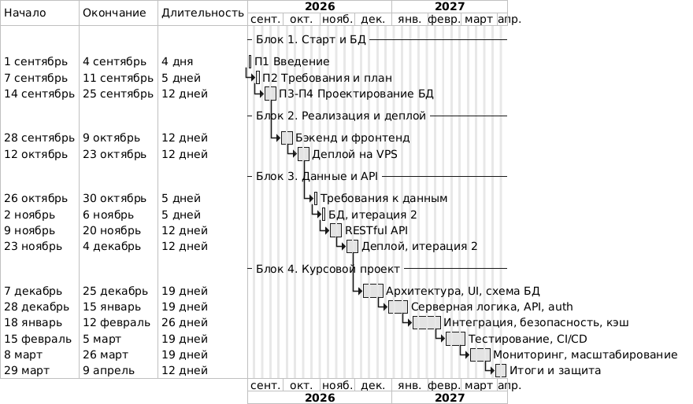
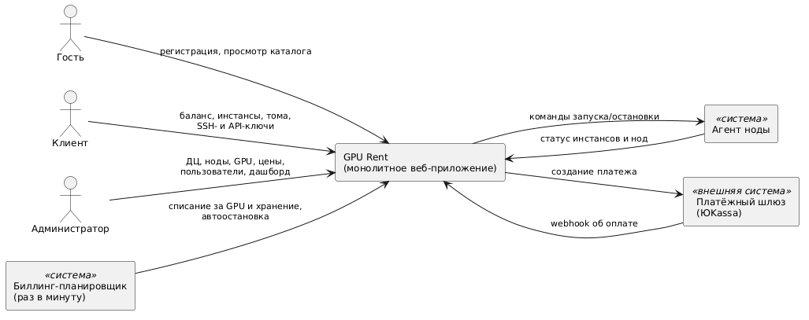

# Цель работы

Познакомиться со структурой семестра и балльной системой дисциплины «Создание программного обеспечения», организовать командную работу над проектом (роли, зоны ответственности, артефакты, процесс), выбрать и обосновать тему проекта на основе исследования предметной области, сформулировать видение продукта и подготовить репозиторий, в котором будут вестись код и документация на протяжении всего семестра.

# Задание

1. Изучить структуру семестра: обязательную работу в командах, исследовательскую работу в проектах, разработку решений и проектов; смысловые блоки практических занятий по неделям; балльную систему.
2. Определить состав команды по ролям, заданным преподавателем: Тимлид, Системный аналитик, Тестировщик, Backend-разработчик, Frontend-разработчик. Описать зоны ответственности и артефакты каждой роли.
3. Провести исследовательскую работу: выбрать тему проекта, обосновать выбор анализом рынка и аналогов, сформулировать исследовательские вопросы.
4. Сформулировать видение продукта, границы проекта и предварительный технологический стек.
5. Организовать репозиторий и процесс разработки: структура каталогов, ветвление, правила коммитов и ревью, критерии готовности.

# Ход работы

## Структура семестра и балльная система

### Три составляющие семестра

Задание выделяет три составляющие семестра. Они связаны между собой и в нашем проекте выглядят следующим образом.

Таблица 1 — Составляющие семестра и их воплощение в проекте

| Составляющая | Смысл по заданию | Как реализуется в проекте GPU Rent |
|---|---|---|
| Работа в команде | Команда из пяти ролей, общая ответственность за результат | Пять ролей распределены по этапам; проект ведёт один исполнитель (раздел «Организация работы одного исполнителя во всех ролях») |
| Исследовательская работа | Поиск новых подходов, технологий и методов, анализ проблем проекта | Анализ рынка аренды GPU; исследовательские вопросы по целостности выделения GPU, биллингу и масштабированию хранения учёта (раздел «Исследовательская работа») |
| Разработка решений и проектов | Главный компонент: реальный программный продукт или прототип | Монолитное веб-приложение с базой данных PostgreSQL; развитие от требований и модели данных до деплоя, API и курсового проекта |

Процесс организован короткими циклами по образцу Scrum [1]: неделя служит итерацией с планированием в начале, демонстрацией результата в конце и краткой ретроспективой. Формально Scrum рассчитан на команду, но его ритуалы полезны и одному исполнителю как способ ограничить объём работы и регулярно проверять результат.

### Блоки практических занятий и привязка к проекту

Практические занятия разбиты на тридцать две недели. Нумерация недель ведётся от начала семестра (неделя 1 — 01.09–06.09.2026, далее недели считаются с понедельника); даты могут сдвигаться с учётом учебного календаря. Ниже для каждого блока указано, что будет сделано по проекту GPU Rent.

Таблица 2 — Блоки практик и работы по проекту GPU Rent

| Недели | Содержание практики по заданию | Работы по проекту GPU Rent | Основной результат |
|---|---|---|---|
| 1 (с 01.09) | Введение в дисциплину | Выбор темы, роли, видение, репозиторий, процесс | Этот отчёт, каркас репозитория |
| 2 (с 07.09) | Анализ требований и планирование | Функциональные и нефункциональные требования, модель вариантов использования, стек, план работ | Отчёт П2, перечень FR и NFR |
| 3–4 (с 14.09) | Проектирование БД | Неделя 3 (П3) — логическая модель: 18 таблиц, ключи, ограничения, нормализация и осознанная денормализация, представления. Неделя 4 (П4) — физическая реализация: миграции, индексы, роли, RLS, тесты, тестовые данные | Отчёты П3 и П4, ER-диаграмма, рабочие миграции |
| 5–6 (с 28.09) | Реализация бэкенда и фронтенда | Серверная часть на Node.js и интерфейс на React: вход, каталог, создание инстанса, баланс; кэш в Redis | Первые рабочие экраны и API |
| 7–8 (с 12.10) | Деплой и настройка серверного окружения | VPS, Docker Compose, Nginx как обратный прокси, TLS (Let's Encrypt), резервное копирование БД, CI/CD (автоматическая сборка и проверки) | Приложение доступно по HTTPS |
| 9 (с 26.10) | Анализ требований и планирование данных | Оценка объёмов данных и сроков хранения, требования 152-ФЗ к персональным данным, расчёт роста таблицы потребления | Обновлённые требования к данным |
| 10 (с 02.11) | Проектирование БД проекта | Вторая итерация модели по результатам эксплуатации: автоматизация партиций, ревизия индексов по планам запросов | Новая версия миграций |
| 11–12 (с 09.11) | RESTful API | Спецификация OpenAPI, версионирование, пагинация, формат ошибок, идемпотентность платёжных операций, API-ключи | Документированный API |
| 13–14 (с 23.11) | Деплой и настройка окружения | Выкладка релиза, две реплики приложения за балансировщиком | Воспроизводимый деплой |
| 15–17 (с 07.12) | Архитектура курсового проекта; интерфейс; схема БД | Уточнение архитектуры, прототипы экранов, финальная схема БД | Проектная документация |
| 18–20 | Серверная логика; API; аутентификация и авторизация | Бизнес-правила жизненного цикла инстансов, биллинг, роли и сессии | Серверная часть |
| 21–24 | Интеграция фронтенда; безопасность; кэширование; паттерны | Связка интерфейса с API, меры OWASP, кэш каталога, рефакторинг по паттернам | Защищённое приложение |
| 25–27 | Тестирование; развёртывание; CI/CD | Модульные, интеграционные и нагрузочные тесты, конвейер сборки | Набор тестов и конвейер |
| 28–30 | Мониторинг и логирование; обратная связь; масштабирование | Метрики и журналы, сбор отзывов, план масштабирования | Эксплуатационные материалы |
| 31–32 | Подведение итогов | Итоговая сборка, демонстрация, защита | Защита проекта |

План этапов показан на диаграмме.



### Балльная система

Студент защищает практические работы и отвечает на дополнительные вопросы преподавателя. Оценка определяется сопоставлением выполненной работы с требованиями задания и пунктами оценки. Для выполнения предусмотрено пять практических задач. Работы №1 и №2 оцениваются по пятибалльной системе. Работы №3 и №4 оцениваются по комплексной схеме: итоговая оценка складывается из качества работы над курсовым проектом и ответов на вопросы преподавателя.

Отсюда два правила: отчёты П1 и П2 покрывают все пункты задания, а проектные решения П3 и П4 можно объяснить и воспроизвести (схема БД, миграции и тесты лежат в репозитории, а не только в тексте отчёта).

## Команда и роли

### Роли и зоны ответственности

Задание определяет пять ролей. Для проекта GPU Rent границы ролей и их артефакты установлены следующим образом.

Таблица 3 — Роли, зоны ответственности и артефакты

| Роль | Зона ответственности | Артефакты | Где лежат |
|---|---|---|---|
| Тимлид | План и приоритеты, границы проекта, процесс (ветвление, ревью), принятие технических решений, контроль сроков, итоговая сборка и защита | План работ, журнал решений, правила процесса, итоговая сборка отчётов | `README.md`, `docs/reports/`, `tools/` |
| Системный аналитик | Сбор и формализация требований, модели вариантов использования, модель данных, глоссарий, трассировка требований к реализации | Каталог требований FR и NFR, диаграммы, ER-модель, словарь данных | `docs/reports/`, `docs/diagrams/src/` |
| Тестировщик | Критерии приёмки, тест-план, тесты БД и API, проверка ограничений целостности, воспроизводимые замеры производительности | Тестовые сценарии SQL, отчёты об испытаниях, результаты `EXPLAIN ANALYZE` | `db/tests/`, `db/bench/` |
| Backend-разработчик | Миграции и объекты БД, функции и триггеры, серверная логика, API, интеграции (платёжный шлюз), безопасность на стороне сервера | Миграции, функции, сид-данные, исходный код сервера | `db/migrations/`, `db/seed/`, `db/scripts/` и каталог серверной части |
| Frontend-разработчик | Интерфейс клиента и администратора, работа с API, адаптивная вёрстка, удобство использования | Прототипы экранов, компоненты React, стили | каталог клиентской части |

Роли пересекаются по артефактам, поэтому в таблице 4 зафиксирована ответственность по ключевым активностям проекта методом RACI [2]: R (Responsible) — выполняет, A (Accountable) — отвечает за результат и принимает его, C (Consulted) — консультирует, I (Informed) — информируется. В каждой строке ровно один A.

Таблица 4 — Матрица RACI по ключевым активностям

| Активность | Тимлид | Аналитик | Тестировщик | Backend | Frontend |
|---|---|---|---|---|---|
| Определение видения и границ проекта | A/R | C | I | C | C |
| Сбор и формализация требований | C | A/R | C | C | C |
| Выбор технологического стека | A | C | I | R | C |
| Логическое проектирование БД | C | A/R | C | R | I |
| Реализация миграций, функций, триггеров | I | C | C | A/R | I |
| Проектирование интерфейса | C | C | I | I | A/R |
| Реализация серверной логики и API | I | C | C | A/R | C |
| Реализация клиентской части | I | C | C | C | A/R |
| Тест-план, тесты БД и API | C | C | A/R | R | R |
| Замеры производительности и индексы | C | I | R | A/R | I |
| Деплой и настройка окружения | A | I | C | R | I |
| Ревью изменений и приёмка этапа | A | C | R | R | R |
| Ведение документации и отчётов | A | R | C | R | R |

Тимлид отвечает за то, чтобы артефакты не расходились между собой: чтобы идентификаторы требований в отчёте совпадали с тестами, а имена таблиц — с миграциями.

### Организация работы одного исполнителя во всех ролях

Проект выполняется одним студентом: Васин С. А. (группа ЭФБО-17-24) исполняет все пять ролей. Поэтому вместо распределения людей по ролям применяется распределение времени по ролям: роль является «шляпой», которую исполнитель надевает на конкретный этап и конкретный артефакт.

С организационной точки зрения это имеет и преимущество, и очевидный недостаток. Преимущество отмечает Ф. Брукс [3]: стоимость коммуникации растёт как n(n−1)/2 каналов, то есть для пяти человек это десять каналов связи, а для одного исполнителя — ноль. Согласование между аналитиком, разработчиками и тестировщиком сводится к дисциплине ведения артефактов. Недостаток — отсутствие независимого взгляда: автор кода сам же его проверяет. Для снижения этого риска приняты следующие меры.

1. **Планирование по ролям.** Недельный бюджет времени — примерно 8–10 часов. Неделя делится на блоки, каждый из которых выполняется в одной роли, и роль не меняется внутри блока (таблица 5).
2. **Разделение автора и ревьюера во времени.** Принято правило: изменения не сливаются в день написания без проверки; ревью выполняется в роли тестировщика по чек-листу после паузы (как правило, на следующий день). Чек-лист содержит проверку соответствия требованию, обратимости миграции, наличия теста, обновления документации и отсутствия секретов.
3. **Непрерывная интеграция как второй ревьюер (вводится работой 5.4, недели 7–8).** Автоматические проверки (применение миграций на чистой базе, запуск тестов БД, линтеры) будут выполняться независимо от исполнителя, а слияние с основной веткой будет допускаться только при успешном прогоне. До ввода CI те же проверки запускаются вручную скриптами `db/scripts/reset.sh` и `db/scripts/test.sh`.
4. **Ограничение незавершённой работы.** Одновременно ведётся не более двух задач, чтобы переключение ролей не превращалось в потерю контекста.
5. **Журнал решений.** Значимые решения (почему выбран тот или иной подход) записываются в отчёт текущего этапа, чтобы через месяц не восстанавливать причины по памяти.

Типовое распределение недельного бюджета приведено в таблице 5.

Таблица 5 — Типовая неделя одного исполнителя

| Блок | Роль | Время, ч | Результат |
|---|---|---|---|
| Планирование недели, разбор задач | Тимлид | 0,5–1 | Список задач в репозитории, определение критериев готовности |
| Уточнение требований и модели | Аналитик | 1–2 | Обновлённые требования и диаграммы |
| Реализация | Backend или Frontend | 3–4 | Изменения в ветке `feature/*` |
| Тесты и проверка | Тестировщик | 1–2 | Тесты, протокол проверки |
| Ревью, слияние, отчёт | Тимлид | 1–1,5 | Слитый pull request, обновлённая документация |

К рискам такой организации отнесены перегрузка и срыв сроков (компенсируются ограничением объёма MVP и еженедельным пересмотром плана), а также «слепые пятна» из-за единственного исполнителя (компенсируются чек-листами, автоматическими проверками и вопросами преподавателя на защите).

## Исследовательская работа

### Зачем арендуют GPU

Видеокарты эффективны для задач, которые разбиваются на множество однотипных параллельных операций. Основные сценарии аренды:

- **обучение и дообучение моделей машинного обучения:** нужен большой объём видеопамяти и несколько GPU на время от часов до недель;
- **инференс:** развёртывание обученной модели для обработки запросов, нагрузка неравномерная;
- **рендеринг и обработка видео:** пакетные задачи, которым нужна мощная графика на ограниченное время;
- **научные расчёты и эксперименты:** кратковременные запуски без покупки оборудования.

Покупка оборудования неудобна при неравномерной загрузке: высокая начальная стоимость, быстрое моральное устаревание, затраты на охлаждение, электропитание и обслуживание. Аренда переносит эти затраты в операционные и позволяет платить только за время использования, поэтому ключевое качество такого сервиса — точная тарификация по времени и быстрое получение готового окружения.

### Анализ аналогов

Для сравнения выбраны пять сервисов: RunPod [4], Vast.ai [5], Immers.cloud [6], Selectel [7] и Beget [8]. Сравнение качественное: по публичным страницам и документации на 30.09.2026. Цены намеренно не сравниваются: они меняются и зависят от модели GPU, региона и типа тарифа, а для выбора темы важна функциональность.

Таблица 6 — Сравнение аналогов по качественным признакам

| Сервис | Модель размещения | Тарификация | Готовые шаблоны и образы | Постоянное хранилище | API |
|---|---|---|---|---|---|
| RunPod | Контейнеры (поды) с GPU | По времени работы, малая дискретность (в документации — минуты) | Да, шаблоны, в том числе с PyTorch | Диски пода и сетевые тома, которые можно подключать к разным подам | Да |
| Vast.ai | Торговая площадка: хосты сами задают цены | Посекундная по документации; хранилище тарифицируется и у остановленного инстанса | Да, шаблоны образов | Диск на хосте | Да, а также консольный клиент |
| Immers.cloud | Виртуальные машины с GPU | Посекундная по заявлению сайта; пауза без оплаты | Готовые образы: ОС и приложения для машинного обучения и графики | Диски, объектное хранилище | Да, интерфейс OpenStack |
| Selectel | Облачные серверы с GPU | Почасовая, посуточная, помесячная | Образы ОС, загрузка собственных | Сетевые диски, файловое и объектное хранилища | Да, API и Terraform |
| Beget | VPS; GPU-серверы — отдельная услуга аренды | Почасовая, посуточная, помесячная (для VPS) | Набор готовых приложений при создании сервера | Диск сервера | Да, API и Terraform |

Из таблицы видно различие двух подходов. Специализированные GPU-сервисы (RunPod, Vast.ai, Immers.cloud) предлагают тонкую тарификацию, готовые окружения для ML и удобное подключение (SSH, Jupyter). Универсальные облака и хостинги (Selectel, Beget) шире по набору услуг, но используют более грубые периоды оплаты и рассчитаны на общий круг задач.

### Выводы: что берём в GPU Rent

Из анализа следуют решения для проекта.

1. **Посекундный учёт времени** работы GPU: оплата не округляется до часа. Тарифицируется также хранение томов.
2. **Предоплаченный баланс и автоматическая остановка** инстансов при исчерпании средств (как у Vast.ai): это защищает и клиента, и сервис от неограниченной задолженности.
3. **Шаблоны** (образы PyTorch, Jupyter, Stable Diffusion) для запуска одним действием, а также приватные шаблоны пользователя.
4. **Сетевые тома** в пределах дата-центра, не привязанные к жизни инстанса.
5. **Два тарифа** (on-demand и spot) для каждой модели GPU в дата-центре.
6. **API-ключи** для автоматизации и **SSH-ключи** для подключения.
7. **Административная часть**: дата-центры, ноды, GPU, история цен, загрузка и выручка.

Сознательно не берутся: торговая площадка сторонних хостов, собственные виртуальные машины с Windows и облачное хранилище общего назначения (S3). Они не нужны для учебной задачи и увеличили бы объём без выигрыша в проектных знаниях.

### Исследовательские вопросы проекта

Тема выбрана ещё и потому, что она даёт содержательные задачи по проектированию базы данных и корректности при конкурентном доступе. Эти задачи сформулированы как исследовательские вопросы, на которые отвечают последующие практики.

Таблица 7 — Исследовательские вопросы

| № | Вопрос | Гипотеза и способ проверки | Где рассматривается |
|---|---|---|---|
| RQ1 | Как на уровне БД гарантировать, что физическая GPU не выделена двум инстансам одновременно? | Ограничение `EXCLUDE USING gist` по идентификатору GPU и диапазону времени выделения плюс выбор свободных GPU с блокировкой `FOR UPDATE SKIP LOCKED`; проверка конкурентными сеансами | П3, П4 |
| RQ2 | Как сделать точный посекундный биллинг без расхождений при повторном запуске расчёта? | Фиксация цены снимком при запуске инстанса, метка `last_billed_at`, идемпотентный расчётный проход; тип `numeric` вместо `float` | П2, П3, П4 |
| RQ3 | Как масштабировать хранение учёта потребления, если записей десятки миллионов в год? | Секционирование по месяцам, индекс BRIN по времени, материализованное представление для дашборда; замеры `EXPLAIN ANALYZE` до и после | П3, П4 |
| RQ4 | Как обеспечить, чтобы баланс пользователя не расходился с журналом операций? | Неизменяемый журнал операций, баланс как кэш суммы, обновляемый триггером; запрет изменения журнала | П3, П4 |
| RQ5 | Как хранить историю цен, чтобы периоды действия не пересекались? | Диапазонный тип `tstzrange` и `EXCLUDE USING gist` | П3, П4 |
| RQ6 | Как изолировать данные клиентов на уровне БД, а не только в коде приложения? | Политики `ROW LEVEL SECURITY` по `user_id`, отдельные роли БД для приложения и аналитики; тесты на доступ | П3, П4 |

Ограничения-исключения (`EXCLUDE`), диапазонные типы и секционирование описаны в документации PostgreSQL [9]. Вопросы безопасности хранения паролей и секретов будут опираться на основы прикладной криптографии [10] и на разбор типовых атак на веб-приложения [11], а также на перечень OWASP Top 10 [12]; роль социальной инженерии в компрометации учётных записей подробно показана в [13], поэтому в проект закладываются подтверждение email и журнал аудита действий администратора.

## Видение продукта

### Проблема и целевая аудитория

**Проблема.** Разработчику, студенту или небольшой команде для одной задачи нужна мощная видеокарта на несколько часов, а покупать её нецелесообразно. Существующие универсальные облака оплачиваются крупными периодами (часы, сутки, месяцы), а специализированные сервисы требуют от пользователя самостоятельной настройки окружения.

**Целевая аудитория:**

- исследователи и студенты, запускающие обучение моделей и эксперименты;
- разработчики, развёртывающие инференс небольших моделей и сервисы на GPU;
- дизайнеры и монтажёры, которым нужен рендеринг на ограниченное время;
- администраторы сервиса, управляющие парком серверов и ценами.

**Формулировка видения.** GPU Rent — веб-сервис, в котором пользователь за несколько действий пополняет баланс, выбирает модель GPU в нужном дата-центре, запускает контейнер из готового шаблона, подключается к нему по SSH или Jupyter и платит только за секунды фактической работы.

### Ключевые возможности

Деление на MVP и последующие версии предварительное, окончательную приоритизацию выполняет П2.

Таблица 8 — Предварительное деление возможностей

| Группа | Возможности | Идентификаторы требований |
|---|---|---|
| MVP | Регистрация и вход; SSH-ключи; каталог GPU и шаблонов; создание, остановка и терминация инстанса; посекундный биллинг; пополнение баланса; автоостановка; история операций; администрирование дата-центров, нод, GPU и цен | FR-01–03, FR-05–08, FR-10–15 |
| Позже | API-ключи; сетевые тома; блокировка пользователей; дашборд загрузки и выручки; журнал аудита; кэширование каталога под высокую нагрузку; две реплики приложения | FR-04, FR-09, FR-16–18, NFR-01, NFR-02 |

Идентификаторы FR-xx и NFR-xx — функциональные и нефункциональные требования, которые определяются и обосновываются в отчёте П2.

### Границы проекта

Проект учебный, поэтому его границы заданы явно.

- **Не реализуется реальная виртуализация и оркестрация контейнеров.** Запуск и остановка контейнеров на серверах имитируется агентом ноды, который принимает команды и сообщает статус. Этого достаточно, чтобы проверить жизненный цикл инстанса, выделение GPU и биллинг.
- Платёжный шлюз (ЮKassa) используется через webhook; проведение реальных платежей в рамках учебной работы не предполагается.
- Семантика вытеснения инстансов на тарифе spot уточняется в П2; в модели данных тариф выделен отдельным типом цены.
- Мобильное приложение не разрабатывается; интерфейс адаптивный.

Внешние стороны системы показаны на диаграмме контекста.



Акторов шесть: гость, клиент и администратор — люди; биллинг-планировщик (запускается раз в минуту) и агент ноды — системные; платёжный шлюз — внешняя система.

### Технологический стек

Предварительный стек выбирается, исходя из того, что проект ведёт один исполнитель, а главная сложность — в данных, а не в инфраструктуре. Обоснование будет развёрнуто в отчёте П2.

Таблица 9 — Предварительный стек

| Компонент | Выбор | Краткое обоснование |
|---|---|---|
| Архитектура | Монолит | Один деплой-артефакт, транзакции охватывают выделение GPU и списание денег; нет расходов на сетевое взаимодействие сервисов |
| Сервер | Node.js 24 LTS, TypeScript, Express 4 | Статическая типизация, большая экосистема, один язык на сервере и клиенте |
| Клиент | React 18, Vite | Компонентный подход; сборка в статику, которую раздаёт Nginx (Express обслуживает только `/api`) |
| СУБД | PostgreSQL 16 | Диапазонные типы, `EXCLUDE`, секционирование, `ROW LEVEL SECURITY`, триггеры, расширения `pgcrypto`, `btree_gist`, `citext` |
| Доступ к БД | SQL-миграции, node-postgres или Kysely | Схема описывается чистым SQL; выбранные средства не скрывают возможности PostgreSQL |
| Кэш и сессии | Redis 7 | Каталог и доступность читаются намного чаще, чем меняются |
| Деплой | VPS, Docker Compose, Nginx, TLS | Воспроизводимое окружение, одна точка входа |
| Процесс | Git, GitHub, CI | Прозрачная история, автоматические проверки |

Отдельно отмечено, что ORM Prisma не подходит: она не выражает `EXCLUDE`, политики RLS и секционирование, на которых построены ответы на RQ1, RQ3 и RQ6.

## Организация репозитория и процесса

### Структура каталогов

Репозиторий проекта создан с каталогами, соответствующими артефактам ролей.

```text
README.md                      обзор, стек, запуск БД, сборка отчётов
docs/reports/                  отчёты П1–П4 (markdown-исходники)
docs/diagrams/src/             исходники диаграмм PlantUML
docs/diagrams/png/             отрендеренные диаграммы
db/migrations/                 версионированные SQL-миграции NNNN_name.sql
db/seed/                       тестовые данные
db/tests/                      SQL-тесты
db/bench/                      сценарии EXPLAIN ANALYZE и результаты
db/scripts/                    reset, test, bench
tools/                         сборка отчётов из markdown в docx и pdf
reports/                       готовые отчёты в PDF
```

Принцип: всё, что можно воспроизвести, хранится в виде исходника (SQL, PlantUML, markdown), а не в виде готового файла; готовые PDF и PNG — производные артефакты, которые пересобираются.

### Ветвление

Принята упрощённая схема с длинной веткой `main` и короткоживущими ветками задач [14]. Схема вводится с началом реализации бэкенда и фронтенда (недели 5–6); на момент сдачи П1–П4 репозиторий содержит документацию и базу данных и ведётся линейно в `main`, CI ещё не настроен. Правила схемы:

- `main` должна всегда быть в рабочем состоянии, прямые коммиты в неё не делаются;
- каждая задача — ветка `feature/<кратко>` (для исправлений — `fix/<кратко>`, для документации — `docs/<кратко>`) от актуальной `main`;
- срок жизни ветки — не более нескольких дней, чтобы не копить конфликты;
- слияние выполняется через pull request.

### Сообщения коммитов

Применяется спецификация Conventional Commits [15]: `тип(область): описание`. Типы: `feat` — новая возможность, `fix` — исправление, `docs` — документация, `test` — тесты, `refactor` — изменение структуры без смены поведения, `chore` — служебные изменения. Примеры:

```text
docs(pr1): отчёт по введению в дисциплину
feat(db): таблица instance_gpus с запретом двойного выделения
test(db): проверка идемпотентности пополнения баланса
```

Один коммит соответствует одному логически завершённому изменению; описание пишется в повелительном наклонении и объясняет, что и зачем изменено.

### Правила pull request и ревью

1. Pull request небольшой и относится к одной задаче; в описании указаны цель, ссылка на требование (FR-xx или NFR-xx) и способ проверки.
2. Автоматические проверки должны пройти.
3. Перед слиянием выполняется самопроверка по чек-листу: соответствие требованию; миграция применяется на чистой базе; есть тест, который падает без изменения; документация обновлена; нет секретов и личных данных.
4. Слияние — с сохранением линейной истории (squash), заголовок соответствует Conventional Commits.

### Definition of Done

Для задач, выполняемых по описанной схеме, задача считается выполненной, если одновременно: поведение соответствует требованию и критерию приёмки; миграции применяются на пустой базе; тесты добавлены или обновлены и проходят; документация соответствует коду; pull request прошёл проверки и слит в `main`; изменение воспроизводится по инструкции в `README.md`.

### Живая документация

Документация ведётся вместе с кодом: любое изменение схемы или поведения обновляет соответствующие разделы в том же pull request. Отчёты хранятся как markdown-исходники и собираются в docx и pdf одним скриптом из каталога `tools/`; схемы и диаграммы — как текстовые файлы PlantUML, поэтому они сравниваются в истории изменений. Перед завершением каждого этапа имена таблиц, требования и числа в тексте сверяются с миграциями и тестами. Расхождение между документом и кодом считается дефектом и фиксируется как задача.

# ЗАКЛЮЧЕНИЕ

В работе изучена структура семестра и балльная система; блоки практик из тридцати двух недель сопоставлены с этапами проекта, а план показан на диаграмме. Определены пять ролей, для каждой описаны зоны ответственности и артефакты, построена матрица RACI по тринадцати ключевым активностям. Показано, как один исполнитель совмещает все роли: планирование по ролям, разнесённое во времени ревью по чек-листу, автоматические проверки как независимый контроль и ограничение числа одновременных задач.

Тема проекта — монолитное веб-приложение аренды облачных GPU-серверов GPU Rent — выбрана по результатам сравнения пяти аналогов. Из анализа взяты посекундная тарификация, предоплаченный баланс с автостопом, шаблоны образов, сетевые тома и API; за границы проекта вынесены реальная виртуализация, торговая площадка хостов и Windows-окружения. Сформулированы шесть исследовательских вопросов, которые связывают тему с проектированием БД: запрет двойного выделения GPU, точный биллинг, масштабирование учёта потребления, целостность журнала денег, история цен и изоляция данных клиентов.

Подготовлены видение, границы и предварительный стек, а также организация репозитория и процесса: структура каталогов, ветвление, Conventional Commits, правила pull request, критерии готовности и принцип живой документации. Ограничение работы: деление возможностей на MVP и последующие версии и обоснование стека предварительные и уточняются в П2; сравнение аналогов основано на публичных страницах и не включает проверку сервисов на практике. Следующий этап — анализ требований и планирование разработки (П2).

# СПИСОК ИСПОЛЬЗОВАННЫХ ИСТОЧНИКОВ

1. Schwaber K., Sutherland J. The Scrum Guide [Электронный ресурс]. — 2020. — URL: https://scrumguides.org/scrum-guide.html (дата обращения: 30.09.2026).
2. A Guide to the Project Management Body of Knowledge (PMBOK Guide). — 6th ed. — Newtown Square: Project Management Institute, 2017.
3. Brooks F. P. The Mythical Man-Month: Essays on Software Engineering. — Anniversary ed. — Boston: Addison-Wesley, 1995. — 322 p.
4. Runpod Documentation: Pods overview [Электронный ресурс]. — URL: https://docs.runpod.io/pods/overview (дата обращения: 30.09.2026).
5. Vast.ai Documentation: Pricing [Электронный ресурс]. — URL: https://docs.vast.ai/documentation/instances/pricing (дата обращения: 30.09.2026).
6. Immers.cloud: облачные серверы с GPU [Электронный ресурс]. — URL: https://immers.cloud (дата обращения: 30.09.2026).
7. Selectel: облачные серверы с GPU [Электронный ресурс]. — URL: https://selectel.ru/services/cloud/servers/gpu/ (дата обращения: 30.09.2026).
8. Beget: VPS/VDS [Электронный ресурс]. — URL: https://beget.com/ru/vps (дата обращения: 30.09.2026).
9. PostgreSQL 16 Documentation [Электронный ресурс]. — URL: https://www.postgresql.org/docs/16/ (дата обращения: 30.09.2026).
10. Шнайер Б. Прикладная криптография. — Питер, 2008. — 784 с.
11. Гудро М. Тайны хакеров. Безопасность Web-приложений. — ДМК Пресс, 2019. — 480 с.
12. OWASP Top 10 [Электронный ресурс]. — URL: https://owasp.org/www-project-top-ten/ (дата обращения: 30.09.2026).
13. Митник К. Искусство обмана. Хакерские приемы и тактики. — Манн, Иванов и Фербер, 2019. — 488 с.
14. Chacon S., Straub B. Pro Git [Электронный ресурс]. — 2nd ed. — Apress, 2014. — URL: https://git-scm.com/book/ru/v2 (дата обращения: 30.09.2026).
15. Conventional Commits 1.0.0 [Электронный ресурс]. — URL: https://www.conventionalcommits.org/ru/v1.0.0/ (дата обращения: 30.09.2026).
