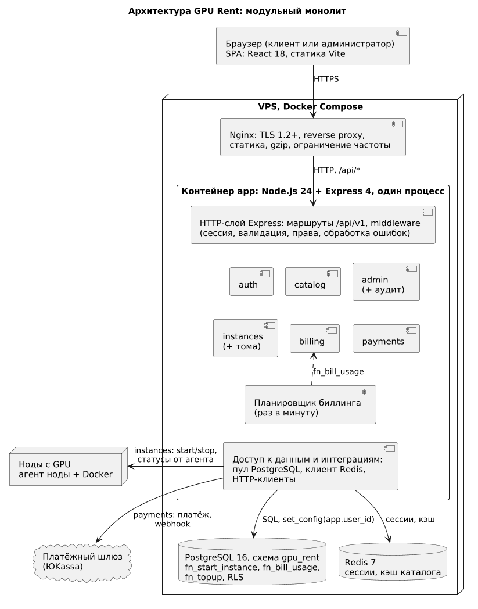
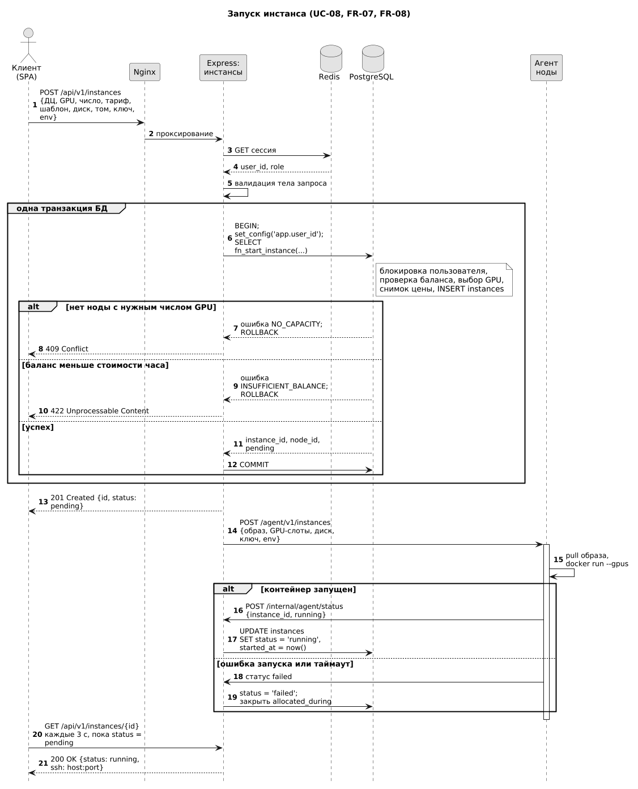
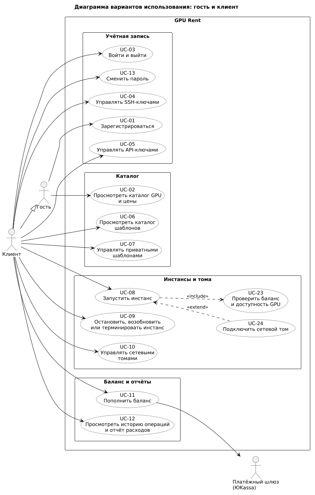
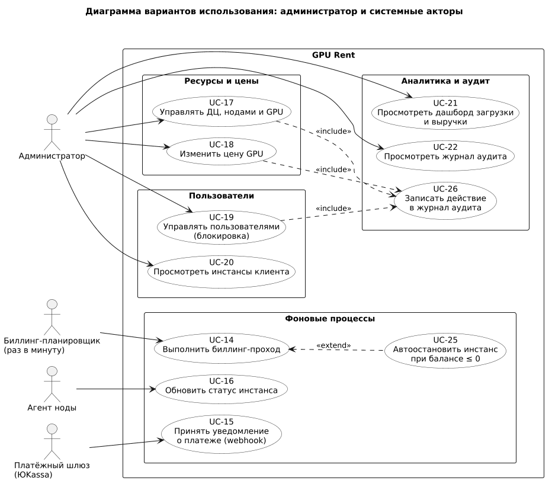
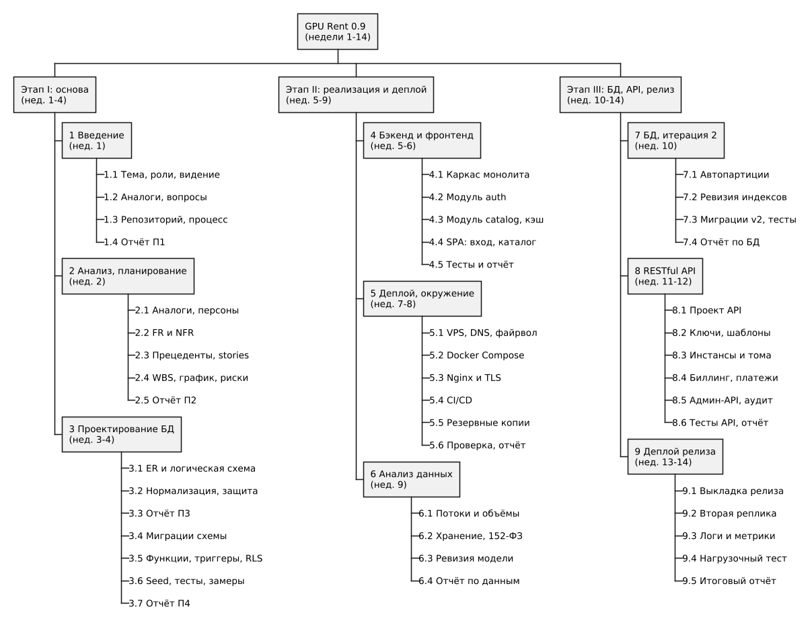
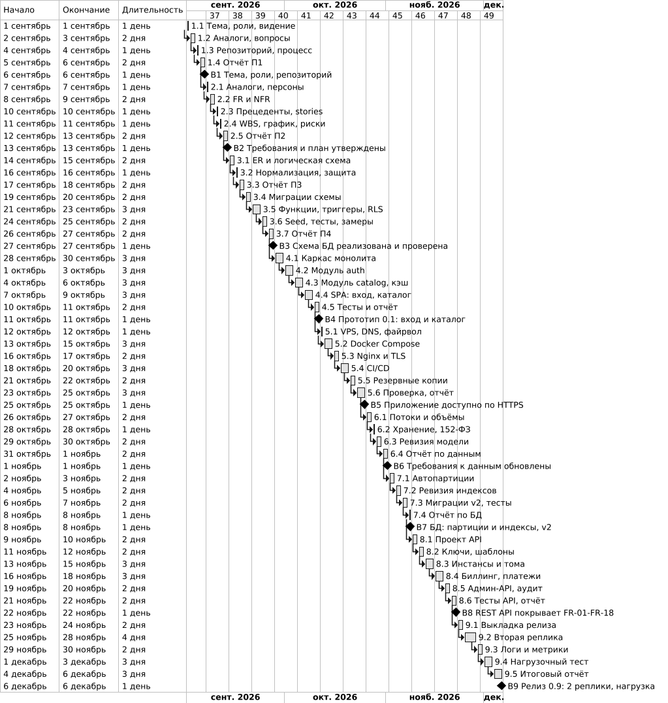
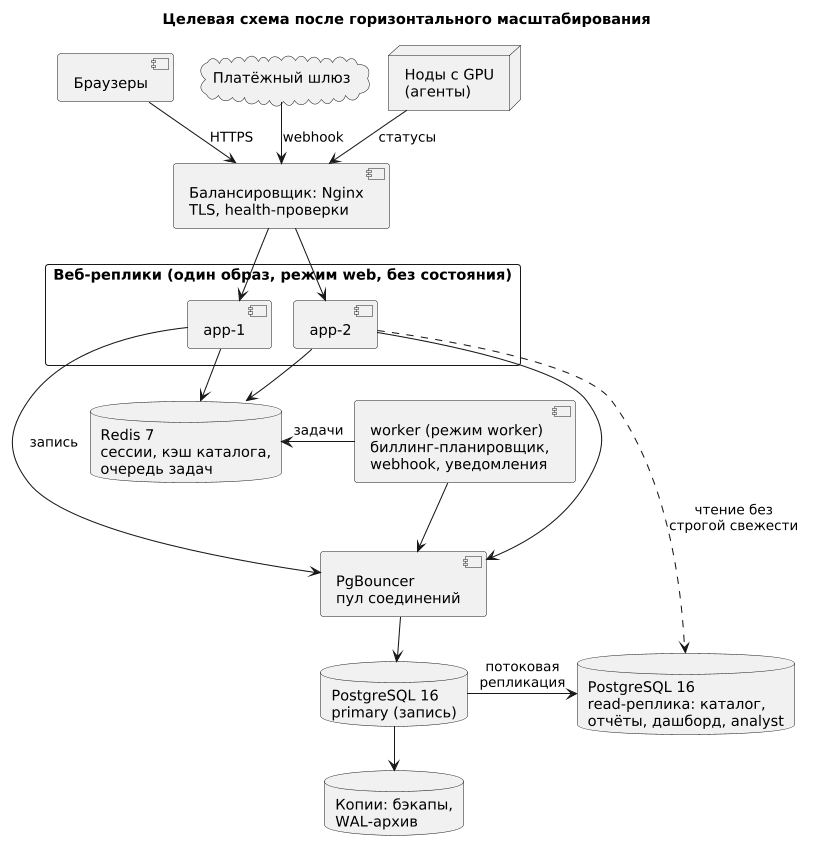

# Цель работы

Изучить процесс анализа требований и планирования разработки монолитного веб-приложения и применить его к проекту GPU Rent — сервису аренды облачных GPU-серверов: рассмотреть основы веб-разработки и клиент-серверного взаимодействия, собрать и оформить функциональные и нефункциональные требования, построить модель вариантов использования, составить план работ с оценками трудоёмкости и графиком, оценить риски и пути масштабирования.

# Задание

1. Изучить основы веб-разработки: HTML, CSS и JavaScript, принципы работы веб-серверов и клиент-серверного взаимодействия.
2. Изучить методы анализа требований: функциональные и нефункциональные требования, способы их сбора и документирования.
3. Выполнить практику анализа требований: построить варианты использования, оформить требования диаграммами и текстовыми описаниями.
4. Изучить планирование разработки: этапы, составление расписания, планирование ресурсов.
5. Составить практический план разработки монолитного веб-приложения с учётом зависимостей между задачами и этапами.
6. Изучить методы управления рисками и возможности масштабирования приложения.
7. Разработать план разработки конкретного веб-приложения (GPU Rent) по результатам анализа требований.

# Ход работы

Подразделы 3.1–3.7 соответствуют шагам задания 1–7. Обозначения: FR-xx и NFR-xx — функциональные и нефункциональные требования, UC-xx — прецеденты, US-xx — пользовательские истории, R-xx — риски, числа вида 4.2 — работы плана. Недели отсчитываются от начала семестра: неделя 1 — 01.09–06.09.2026, далее календарные недели с понедельника по воскресенье. Имена таблиц, функций и представлений БД (`instances`, `fn_start_instance` и др.) взяты из модели данных проекта, которая проектируется в П3 и реализуется в П4.

## Основы веб-разработки и клиент-серверное взаимодействие

### HTML, CSS и JavaScript в клиентской части

Клиентская часть строится из трёх технологий [1]. HTML описывает структуру и смысл содержимого (в GPU Rent — экраны каталога, мастера создания инстанса, списка инстансов, формы входа и пополнения баланса), CSS — оформление и адаптацию к размеру экрана (раскладка flex и grid, медиазапросы; корректная вёрстка от ширины 360 px, NFR-07), JavaScript — поведение: реакцию на действия, запросы к серверу и обновление страницы без перезагрузки. Используются React 18 и TypeScript; сборщик Vite превращает исходники в статику (HTML и хэшированные файлы JS и CSS), которую раздаёт Nginx.

Выбрано одностраничное приложение (SPA), а не серверная генерация страниц: кабинет требует частых обновлений без перезагрузки (статус инстанса опрашивается каждые 3 с, баланс), а публичная часть ограничена каталогом, для которого продвижение в поисковых системах второстепенно. Проверку данных в браузере считаем удобством, а не защитой: источник истины — сервер, который повторяет все проверки.

### Клиент-серверное взаимодействие и протокол HTTP

Браузер и сервер общаются по модели «запрос — ответ» поверх HTTP; протокол не хранит состояние между запросами, а его семантика описана в RFC 9110 [2] и справочнике MDN [3]. Основные элементы протокола и их применение в проекте собраны в таблице 1.

Таблица 1 — Элементы HTTP и их применение в GPU Rent

| Элемент | Правило | Применение в проекте |
|---|---|---|
| Методы | `GET` безопасен и идемпотентен, `POST` не идемпотентен, `PUT` и `DELETE` идемпотентны | `GET /api/v1/catalog/gpus`; `POST /api/v1/instances`; `POST /api/v1/instances/{id}/stop`; `DELETE /api/v1/ssh-keys/{id}` |
| Коды ответа | 2xx — успех, 4xx — ошибка клиента, 5xx — ошибка сервера | 201 инстанс создан; 401, 403 нет входа или прав; 409 нет свободных GPU; 422 недостаточно средств; 429 лимит запросов |
| Заголовки | Метаданные запроса и ответа | `Content-Type: application/json`; `Cache-Control`, `ETag` для каталога; `Authorization: Bearer` для API-ключей; `Strict-Transport-Security` |
| Cookie и сессии | Состояние хранится на сервере, клиенту выдаётся идентификатор | Случайный идентификатор (128 бит и более) в cookie `HttpOnly`, `Secure`, `SameSite=Lax`; данные сессии в Redis на 7 суток с продлением при активности; для изменяющих запросов токен CSRF [4] |
| HTTPS и TLS | Шифрование канала, проверка подлинности сервера сертификатом | TLS 1.2 и выше на Nginx, сертификат Let's Encrypt с автообновлением, HSTS; криптографические основы — по [5] |

### REST, веб-сервер и сервер приложений

Архитектурный стиль REST [6] опирается на ресурсы, единообразный интерфейс, отсутствие состояния на сервере между запросами и кэшируемость ответов. API GPU Rent: ресурсы названы существительными во множественном числе (`/instances`, `/volumes`, `/ssh-keys`, `/catalog/gpus`), действие задаётся HTTP-методом, а операции, не сводящиеся к созданию, чтению, изменению и удалению, оформляются подресурсом (`POST /instances/{id}/stop`). Версия входит в путь (`/api/v1`), ошибки возвращаются в едином JSON-формате, списки разбиваются на страницы (спецификация OpenAPI — работа 8.1).

Обязанности разделены между двумя программами [7]. Nginx — веб-сервер и обратный прокси: завершает TLS, отдаёт статику со сжатием и заголовками кэширования, ограничивает частоту запросов и принимает медленных клиентов. Express — сервер приложений: маршрутизация, цепочка промежуточных обработчиков (сессия → права → проверка тела запроса → обработчик → обработка ошибок), бизнес-логика и доступ к БД. Разделение необходимо, потому что Node.js исполняет JavaScript в одном потоке с неблокирующим вводом-выводом: TLS, статику и медленные соединения берёт на себя Nginx.

### Монолит и микросервисы: выбор архитектуры

Архитектура GPU Rent — модульный монолит: одно приложение на Node.js, развёртываемое одним Docker-образом, с шестью модулями (рисунок 1): `auth` (FR-01–FR-04), `catalog` (FR-05, FR-06), `instances` (FR-07–FR-09), `billing` (FR-10, FR-12, FR-13), `payments` (FR-11) и `admin` (FR-14–FR-18). Модуль обращается к данным другого только через его сервисные функции; планировщик биллинга — таймер в том же процессе, раз в минуту вызывающий `fn_bill_usage`. Внешние стороны: платёжный шлюз ЮKassa (webhook [8]) и агенты нод, принимающие команды запуска и остановки и присылающие статусы.

Путь запроса показан на примере запуска инстанса (рисунок 2, UC-08). Проверка баланса, подбор GPU, фиксация цены и создание записей выполняются одной транзакцией БД, поэтому при отказе не остаётся «полузапущенных» инстансов. Ответы идут тем же путём через Nginx (обратные стрелки от него не показаны).

Таблица 2 — Монолит и микросервисы для GPU Rent

| Критерий | Монолит | Микросервисы | Вывод |
|---|---|---|---|
| Согласованность данных | Одна ACID-транзакция: баланс, выбор GPU, запись инстанса | Распределённая сага с компенсациями | Деньги и GPU требуют транзакции |
| Развёртывание | Один образ и один файл Compose | Несколько образов, оркестратор | Одному исполнителю доступен монолит |
| Команда | Один человек владеет кодом | Выигрыш при независимых командах | Система повторяет структуру команды |
| Вызовы | Вызов функции | Сеть, задержки, повторы | Нет расходов на сеть |
| Масштабирование | Целиком, но без состояния репликами | Точечно по сервисам | Для NFR-01, NFR-02 хватает двух реплик |
| Изоляция отказов | Ошибка может остановить процесс | Отказ изолирован | Перезапуск контейнера, проверки здоровья |

Выбран модульный монолит. Решающие доводы: запуск инстанса и списание требуют транзакции над несколькими таблицами; проект ведёт один исполнитель; деплой сводится к одному артефакту; границы модулей совпадают с будущими границами сервисов, поэтому путь к их выделению сохраняется (раздел 3.6.2). Это согласуется с практикой «сначала монолит» [9, 10]. Цена решения — общий процесс и единица масштабирования, смягчаемые перезапуском контейнера, проверками здоровья и, позднее, двумя репликами.

## Методы анализа требований

**Процесс.** Анализ требований — непрерывный процесс из пяти действий [11, 12]: выявление потребностей, анализ (устранить противоречия, классифицировать, расставить приоритеты), спецификация (записать проверяемо), проверка (убедиться, что записанное нужно и понято одинаково) и управление (версии, трассировка, изменения). Требование описывает, что делает система и с каким качеством, а не как это реализовать. Источники — заинтересованные лица, документы, аналоги и предметная область.

**Методы сбора.** Сравнение методов и их применение в проекте даны в таблице 3.

Таблица 3 — Методы сбора требований

| Метод | Сильные стороны и ограничения | Применение в GPU Rent |
|---|---|---|
| Интервью | Глубина и уточняющие вопросы; трудоёмко, зависит от респондента | Не применялось на этом этапе: запланировано для валидации персон на следующих итерациях |
| Прото-персоны и сценарии | Быстро формулируют гипотезы о потребностях пользователей без доступа к ним; строятся на вторичных данных и не заменяют исследование | Применено: три прото-персоны на основе документации, FAQ и публичных обсуждений пользователей аналогов |
| Анкетирование | Охват и количественные данные; нет уточнений, нужна большая выборка | Не применялось: нет доступа к выборке потенциальных клиентов |
| Наблюдение | Видны скрытые действия; нужен доступ к пользователям | Частично: разбор пользовательских путей аналогов по их документации |
| Анализ документов и аналогов | Быстро и дёшево; показывает принятые решения, а не потребности | Применено: пять аналогов (П1), документация ЮKassa, PostgreSQL, OWASP, 152-ФЗ |
| Мозговой штурм | Много идей за короткое время; нужна жёсткая фильтрация | Применено единолично: список идей, отсев по MoSCoW |
| Прототипирование | Снимает недопонимание визуально; риск привязаться к макету | Не применялось: первые экраны — в работе 4.4 |

**Классификация.** Требования делят по уровням и природе [11]: бизнес («зачем»: сдавать GPU с оплатой за секунды работы), пользовательские («какая задача у пользователя», US-01), функциональные («что делает система», FR-10), нефункциональные («с каким качеством», NFR-01), ограничения (один исполнитель, зафиксированный стек, 152-ФЗ) и требования к внешним интерфейсам (webhook шлюза, протокол агента ноды). Нефункциональные требования группируют по модели качества ISO/IEC 25010 [13] (эффективность, совместимость, удобство, надёжность, безопасность, сопровождаемость и др.) или по схеме FURPS+ (Functionality, Usability, Reliability, Performance, Supportability).

**Документирование.** Спецификация требований (SRS) по ISO/IEC/IEEE 29148 [12] включает назначение, границы, функции, ограничения и проверяемые требования; в проекте её роль выполняют таблицы 7 и 8. Прецеденты по Коберну [14] описывают взаимодействие актора с системой ради цели: предусловия, основной сценарий, расширения (альтернативы и ошибки), постусловия. Пользовательские истории [15] имеют вид «Как <роль>, я хочу <действие>, чтобы <ценность>» и дополняются критериями приёмки Given / When / Then (дано / когда / тогда), которые становятся тестами. Хорошее требование необходимо, однозначно, полно, единично, выполнимо, проверяемо и непротиворечиво (ISO 29148).

**Приоритизация и трассировка.** MoSCoW делит требования на Must (без них релиз бессмыслен), Should (важные, релиз возможен без них), Could (желательные) и Won't (осознанно не делаются в этой версии). Трассировка связывает требование с источником, прецедентом, объектами реализации и проверкой: по ней находят затронутые места при изменении и доказывают, что каждое требование реализовано (раздел 3.3.7).

**Типичные ошибки.** Они перечислены в таблице 4 вместе с примерами из проекта.

Таблица 4 — Типичные ошибки анализа требований и меры в проекте

| Ошибка | Чем опасна | Пример и мера в проекте |
|---|---|---|
| Неизмеримые формулировки («быстро») | Нельзя проверить | NFR-01: p95 < 300 мс; NFR-02: 99,5 % в месяц, не более 3 ч 36 мин простоя |
| Смешение «что» и «как» | Сужает варианты реализации | В FR нет технологий; Redis и PostgreSQL названы в стеке и в критериях NFR |
| Пропущенные акторы и фоновые процессы | Неполнота | Биллинг-планировщик, агент ноды и шлюз оформлены акторами (UC-14–UC-16) |
| Неявные допущения | Разные трактовки | «Учёт» посекундный, «списание» раз в минуту; тариф spot отличается только ценой, вытеснения нет |
| Противоречия требований | Нереализуемость | Остановка освобождает GPU (FR-08), поэтому возобновление может закончиться отказом NO_CAPACITY (UC-08, расширение 5а) |
| Лишние возможности (gold plating) | Срыв сроков | Список Won't: вытеснение spot, Windows-образы, S3, мобильное приложение |
| Нет приоритетов, критериев приёмки, трассировки | Нельзя доказать выполнение | MoSCoW, критерии Given / When / Then, матрица трассировки |

## Практика анализа требований

### Заинтересованные лица и сбор требований

Таблица 5 — Заинтересованные лица

| Заинтересованное лицо | Интерес | Требования |
|---|---|---|
| Клиент-исследователь (студент, машинное обучение) | Недорогая GPU на часы, защита от «забытого» инстанса, сохранность данных | FR-07, FR-09, FR-10, FR-12 |
| Клиент-разработчик (инференс, сервисы) | Доступ по SSH и API, предсказуемая цена, безопасные переменные окружения | FR-03, FR-04, FR-07, FR-10 |
| Клиент-дизайнер или монтажёр (рендеринг) | Запуск из шаблона, понятная стоимость | FR-05, FR-06, FR-13 |
| Администратор сервиса | Управление парком, ценами, пользователями; загрузка и выручка; аудит | FR-14–FR-18 |
| Владелец сервиса | Отсутствие потерь денег, правовая чистота, выручка | FR-10, FR-17, NFR-04, NFR-09 |
| Платёжный шлюз (ЮKassa) | Корректный приём уведомлений, повторная доставка | FR-11 |
| Преподаватель | Соответствие заданию, воспроизводимость | Все требования, NFR-08 |
| Регулятор (152-ФЗ) | Минимизация и защита персональных данных | NFR-09 |

Реально применённые методы сбора и их результаты описаны в таблице 6. Прямых контактов с потенциальными клиентами на этом этапе не было: потребности пользователей сформулированы как гипотезы в виде прото-персон.

Таблица 6 — Применённые методы и результаты

| Метод | Что сделано | Результат |
|---|---|---|
| Анализ аналогов | Сравнение RunPod, Vast.ai, Immers.cloud, Selectel, Beget (отчёт П1) | Семь решений: посекундный учёт, баланс и автостоп, шаблоны, тома, два тарифа, API-ключи, админ-часть |
| Прото-персоны и сценарии | Три персоны-гипотезы: студент (машинное обучение), разработчик, дизайнер (рендеринг). Для каждой описаны задача, типовой сценарий использования, возможные боли и ожидания от оплаты. Основа: документация и тарифы аналогов, их FAQ и публичные обсуждения пользователей | Студент, по гипотезе, боится забыть выключить инстанс (FR-12) и хочет сохранять данные между запусками (FR-09). Разработчику нужны SSH, API и цена, зафиксированная при запуске (FR-03, FR-04, FR-10). Дизайнеру важны шаблон и видимая стоимость (FR-05, FR-06, FR-13) |
| Анализ документов | Задания практик, документация ЮKassa [8], PostgreSQL [16], OWASP [17], 152-ФЗ [18] | Идемпотентность webhook (FR-11), журнал аудита (FR-18), NFR-03, NFR-09 |
| Мозговой штурм | Единоличный список идей, отфильтрованный по MoSCoW | Состав FR-01–FR-18 и список Won't |

Прото-персоны — гипотезы о потребностях, а не результаты опроса: они не подтверждены прямым контактом с пользователями и не измеряют спрос. Поэтому решения опираются также на аналоги и документы, а валидация персон интервью с реальными пользователями (студенты, разработчики, рендер-специалисты) вынесена в план следующих итераций.

### Функциональные требования

Состав и нумерация FR-01–FR-18 получены по результатам анализа аналогов, персон, документов и мозгового штурма (таблица 6). Источник: А — аналоги, П — персоны (гипотезы), Д — документы и задание, М — мозговой штурм. Приоритеты MoSCoW: Must — 13 требований, Should — 4, Could — 1.

Таблица 7 — Функциональные требования

| ID | Требование | Приоритет | Актор | Источник |
|---|---|---|---|---|
| FR-01 | Регистрация по email и паролю (от 10 символов), подтверждение email по ссылке; до подтверждения запуск инстансов недоступен | Must | Гость | А, Д |
| FR-02 | Вход и выход, сессия в cookie; смена пароля с вводом текущего, остальные сессии завершаются | Must | Клиент, Администратор | А, Д |
| FR-03 | Добавление и удаление SSH-ключей, показ fingerprint; дубликат ключа отклоняется | Must | Клиент | А, П |
| FR-04 | API-ключи: значение показывается один раз, хранится хэш, есть отзыв и срок действия | Could | Клиент | А, П |
| FR-05 | Каталог: модели GPU по ДЦ с ценой on-demand и spot и числом свободных GPU; доступен гостю | Must | Гость, Клиент | А, П |
| FR-06 | Каталог шаблонов: публичные и собственные приватные; образ Docker, диск по умолчанию | Must | Клиент | А, П |
| FR-07 | Создание инстанса: ДЦ, модель, 1–8 GPU, тариф, шаблон, диск, том (по желанию), SSH-ключ, переменные окружения. Проверки: хватает свободных GPU одной ноды, баланс не меньше стоимости 1 часа | Must | Клиент | А, П |
| FR-08 | Жизненный цикл pending → running → stopped → running … → terminated и failed; остановка освобождает GPU, терминация необратима | Must | Клиент, Агент ноды | А, Д |
| FR-09 | Сетевые тома: создать, расширить, удалить; том в одном ДЦ, не более одного активного инстанса этого ДЦ | Should | Клиент | А, П |
| FR-10 | Посекундный учёт работы GPU и хранения, списание раз в минуту; цена фиксируется снимком при запуске | Must | Биллинг-планировщик | А, П |
| FR-11 | Пополнение через платёжный шлюз; webhook, идемпотентность по идентификатору платежа | Must | Клиент, Платёжный шлюз | Д |
| FR-12 | Автоостановка инстансов при балансе не выше нуля; уведомление | Must | Биллинг-планировщик | А, П |
| FR-13 | История операций по балансу; отчёт расходов за период по инстансам и дням | Must | Клиент | П |
| FR-14 | Администратор управляет ДЦ, нодами и GPU, включая вывод в обслуживание | Must | Администратор | А, Д |
| FR-15 | Администратор управляет ценами с историей; периоды не пересекаются | Must | Администратор | А, Д |
| FR-16 | Блокировка пользователей; просмотр инстансов любого клиента | Should | Администратор | М |
| FR-17 | Дашборд загрузки GPU и выручки по дням, ДЦ и моделям | Should | Администратор | А, М |
| FR-18 | Журнал аудита значимых действий (роли, блокировки, цены, статусы инстансов) | Should | Администратор, система | Д |

Must совпадает с MVP из отчёта П1 (FR-01–FR-03, FR-05–FR-08, FR-10–FR-15). В версию не входят (Won't): вытеснение инстансов spot (тариф отличается только ценой: этим закрыт вопрос о семантике spot, оставленный открытым в П1), реальные платежи и оркестрация контейнеров (тестовый контур шлюза и эмулятор агента ноды), образы Windows, торговая площадка хостов, объектное хранилище, мобильное приложение, двухфакторная аутентификация, ручные корректировки и возвраты через интерфейс.

### Нефункциональные требования, ограничения и допущения

Характеристики качества в таблице названы по классификации ISO/IEC 25010:2011 [13]; в 2023 г. стандарт вышел в новой редакции.

Таблица 8 — Нефункциональные требования

| ID | Характеристика (ISO 25010) | Требование | Измеримый критерий, реализация, проверка |
|---|---|---|---|
| NFR-01 | Эффективность | Быстрый отклик каталога и списков; каталог выдерживает 1000 RPS за счёт кэша | p95 < 300 мс; 1000 RPS на стенде 2 vCPU и 4 ГБ. Кэш Redis, индексы; нагрузочный тест, работа 9.4 |
| NFR-02 | Надёжность | Высокая доступность | 99,5 % за календарный месяц (не более 3 ч 36 мин простоя), проверка `/healthz` раз в минуту. Две реплики за балансировщиком; работы 9.2, 9.4 |
| NFR-03 | Безопасность | Защита от типовых атак, хранение секретов, изоляция данных | Чек-лист OWASP Top 10 без открытых пунктов; bcrypt со стоимостью не менее 12; TLS 1.2+, SSL Labs не ниже A; секреты шифруются; RLS. Работы 3.6, 5.6, 8.6 |
| NFR-04 | Функциональная корректность | Деньги считаются точно и не расходятся с журналом | `users.balance` = сумма `transactions.amount` для каждого пользователя (сверочный запрос возвращает 0 строк); `numeric`, не `float`. Тесты БД |
| NFR-05 | Эффективность (ёмкость) | Учёт потребления выдерживает десятки миллионов строк в год | `usage_records` секционирована по месяцам, `EXPLAIN` запроса за месяц читает одну секцию, секции создаются автоматически. Работы 3.6, 7.1, 7.2 |
| NFR-06 | Безопасность (неотказуемость) | Журналирование и аудит | Журнал аудита только на добавление, логи в JSON, хранение не менее 1 года. Работы 7.3, 9.3 |
| NFR-07 | Совместимость, удобство | Современные браузеры, адаптивная вёрстка | Две последние версии Chrome, Firefox, Safari, Edge; раскладка от 360 px; Lighthouse Accessibility не ниже 90. Работа 4.5 |
| NFR-08 | Сопровождаемость | Воспроизводимая схема, тесты, CI | Миграции `NNNN_name.sql` применяются на пустой БД менее чем за минуту; тест на каждое ограничение и функцию; слияние только при зелёном CI. Работа 5.4 |
| NFR-09 | Безопасность (конфиденциальность) | Соответствие 152-ФЗ [18] | Хранятся только email, ФИО и IP-адрес в журнале аудита; аналитик видит данные через `v_users_masked`; согласие при регистрации; сервер в РФ. Работа 3.6 |

Ограничения и допущения: один исполнитель, 8–10 часов в неделю; срок плана — 14 недель; стек зафиксирован (раздел 3.1); платежи идут через тестовый контур шлюза, контейнеры запускает эмулятор агента ноды. Для расчёта ёмкости принято 100 одновременно работающих инстансов (раздел 3.6.2).

### Модель вариантов использования

Акторов шесть. Гость — неавторизованный посетитель; клиент — авторизованный пользователь (обобщение гостя, ему доступно и всё, что доступно гостю); администратор — сотрудник сервиса и тоже использует вход (UC-03). Системные акторы: биллинг-планировщик (раз в минуту), агент ноды (сообщает статусы инстансов) и платёжный шлюз (внешняя система, присылает webhook). Прецеденты сгруппированы по пакетам и разнесены на две диаграммы (рисунки 3 и 4). Связь «включает» (include) применена там, где шаг обязателен: запуск инстанса включает проверку баланса и доступности GPU (UC-23), изменение цен, ресурсов и пользователей — запись в журнал аудита (UC-26). Связь «расширяет» (extend) — для условного поведения: подключение тома при запуске (UC-24), автоостановка при балансе не выше нуля в рамках биллинг-прохода (UC-25).

### Спецификации прецедентов

Четыре ключевых прецедента описаны по шаблону Коберна [14] и покрывают основные риски проекта: конкурентный доступ к GPU, деньги и идемпотентность, фоновую обработку, историю цен.

Таблица 9 — Спецификация UC-08 «Запустить инстанс»

| Поле | Содержание |
|---|---|
| Цель, акторы | Получить работающий контейнер на выбранных GPU из шаблона (уровень пользовательской цели). Основной актор — клиент, второстепенный — агент ноды |
| Предусловия | Клиент вошёл, не заблокирован, email подтверждён; в выбранном ДЦ есть нода online |
| Основной сценарий | 1. Клиент выбирает ДЦ и модель GPU, видит цену и число свободных GPU (UC-02). 2. Задаёт число GPU (1–8), тариф, шаблон, диск, по желанию том (UC-24), SSH-ключ, переменные окружения. 3. Система проверяет параметры и принадлежность ключа, тома и шаблона клиенту. 4. Система проверяет баланс: не меньше стоимости 1 часа (UC-23). 5. В одной транзакции `fn_start_instance` блокирует строку пользователя, выбирает ноду с достаточным числом свободных GPU модели (`FOR UPDATE SKIP LOCKED`), фиксирует цену снимком, создаёт `instances` (pending) и `instance_gpus`, шифрует переменные окружения. 6. Система отвечает 201 и передаёт агенту команду запуска. 7. Агент сообщает running (UC-16); система записывает `started_at`, клиент видит адрес SSH |
| Расширения | 3а. Параметры некорректны: 422 с указанием поля, возврат к шагу 2. 4а. Баланс меньше стоимости часа: отказ INSUFFICIENT_BALANCE, предложение пополнить (UC-11). 5а. Нет ноды с нужным числом свободных GPU (в том числе занятых параллельным запуском: заблокированные строки пропускаются): отказ NO_CAPACITY (409), откат транзакции. Так же завершается возобновление остановленного инстанса, если место занято. 5б. Том занят другим инстансом или в другом ДЦ: отказ. 7а. Агент не ответил за таймаут или контейнер не стартовал: статус failed, аллокация закрыта, GPU свободны |
| Постусловия | Успех: инстанс running, GPU выделены, цена зафиксирована, статус в журнале аудита. Неудача: баланс и распределение GPU не изменены; за failed списаний нет, так как учёт идёт с `started_at` |
| Требования | FR-07, FR-08, FR-09, FR-05; NFR-04 |

Таблица 10 — Спецификация UC-11 «Пополнить баланс» (совместно с UC-15)

| Поле | Содержание |
|---|---|
| Цель, акторы | Зачислить сумму платежа на баланс ровно один раз. Основной актор — клиент, второстепенный — платёжный шлюз |
| Предусловия | Клиент вошёл; шлюз доступен (тестовый контур) |
| Основной сценарий | 1. Клиент вводит сумму и подтверждает. 2. Система создаёт `payments` (pending, `numeric(14,2)`) и платёж в шлюзе, получает ссылку на оплату. 3. Клиент оплачивает на странице шлюза; данные карты в GPU Rent не попадают. 4. Шлюз присылает webhook о succeeded (UC-15); система перепроверяет статус платежа запросом к API шлюза. 5. `fn_topup(payment_id)` в одной транзакции переводит платёж в succeeded, задаёт `paid_at` и добавляет в `transactions` запись topup; триггер увеличивает `users.balance`. 6. Клиент видит новый баланс |
| Расширения | 3а. Клиент закрыл страницу оплаты: платёж остаётся pending, по webhook об отмене (canceled) или таймауту становится failed. 4а. Повторный webhook с тем же идентификатором: `UNIQUE(provider, provider_payment_id)` и идемпотентность `fn_topup` исключают второе зачисление, шлюзу возвращается 200. 4б. Уведомление не подтверждается запросом к шлюзу или платёж неизвестен: событие отклоняется и пишется в лог. |
| Постусловия | Сумма зачислена один раз; `users.balance` равен сумме `transactions.amount` |
| Требования | FR-11, NFR-04; риск R-08 |

Таблица 11 — Спецификация UC-14 «Выполнить биллинг-проход» (с UC-25 «Автоостановка»)

| Поле | Содержание |
|---|---|
| Цель, актор | Списать стоимость работы GPU и хранения за интервал; остановить инстансы клиентов с нулевым балансом. Актор — биллинг-планировщик (раз в минуту) |
| Предусловия | Планировщик работает в одном экземпляре (захват `pg_try_advisory_lock`); БД доступна |
| Основной сценарий | 1. По таймеру планировщик задаёт момент отсечки и вызывает `fn_bill_usage(cutoff)`. 2. Для каждого пользователя с работающими инстансами или активными томами функция блокирует его строку (`FOR UPDATE`) — единый порядок блокировок. 3. Для каждого running-инстанса считает секунды от `last_billed_at` до отсечки и сумму `price_per_hour_snapshot × секунды / 3600`; для томов — ГБ·с по действующей цене хранения. 4. Вставляет `usage_records` и транзакции charge (отрицательная сумма); триггер уменьшает `users.balance`; `last_billed_at` = отсечка. 5. Если баланс не выше нуля, выполняется UC-25: внутренняя `_fn_halt_instance` для running-инстансов пользователя, GPU освобождаются, формируется уведомление. 6. Длительность прохода и число пользователей пишутся в лог |
| Расширения | 2а. Строка пользователя занята запуском или пополнением: пользователь пропускается (`SKIP LOCKED`) и обрабатывается следующим проходом. 3а. Повторный вызов на тот же момент: интервал пуст, списание равно нулю. 3б. Проход пропущен из-за сбоя: следующий покрывает период от `last_billed_at`, потерь нет. 5а. Баланс ушёл ниже нуля за минуту: остаётся отрицательным до пополнения, новые запуски невозможны |
| Постусловия | Каждому обработанному интервалу — одна запись `usage_records` и одна транзакция charge; баланс равен сумме журнала; инстансы клиентов с нулевым балансом остановлены |
| Требования | FR-10, FR-12, NFR-04; риски R-04, R-11 |

Таблица 12 — Спецификация UC-18 «Изменить цену GPU»

| Поле | Содержание |
|---|---|
| Цель, актор | Установить новую цену для пары «ДЦ — модель GPU — тариф», сохранив историю. Актор — администратор |
| Предусловия | Администратор вошёл, роль admin; ДЦ и модель существуют |
| Основной сценарий | 1. Администратор выбирает ДЦ, модель и тариф, вводит цену за час (больше нуля) и момент вступления в силу (по умолчанию — сейчас). 2. Система проверяет значение и момент (не раньше начала текущего периода). 3. В одной транзакции закрывает действующий период в `gpu_prices` (верхняя граница — момент вступления) и добавляет новый; `EXCLUDE USING gist` исключает пересечения. 4. Триггер пишет в `audit_log` автора, старую и новую цену, IP (UC-26). 5. Система сбрасывает кэш каталога в Redis для ДЦ и модели. 6. Новые инстансы получают новую цену; запущенные продолжают по своему снимку |
| Расширения | 2а. Цена не больше нуля или не число: 422, срабатывает `CHECK`. 3а. Период пересекается с запланированной будущей ценой: нарушение `EXCLUDE`, 409; администратор меняет дату или заменяет будущий период. |
| Постусловия | Для пары в любой момент действует не более одной цены; история сохранена; действие записано в журнал аудита |
| Требования | FR-15, FR-18, FR-05 |

### Пользовательские истории и критерии приёмки

Таблица 13 — Пользовательские истории

| ID | История | Критерии приёмки (Given / When / Then) | Требования |
|---|---|---|---|
| US-01 | Как клиент, я хочу запустить инстанс с GPU из шаблона PyTorch, чтобы начать обучение без настройки окружения | Дано: баланс 500 ₽, цена 40 ₽/ч, свободна 1 GPU. Когда: запускаю инстанс (1 GPU, on-demand). Тогда: не позднее чем через 120 с статус running и виден адрес SSH. Дано: баланс 10 ₽. Тогда: отказ INSUFFICIENT_BALANCE, инстанс не создан | FR-07, FR-08 |
| US-02 | Как клиент, я хочу пополнить баланс картой, чтобы запускать инстансы | Дано: платёж pending. Когда: шлюз дважды присылает webhook succeeded. Тогда: баланс вырос один раз, в истории одна строка topup | FR-11, FR-13 |
| US-03 | Как клиент, я не хочу терять деньги из-за забытого инстанса, поэтому сервис должен остановить его при нулевом балансе | Дано: баланс 0,50 ₽, работает инстанс 40 ₽/ч. Когда: биллинг-проход. Тогда: списана стоимость интервала, статус stopped, GPU свободны, клиент уведомлён | FR-10, FR-12 |
| US-04 | Как гость, я хочу видеть цены и наличие GPU без регистрации, чтобы решить, стоит ли регистрироваться | Дано: в ДЦ MSK-1 свободны 3 GPU RTX 4090. Когда: открываю каталог. Тогда: вижу цены on-demand и spot и число 3; ответ за < 300 мс (p95) | FR-05, NFR-01 |
| US-05 | Как разработчик, я хочу добавить SSH-ключ, чтобы подключаться к инстансу без пароля | Дано: корректный ключ. Когда: добавляю. Тогда: виден fingerprint, повтор отклонён. Дано: ключ неверного формата. Тогда: ошибка, ключ не сохранён | FR-03 |
| US-06 | Как администратор, я хочу менять цену GPU с заданной даты, не затрагивая запущенные инстансы | Дано: цена 40 ₽/ч. Когда: задаю 45 ₽/ч со следующих суток. Тогда: текущий период закрыт, запущенные инстансы идут по 40 ₽/ч, запись в аудите. Дано: период пересекается. Тогда: отказ 409 | FR-15, FR-18 |
| US-07 | Как клиент, я хочу видеть расходы по инстансам за период, чтобы планировать бюджет | Дано: списания по двум инстансам. Когда: открываю отчёт. Тогда: суммы по инстансам и дням совпадают с суммой транзакций charge за период (расхождение 0,0000) | FR-13, NFR-04 |

### Матрица трассировки

Матрица связывает функциональные требования с прецедентами, модулем монолита и будущими объектами БД (имена соответствуют модели данных проекта). По ней видно, что изменится при правке требования, и что у каждого требования есть реализация. Для нефункциональных требований реализация и проверка указаны в таблице 8; связь с тестами (`db/tests`) добавляется в П4.

Таблица 14 — Трассировка функциональных требований

| Требование | Прецеденты | Модуль | Объекты БД и инфраструктуры |
|---|---|---|---|
| FR-01 | UC-01 | auth | `users` (`email`, `password_hash`, `email_verified_at`); токен подтверждения с TTL в Redis |
| FR-02 | UC-03, UC-13 | auth | `users.password_hash`; сессии в Redis |
| FR-03 | UC-04 | auth | `ssh_keys`, `UNIQUE(user_id, fingerprint)` |
| FR-04 | UC-05 | auth | `api_keys` (`key_hash`, `key_prefix`, `expires_at`, `revoked_at`) |
| FR-05 | UC-02 | catalog | `v_gpu_availability`, `gpu_prices`, `gpus`, `nodes`, `datacenters`, `gpu_models`; кэш Redis |
| FR-06 | UC-06, UC-07 | catalog | `templates` |
| FR-07 | UC-08, UC-23, UC-24 | instances | `fn_start_instance`, `instances`, `instance_gpus`, `instance_env_vars`, `volumes` |
| FR-08 | UC-09, UC-16 | instances | `fn_stop_instance`, `instances.status`, `instance_gpus.allocated_during` |
| FR-09 | UC-10, UC-24 | instances | `volumes`, `storage_prices`, уникальный индекс `instances(volume_id)` для активных |
| FR-10 | UC-14 | billing | `fn_bill_usage`, `usage_records`, `transactions`, `price_per_hour_snapshot`, `last_billed_at` |
| FR-11 | UC-11, UC-15 | payments | `payments`, `UNIQUE(provider, provider_payment_id)`, `fn_topup` |
| FR-12 | UC-25 | billing | `fn_bill_usage`, `_fn_halt_instance`, `users.balance` |
| FR-13 | UC-12 | billing | `transactions` (индекс `user_id, created_at`), `usage_records` |
| FR-14 | UC-17 | admin | `datacenters`, `nodes`, `gpus`, `nodes.status`, `gpus.is_enabled` |
| FR-15 | UC-18 | admin | `gpu_prices`, `storage_prices`, `EXCLUDE` по `valid_during` |
| FR-16 | UC-19, UC-20 | admin | `users.status`, политики RLS для роли admin |
| FR-17 | UC-21 | admin | `mv_daily_revenue` (`REFRESH CONCURRENTLY`), `v_gpu_availability` |
| FR-18 | UC-22, UC-26 | admin | `audit_log`, триггеры на `users`, `gpu_prices`, `instances` |

## Изучение планирования разработки

Разработка веб-приложения проходит этапы: анализ требований, проектирование (архитектура, БД, интерфейс, API), реализация серверной и клиентской частей, тестирование, развёртывание, эксплуатация и сопровождение. Модель жизненного цикла определяет порядок этих этапов и их повторяемость (таблица 15).

Таблица 15 — Модели жизненного цикла

| Модель | Суть, достоинства и недостатки | Оценка для GPU Rent |
|---|---|---|
| Каскадная (водопад) [19] | Этапы строго последовательны; понятный план, но поздняя обратная связь и дорогие изменения | Не подходит: требования уточняются по ходу (семантика spot, возобновление) |
| Итеративно-инкрементальная | Итерации дают работающие инкременты; риски снимаются раньше, но нужна дисциплина планирования | Выбрана |
| Scrum [20] | Спринты, бэклог, планирование, обзор, ретроспектива; рассчитан на команду | Заимствованы бэклог, планирование, обзор, ретроспектива |
| Kanban | Непрерывный поток, доска, лимит незавершённой работы; нет фиксированных сроков | Заимствован лимит WIP (две задачи) |

Выбрана итеративно-инкрементальная модель с итерациями, синхронизированными с блоками практик: две недели (недели 3–4, 5–6, 7–8, 11–12, 13–14) или одна (недели 1, 2, 9, 10). Итерация заканчивается инкрементом (документ, миграции, работающий модуль), отчётом, ретроспективой и уточнением плана. Подробно планируются ближайшие итерации, недели 15–32 остаются укрупнёнными (таблица 2 отчёта П1) и детализируются по мере приближения (скользящее планирование).

Иерархическая структура работ (WBS) [21] раскладывает объём проекта на результат-ориентированные пакеты; объём ветви полностью входит в объём родителя. Пакет должен быть оцениваемым и проверяемым: в проекте это 1,5–4,5 часа и один артефакт в репозитории. Трудоёмкость оценивается по трём точкам (PERT): оптимистичная O, наиболее вероятная M и пессимистичная P оценки; ожидаемая E = (O + 4M + P) / 6, отклонение σ = (P − O) / 6. Метод выбран потому, что оценки одного исполнителя склонны к оптимизму [22], а пессимистичная оценка смещает ожидаемое значение вверх; дисперсии независимых работ складываются. Оценка включает время на изучение материала и самопроверку по чек-листу.

Ресурс один: исполнитель с ёмкостью около 9 часов в неделю (диапазон 8–10). Работы выполняются последовательно, а роль (таблица 3 отчёта П1) показывает «шляпу», в которой работа выполняется. При превышении 10 часов в неделю состав работ сокращается по приоритетам MoSCoW.

## Практический план разработки

### Иерархическая структура работ

Структура (рисунок 5) содержит три этапа, девять блоков по блокам практик и 46 работ; номер работы начинается с номера блока. План охватывает недели 1–14, для которых задание уточняет содержание; недели 15–32 (интерфейс, бизнес-правила, безопасность, тестирование, мониторинг) планируются укрупнённо по таблице 2 отчёта П1. Результат каждой работы — артефакт в репозитории: документ, миграция, код, конфигурация или отчёт.

### Таблица работ и оценки

В таблице 16 зависимости указаны как «окончание — начало» (FS). Сроки получены распределением календарных дней блока пропорционально ожидаемой трудоёмкости. Жирным выделены работы логического критического пути (раздел 3.5.3).

Таблица 16 — Работы, оценки по трём точкам, зависимости и сроки (2026 г.)

| ID | Работа | Роль | O/M/P, ч | E, ч | Предш. | Сроки |
|---|---|---|---|---|---|---|
| **1.1** | Тема, роли, видение | Тимлид | 1/1,5/2,5 | 1,58 | — | 01.09 |
| **1.2** | Аналоги, исследовательские вопросы | Аналитик | 1,5/2/3 | 2,08 | 1.1 | 02–03.09 |
| 1.3 | Репозиторий, ветвление, процесс | Тимлид | 1/1,5/2 | 1,50 | 1.1 | 04.09 |
| 1.4 | Отчёт П1 | Аналитик | 1,5/2/3,5 | 2,17 | 1.2, 1.3 | 05–06.09 |
| **2.1** | Функции аналогов, прото-персоны | Аналитик | 1/1,5/2 | 1,50 | 1.2 | 07.09 |
| **2.2** | Формулировка FR и NFR | Аналитик | 1,5/2/3 | 2,08 | 2.1 | 08–09.09 |
| **2.3** | Прецеденты, user stories | Аналитик | 1,5/2/3 | 2,08 | 2.2 | 10.09 |
| 2.4 | WBS, график, риски | Тимлид | 1/1,5/2 | 1,50 | 2.2 | 11.09 |
| 2.5 | Отчёт П2 | Аналитик | 1,5/2,5/4 | 2,58 | 2.3, 2.4 | 12–13.09 |
| **3.1** | ER и логическая схема (18 таблиц) | Аналитик | 2/3/4,5 | 3,08 | 2.3 | 14–15.09 |
| **3.2** | Нормализация, защита данных | Аналитик | 1/1,5/2,5 | 1,58 | 3.1 | 16.09 |
| 3.3 | Отчёт П3 | Аналитик | 1,5/2/3,5 | 2,17 | 3.2 | 17–18.09 |
| **3.4** | Миграции: типы, таблицы, индексы | Backend | 2/3/5 | 3,17 | 3.2 | 19–20.09 |
| **3.5** | Функции, триггеры, роли, RLS | Backend | 3/4/6,5 | 4,25 | 3.4 | 21–23.09 |
| **3.6** | Seed, тесты БД, EXPLAIN | Тестировщик | 2,5/3/4,5 | 3,17 | 3.5 | 24–25.09 |
| 3.7 | Отчёт П4 | Тестировщик | 1,5/2/3,5 | 2,17 | 3.6, 3.3 | 26–27.09 |
| 4.1 | Каркас монолита (Express, Vite) | Backend | 2/3/4,5 | 3,08 | 3.4 | 28–30.09 |
| 4.2 | Модуль auth (FR-01, FR-02) | Backend | 3/4/6 | 4,17 | 4.1, 3.5 | 01–03.10 |
| 4.3 | Модуль catalog, кэш (FR-05, FR-06) | Backend | 2/3/4,5 | 3,08 | 4.1, 3.4 | 04–06.10 |
| 4.4 | SPA: вход и каталог | Frontend | 3/4/6 | 4,17 | 4.2, 4.3 | 07–09.10 |
| 4.5 | Тесты и отчёт | Тестировщик | 2/3/4,5 | 3,08 | 4.4 | 10–11.10 |
| 5.1 | VPS, DNS, файрвол, SSH | Backend | 1/1,5/2,5 | 1,58 | 4.1 | 12.10 |
| 5.2 | Docker Compose | Backend | 2/3/4,5 | 3,08 | 5.1, 4.4 | 13–15.10 |
| 5.3 | Nginx и TLS | Backend | 1,5/2/3,5 | 2,17 | 5.2 | 16–17.10 |
| 5.4 | CI/CD | Тимлид | 2/3/5 | 3,17 | 5.2 | 18–20.10 |
| 5.5 | Резервные копии БД | Backend | 1/1,5/3 | 1,67 | 5.2 | 21–22.10 |
| 5.6 | Проверка окружения, отчёт | Тестировщик | 2/3/4,5 | 3,08 | 5.3, 5.4, 5.5 | 23–25.10 |
| **6.1** | Потоки и объёмы данных | Аналитик | 1,5/2/3 | 2,08 | 3.6 | 26–27.10 |
| **6.2** | Сроки хранения, 152-ФЗ | Аналитик | 1/1,5/2,5 | 1,58 | 6.1 | 28.10 |
| **6.3** | Ревизия требований и модели | Аналитик | 1,5/2/3,5 | 2,17 | 6.1, 6.2 | 29–30.10 |
| 6.4 | Отчёт по данным | Аналитик | 1,5/2/3 | 2,08 | 6.3 | 31.10–01.11 |
| **7.1** | Автосоздание секций | Backend | 1,5/2/3,5 | 2,17 | 6.3 | 02–03.11 |
| 7.2 | Ревизия индексов (EXPLAIN) | Тестировщик | 1,5/2/3 | 2,08 | 6.3, 3.6 | 04–05.11 |
| **7.3** | Миграции v2 и тесты | Backend | 1,5/2,5/4 | 2,58 | 7.1, 7.2 | 06–07.11 |
| 7.4 | Отчёт по БД | Аналитик | 1/1,5/2,5 | 1,58 | 7.3 | 08.11 |
| 8.1 | Проект API (OpenAPI) | Аналитик | 2/3/4,5 | 3,08 | 6.3 | 09–10.11 |
| 8.2 | Ключи, шаблоны (FR-03, 04, 06) | Backend | 1,5/2/3,5 | 2,17 | 8.1, 4.2 | 11–12.11 |
| **8.3** | Инстансы, тома (FR-07–09) | Backend | 3/4/6 | 4,17 | 8.1, 7.3, 4.3 | 13–15.11 |
| **8.4** | Биллинг, платежи (FR-10–13) | Backend | 3/4/6 | 4,17 | 8.3, 7.3 | 16–18.11 |
| 8.5 | Админ-API, аудит (FR-14–18) | Backend | 2/3/5 | 3,17 | 8.1, 7.3 | 19–20.11 |
| **8.6** | Тесты API, отчёт | Тестировщик | 2/3/4,5 | 3,08 | 8.2, 8.4, 8.5 | 21–22.11 |
| **9.1** | Выкладка релиза | Backend | 1,5/2/3,5 | 2,17 | 8.6, 5.4 | 23–24.11 |
| **9.2** | Вторая реплика, балансировка | Backend | 2,5/3,5/5,5 | 3,67 | 9.1, 5.3 | 25–28.11 |
| 9.3 | Логи и метрики | Backend | 1,5/2,5/4 | 2,58 | 9.1 | 29–30.11 |
| **9.4** | Нагрузочный тест (NFR-01, 02) | Тестировщик | 2/3/5 | 3,17 | 9.2, 9.3 | 01–03.12 |
| **9.5** | Итоговый отчёт | Тимлид | 2/3/4,5 | 3,08 | 9.4 | 04–06.12 |

Суммарная ожидаемая трудоёмкость — 119,82 ч, σ по проекту 2,56 ч (при независимости оценок). По ролям: backend 53,10 ч (44 %), аналитик 31,89 ч (27 %), тестировщик 19,83 ч (17 %), тимлид 10,83 ч (9 %), frontend 4,17 ч (3,5 %). Доля frontend мала, потому что основной объём интерфейса лежит за горизонтом плана (недели 15–24).

### График, вехи и критический путь

График построен в виде диаграммы Ганта (рисунок 6). Длительности календарные: трудоёмкость распределена по дням блока с учётом нагрузки около 1,3 часа в день. Стрелки показывают порядок после выравнивания по ресурсу (исполнитель один): каждая работа начинается сразу после предыдущей, и все логические зависимости таблицы 16 соблюдены. Числа в шапке — номера недель ISO; номер недели семестра равен номеру ISO минус 35.

Вехи: В1 — 06.09, тема, роли, репозиторий; В2 — 13.09, требования и план утверждены; В3 — 27.09, схема БД реализована и проверена (П3, П4); В4 — 11.10, прототип 0.1: вход и каталог; В5 — 25.10, приложение доступно по HTTPS; В6 — 01.11, требования к данным обновлены; В7 — 08.11, БД второй итерации; В8 — 22.11, REST API покрывает FR-01–FR-18; В9 — 06.12, релиз 0.9: две реплики и нагрузочный тест.

Критический путь определён методом CPM в двух постановках. Логический (без ограничения ресурсов) состоит из 22 работ суммарной трудоёмкостью 58,66 ч: 1.1 → 1.2 → 2.1 → 2.2 → 2.3 → 3.1 → 3.2 → 3.4 → 3.5 → 3.6 → 6.1 → 6.2 → 6.3 → 7.1 → 7.3 → 8.3 → 8.4 → 8.6 → 9.1 → 9.2 → 9.4 → 9.5. Это цепочка «требования → схема БД → функции БД → данные → API → релиз»; околокритические работы — 7.2 (запас 0,09 ч), 9.3 (1,09 ч) и 8.1 (1,67 ч), у отчётов и части работ деплоя запас измеряется десятками часов. Во второй постановке, с единственным исполнителем, критическим оказывается весь график, а резерв равен разности ёмкости и трудоёмкости: 124,7 − 119,82 = 4,9 ч при 9 ч/нед и 18,8 ч при 10 ч/нед. При независимости оценок вероятность уложиться в 124,7 ч около 97 % (z = 1,9); систематическую недооценку (риск R-02) метод не отражает, поэтому план сверяется с фактом каждую итерацию.

### Ресурсы и нагрузка

Таблица 17 — Загрузка по блокам

| Блок | Недели | Даты | Σ E, ч | Ёмкость при 9 ч/нед, ч | Загрузка, ч/нед |
|---|---|---|---|---|---|
| 1 Введение в дисциплину | 1 | 01.09–06.09 | 7,33 | 7,7 | 8,6 |
| 2 Анализ и планирование | 2 | 07.09–13.09 | 9,74 | 9 | 9,7 |
| 3 Проектирование БД | 3–4 | 14.09–27.09 | 19,59 | 18 | 9,8 |
| 4 Бэкенд и фронтенд | 5–6 | 28.09–11.10 | 17,58 | 18 | 8,8 |
| 5 Деплой и окружение | 7–8 | 12.10–25.10 | 14,75 | 18 | 7,4 |
| 6 Анализ данных проекта | 9 | 26.10–01.11 | 7,91 | 9 | 7,9 |
| 7 БД проекта, итерация 2 | 10 | 02.11–08.11 | 8,41 | 9 | 8,4 |
| 8 RESTful API | 11–12 | 09.11–22.11 | 19,84 | 18 | 9,9 |
| 9 Деплой релиза, масштабирование | 13–14 | 23.11–06.12 | 14,67 | 18 | 7,3 |
| **Итого** | 1–14 | 01.09–06.12 | **119,82** | **124,7** | **8,6** |

Нагрузка составляет 7,3–9,9 ч/нед и не выходит за верхнюю границу 10 часов. Самые нагруженные блоки — 2, 3 и 8 (9,7–9,9 ч/нед): на них приходятся отчёты П2–П4 и разработка API. У блоков 5 и 9 запас около 3 часов, в них переносятся хвосты. Ревью выполняется в роли тестировщика по чек-листу на следующий день после написания, как принято в отчёте П1.

## Учёт рисков и масштабирования

### Управление рисками

Управление рисками [21] включает идентификацию, качественную оценку, выбор стратегии и мониторинг. Каждый риск оценивается по вероятности P (1 — менее 10 %, 2 — 10–30 %, 3 — 30–50 %, 4 — 50–70 %, 5 — более 70 %) и влиянию I (1 — незначительное, 2 — задержка до суток, 3 — задержка до недели или доработка, 4 — срыв вехи или потеря данных без денежного ущерба, 5 — потеря денег или данных клиентов, срыв проекта). Оценка P×I: 1–4 — низкий уровень, 5–9 — средний, 10–15 — высокий, 16–25 — критический. Стратегии: избежать (убрать источник), снизить (уменьшить P или I), передать (третьей стороне), принять (осознанно, с резервом).

Реестр содержит 14 рисков (таблица 18): технические R-03, R-05, R-09; организационные R-01, R-02, R-14; финансовые R-04, R-10, R-11, R-12; безопасности R-06, R-07, R-08; правовой R-13. Угрозы безопасности учитывают типовые атаки на веб-приложения [4, 17] и роль социальной инженерии [23]: отсюда подтверждение email, ограничение частоты входа и журнал аудита действий администратора.

Таблица 18 — Реестр рисков (по убыванию оценки)

| ID | Риск (тип) | P×I | Стратегия | Мера | Владелец |
|---|---|---|---|---|---|
| R-01 | Перегрузка или недоступность единственного исполнителя, срыв сроков (Орг.) | 4×4=16 | Снизить | Блоки по 1–2 недели, WIP не более двух задач, еженедельный пересмотр; при отставании более 20 % сокращаются Should и Could (FR-04, FR-17, FR-18) | Тимлид |
| R-03 | Двойное выделение одной GPU при конкурентных запусках (Техн.) | 3×5=15 | Снизить | `EXCLUDE USING gist` на `instance_gpus`, `FOR UPDATE SKIP LOCKED`, тест с параллельными сеансами | Backend |
| R-04 | Расхождение баланса и журнала операций, ошибки округления (Фин.) | 3×5=15 | Снизить | Неизменяемый `transactions`, триггер баланса, `numeric`, идемпотентный `fn_bill_usage`, тест сверки | Backend |
| R-06 | Компрометация учётных записей: подбор пароля, фишинг, кража сессии (Безоп.) | 3×5=15 | Снизить | bcrypt, ограничение частоты входа, cookie `HttpOnly`/`Secure`/`SameSite`, подтверждение email, аудит входов администратора | Backend |
| R-02 | Систематическая недооценка трудоёмкости (Орг.) | 4×3=12 | Снизить | Оценка по трём точкам, сверка плана и факта каждый блок, поправочный коэффициент; порог пересмотра плана 1,3 | Тимлид |
| R-05 | Рост `usage_records` (около 52 млн строк в год) и деградация отчётов (Техн.) | 4×3=12 | Снизить | Секции по месяцам, BRIN, `mv_daily_revenue`, архивирование; триггер — размер секции (раздел 3.6.2) | Backend |
| R-08 | Подделка или повтор webhook платёжного шлюза, двойное зачисление (Безоп.) | 3×4=12 | Снизить | `UNIQUE(provider, provider_payment_id)`, идемпотентный `fn_topup`, перепроверка статуса запросом к API шлюза | Backend |
| R-07 | Утечка секретов: переменные окружения инстансов, API-ключи, `.env` (Безоп.) | 2×5=10 | Снизить | `pgp_sym_encrypt` с ключом вне БД, в БД только sha256 ключей, `.env` в `.gitignore`, сканирование секретов в CI | Backend |
| R-09 | Отказ единственного VPS, потеря данных БД (Техн.) | 2×5=10 | Снизить | Суточные дампы и архив WAL, проверка восстановления каждую итерацию, снимки диска; вторая реплика позже | Тимлид |
| R-12 | Обработка данных банковских карт (PCI DSS) (Фин.) | 2×5=10 | Передать | Оплата на странице шлюза; в БД только идентификатор и сумма платежа | Аналитик |
| R-11 | Отрицательный баланс клиента между проходами биллинга или при сбое (Фин.) | 3×3=9 | Снизить | Запуск при балансе не меньше стоимости часа, проход раз в минуту, автостоп, оповещение при паузе более 3 минут | Backend |
| R-14 | Разрастание состава требований (Орг.) | 3×3=9 | Снизить | Базовая версия требований, MoSCoW, список Won't, изменения через журнал решений | Аналитик |
| R-13 | Нарушение 152-ФЗ: лишние персональные данные, хранение вне РФ (Прав.) | 2×4=8 | Избежать | Только email, ФИО и IP-адрес в журнале аудита, аналитика через `v_users_masked`, согласие при регистрации, VPS в РФ | Аналитик |
| R-10 | Расходы на инфраструктуру выше учебного бюджета (Фин.) | 3×2=6 | Принять | Минимальный VPS (2 vCPU, 4 ГБ), почасовая оплата, выключение стенда вне демонстраций | Тимлид |

Таблица 19 — Матрица «вероятность × влияние» (R03 означает R-03)

| P \ I | 1 | 2 | 3 | 4 | 5 |
|---|---|---|---|---|---|
| **5** | · | · | · | · | · |
| **4** | · | · | R02, R05 | R01 | · |
| **3** | · | R10 | R11, R14 | R08 | R03, R04, R06 |
| **2** | · | · | · | R13 | R07, R09, R12 |
| **1** | · | · | · | · | · |

В итоге: один критический риск (R-01), девять высоких и четыре средних; для 11 рисков выбрана стратегия «снизить», по одному — «принять» (R-10), «передать» (R-12) и «избежать» (R-13). Опасные риски сосредоточены в зоне влияния 5 при вероятности 2–3 (деньги и данные клиентов), поэтому меры для них заложены на уровне БД (ограничения, неизменяемый журнал, RLS, идемпотентные функции), а не процедурами. Реестр пересматривается в конце каждой итерации: пересчитываются P и I, добавляются новые риски.

### Масштабирование

Нагрузку описывают параметрами (запросы в секунду, доля чтения, число работающих инстансов), а производительность — перцентилями времени ответа [24]; меры применяют по метрикам, начиная с самой дешёвой. Сначала вертикальное масштабирование (больше vCPU и памяти, настройка PostgreSQL), затем горизонтальное. Основа горизонтального пути закладывается в версии 0.9, потому что почти ничего не стоит: процесс без состояния (сессии в Redis, файлов на диске нет, конфигурация из окружения, журналы в стандартный вывод [25]); идемпотентный `fn_bill_usage` и захват планировщиком `pg_try_advisory_lock`, чтобы два экземпляра не задваивали работу; эндпоинт `/healthz` и корректное завершение; миграции отдельным шагом до запуска новой версии; обмен между модулями через сервисные функции.

Ёмкость учёта оценивается так: при 100 одновременно работающих инстансах и записи раз в минуту образуется 100 × 1440 = 144 тыс. строк `usage_records` в сутки, около 52,6 млн в год (плюс тома), что обосновывает секционирование по месяцам (NFR-05). Меры и триггеры сведены в таблицу 20, целевая схема — на рисунке 7.

Таблица 20 — Меры масштабирования и метрики-триггеры

| Узкое место | Мера | Триггер | Предпосылка в версии 0.9 |
|---|---|---|---|
| Чтение каталога | Кэш Redis (cache-aside, TTL 10 с, ETag), ключ на пару «ДЦ — модель» (24 пары): БД получает около 2,4 запроса в секунду вместо 1000 | p95 каталога > 300 мс три окна по 5 минут подряд или попаданий в кэш < 90 % | `v_gpu_availability`, Redis в стеке |
| CPU приложения | Больше vCPU, затем реплики без состояния за балансировщиком Nginx | CPU процесса > 70 % в течение 15 минут | Сессии в Redis, `/healthz` |
| Доступность, выкладка | Две реплики, скользящее обновление | Доступность за месяц < 99,5 % или выкладка требует остановки | NFR-02 |
| Чтение из БД, число соединений | Read-реплика (потоковая репликация) для каталога, отчётов и роли analyst; PgBouncer в режиме транзакций (контекст RLS задаётся `set_config(…, true)` внутри транзакции и с пулом совместим) | CPU PostgreSQL > 70 % или соединений > 80 % от `max_connections` | Роль `gpu_rent_analyst`, транзакционный контекст RLS |
| Рост `usage_records` | Месячные секции, BRIN, архивирование старых секций, предагрегация в `mv_daily_revenue` | Размер секции > 10 ГБ или отчёт за месяц дольше 1 с | Секционирование с первой миграции [16] |
| Фоновые задачи | Worker из того же образа (режим worker) для биллинга, webhook и уведомлений, очередь в Redis | Проход биллинга > 30 с (половина интервала) или задержка очереди webhook > 1 мин | Идемпотентный `fn_bill_usage`, advisory lock |
| Независимость модулей | Выделение сервисов по шаблону «удушающая смоковница» (Strangler Fig) [10]: `payments` (граница PCI и шлюза), затем `billing` (самая интенсивная запись), затем `catalog` как модель чтения | Нагрузка или темп изменений модуля не укладываются в общую единицу развёртывания | Границы модулей, сервисные функции |

Преждевременное выделение сервисов отвергнуто осознанно: транзакции между `billing`, `instances` и `payments` при разделении превратились бы в распределённые саги, и пока триггеры не сработали, издержки превышают выигрыш.

## Практическое применение: итоговый план разработки GPU Rent

Итоговый план сводит результаты шагов 1–6: требования (таблицы 7 и 8), архитектуру (рисунок 1), работы и сроки (таблица 16), риски (таблица 18). Общий критерий готовности для всех работ — Definition of Done из отчёта П1: поведение соответствует требованию и критерию приёмки, миграции применяются на пустой БД, тесты проходят, документация согласована с кодом, изменение слито в `main` после проверки.

Таблица 21 — Итоговый план разработки

| Этап (недели, даты) | Артефакты | Критерии готовности | Требования |
|---|---|---|---|
| 1. Введение (1; 01.09–06.09) | Отчёт П1, репозиторий, правила процесса | Репозиторий опубликован; описаны роли, процесс, DoD | — |
| 2. Анализ и планирование (2; 07.09–13.09) | Отчёт П2, каталог FR и NFR, 7 диаграмм, WBS, график, риски | 18 FR и 9 NFR с приоритетами и измеримыми критериями; каждый FR трассирован | FR-01–18, NFR-01–09 (определены) |
| 3. Проектирование БД (3–4; 14.09–27.09) | Логическая модель, `db/migrations`, `db/seed`, `db/tests`, замеры, отчёты П3 и П4 | Миграции применяются на пустой БД; тесты проходят; seed менее 2 мин и не менее 1 млн `usage_records`; `EXPLAIN ANALYZE` до и после индексов | Основа FR-05, 07, 08, 10, 11, 14, 15, 17, 18; NFR-03–05, 08, 09 |
| 4. Бэкенд и фронтенд (5–6; 28.09–11.10) | Каркас, модули `auth` и `catalog`, SPA входа и каталога | Регистрация и вход работают; каталог через кэш, p95 < 300 мс на локальном стенде; CI зелёный | FR-01, 02, 05, 06; NFR-01, 07 |
| 5. Деплой (7–8; 12.10–25.10) | VPS, Compose, Nginx с TLS, CI/CD, копии БД | HTTPS (SSL Labs не ниже A); выкладка после слияния; восстановление из копии проверено | NFR-03, 08; основа NFR-02 |
| 6. Анализ данных (9; 26.10–01.11) | Расчёт объёмов, политика хранения, перечень ПДн | Рост таблиц посчитан; журналы хранятся не менее года; ПДн согласованы с NFR-09 | NFR-05, 06, 09 |
| 7. БД, итерация 2 (10; 02.11–08.11) | Автосоздание секций, индексы, миграции v2 | Секция следующего месяца создаётся автоматически; замеры подтверждают выигрыш; тесты проходят | NFR-01, 05 |
| 8. RESTful API (11–12; 09.11–22.11) | OpenAPI 3.1, модули `instances`, `billing`, `payments`, `admin`, ключи | Все FR доступны через `/api/v1`; единый формат ошибок; повтор webhook не задваивает зачисление (тест) | FR-01–18 (сервер) |
| 9. Релиз (13–14; 23.11–06.12) | Релиз 0.9, вторая реплика, логи и метрики, нагрузочный тест | Две реплики за балансировщиком; p95 < 300 мс при 1000 RPS; отключение реплики не прерывает обслуживание | NFR-01, 02, 06 |

За горизонтом (недели 15–32) остаются интерфейс клиента и администратора по всем FR, углубление безопасности, модульные, интеграционные и нагрузочные тесты, мониторинг и обратная связь; они детализируются скользящим планированием. Развитием осознанно оставлены подтверждение остановки агентом ноды, история размеров томов для точного биллинга хранения, политика допустимого долга и накопительное округление посекундных списаний.

# Ответы на контрольные вопросы

## Вопросы уровня 2 (неудовлетворительно)

### Какие основы веб-разработки были изучены?

Клиентские технологии HTML, CSS и JavaScript и их роль в GPU Rent (SPA на React с адаптивной вёрсткой); клиент-серверная модель и HTTP: методы, коды ответа, заголовки, cookie и сессии, HTTPS и TLS (таблица 1); стиль REST; разделение обязанностей между веб-сервером Nginx и сервером приложений Express; различие монолита и микросервисов с обоснованием модульного монолита (раздел 3.1).

### Сколько времени было уделено изучению темы?

Оценка часов дана по оценке автора, приближённо, с округлением до получаса (таблица 22).

Таблица 22 — Затраты времени по активностям

| Активность | Часы |
|---|---|
| Теория: веб-основы и HTTP (1,5); методы анализа требований по Вигерсу, Коберну, ISO 29148 (2); планирование и PERT (1); риски и масштабирование (1) | 5,5 |
| Практика: разбор аналогов и прото-персоны | 1,5 |
| Практика: формулировка FR и NFR | 1,5 |
| Практика: прецеденты, спецификации, истории, трассировка | 2 |
| Практика: WBS, оценки, график | 1,5 |
| Практика: реестр рисков и схема масштабирования | 1 |
| Оформление: диаграммы PlantUML и текст отчёта | 4 |
| **Итого** | **17** |

На теорию ушло около 5,5 часа, остальное — практика и оформление. Плановая оценка работ 2.1–2.5 — 9,74 ч, то есть факт примерно в 1,7 раза больше: план не выделял изучение теории и лишь отчасти учитывал объём отчёта с диаграммами. Это первая точка калибровки (риск R-02): коэффициент пересчитывается в ретроспективе следующей итерации, а при значении выше 1,3 сокращается состав Should и Could.

### В чем заключается процесс анализа требований?

Это непрерывный процесс из пяти действий: выявление потребностей (анализ аналогов и документов, прото-персоны; интервью с пользователями запланированы), анализ (классификация, приоритеты MoSCoW, устранение противоречий), спецификация (FR и NFR, прецеденты, истории), проверка (критерии Given / When / Then, измеримость NFR, критерии качества ISO 29148) и управление (идентификаторы, трассировка, контроль изменений). Результат в проекте: 18 FR, 9 NFR, 26 прецедентов, 7 историй и матрица трассировки.

### Какие ошибки или недоразумения могут возникнуть при анализе требований?

Неизмеримые формулировки; смешение «что» и «как»; пропущенные акторы и фоновые процессы; неявные допущения; противоречия; лишние возможности; отсутствие приоритетов, критериев приёмки и трассировки (таблица 4). В проекте встретились: неопределённая семантика spot (решено: отличается только ценой), смешение «посекундного учёта» и «списания раз в минуту» (разведены), негарантированное возобновление инстанса после освобождения GPU (расширение 5а в UC-08).

## Вопросы уровня 3 (удовлетворительно)

### Какие ключевые аспекты веб-разработки были изучены?

Шесть аспектов. Отсутствие состояния у HTTP и сессии: идентификатор в cookie, данные в Redis. Безопасность: флаги cookie, токен CSRF, TLS 1.2+, bcrypt, OWASP Top 10. Проектирование REST API: ресурсы, коды ответа, версионирование, идемпотентность платёжных операций. Разделение прокси и приложения. Кэширование и производительность: кэш каталога в Redis, ETag, перцентили времени ответа. Адаптивность и совместимость с браузерами (NFR-07).

### Могли бы вы рассказать о методах сбора требований?

Рассмотрены интервью (глубина, но трудоёмко), анкетирование (охват, но нужна выборка), наблюдение, анализ документов и аналогов (быстро, но показывает решения, а не потребности), мозговой штурм и прототипирование (таблица 3). Применены анализ аналогов и документов, прото-персоны и мозговой штурм; интервью запланированы как валидация персон. Надёжным считается требование, подтверждённое двумя источниками: FR-12 следует и из примера Vast.ai, и из потребности персоны-студента, которая боится забыть инстанс (гипотеза до проверки интервью).

### Какие требования вы можете собрать и документировать для веб-приложения?

Бизнес-цели, пользовательские задачи, функциональные (учётная запись, каталог, основной процесс, оплата, администрирование), нефункциональные (производительность, доступность, безопасность, целостность и объём данных, аудит, совместимость, сопровождаемость, правовые), ограничения и внешние интерфейсы. Для GPU Rent задокументированы 18 FR и 9 NFR (таблицы 7 и 8) с приоритетами и измеримыми критериями, список Won't, четыре спецификации прецедентов, семь историй с критериями приёмки и матрица трассировки.

### Какие методы управления рисками и масштабирования были рассмотрены?

Для рисков: идентификация по группам, оценка P×I по шкале от 1 до 25, четыре стратегии (избежать, снизить, передать, принять), реестр, матрица и пересмотр каждую итерацию. Для масштабирования: вертикальное и горизонтальное, кэширование, реплика чтения и пул соединений, секционирование, вынос фоновых задач в worker и поэтапное выделение сервисов; каждый шаг привязан к метрике-триггеру (таблица 20).

## Вопросы уровня 4 (хорошо)

### Можете ли вы объяснить основные концепции веб-разработки?

Их удобно показать на одном запросе (рисунок 2). Клиент нажимает «Запустить»; JavaScript формирует `POST /api/v1/instances` с телом JSON, браузер добавляет cookie сессии. Запрос идёт по защищённому каналу к Nginx, который завершает TLS и передаёт его Express. Промежуточный обработчик находит в Redis сессию и проверяет тело, затем модуль `instances` вызывает `fn_start_instance` в транзакции PostgreSQL. Сервер отвечает 201 со статусом pending; SPA опрашивает статус каждые 3 с до running. Здесь участвуют клиент и сервер, запрос и ответ, протокол без состояния и сессия, обратный прокси, API, СУБД с транзакциями и кэш.

### Какие методы анализа требований вы применяли в учебных упражнениях?

Сбор: анализ пяти аналогов, прото-персоны и сценарии, анализ документов, мозговой штурм. Анализ: классификация по типам и характеристикам ISO 25010, MoSCoW. Спецификация: диаграммы прецедентов с include и extend, спецификации по Коберну, истории с критериями Given / When / Then, таблицы FR и NFR с измеримыми критериями. Управление: идентификаторы и матрица трассировки. Интервью и анкетирование не проводились из-за отсутствия доступа к выборке потенциальных клиентов (интервью запланированы для валидации персон), наблюдение применено только частично, прототипирование не использовалось из-за отсутствия экранов на этом этапе.

### Какие этапы разработки веб-приложения были включены в ваш практический план?

Девять блоков и 46 работ (недели 1–14): введение и процесс; анализ и планирование; проектирование БД (логическая модель, миграции, функции, RLS, тестовые данные, тесты, замеры); бэкенд и фронтенд (модули `auth`, `catalog`, SPA входа и каталога); деплой (Docker Compose, Nginx, TLS, CI/CD, копии); анализ данных; вторая итерация БД; RESTful API; релиз, вторая реплика, логи, нагрузочный тест. Тестирование входит в каждый блок отдельной работой; мониторинг и обратная связь — в недели 28–30 (таблица 2 отчёта П1).

### Какие решения и меры были предложены для управления рисками и масштабирования?

Риски: критический R-01 снижается сокращением Should и Could и лимитом WIP; денежные и конкурентные R-03, R-04 закрыты в БД (`EXCLUDE`, `FOR UPDATE SKIP LOCKED`, неизменяемый журнал, триггер баланса, `numeric`, идемпотентные функции); R-06–R-08 — bcrypt, RLS, `pgp_sym_encrypt`, уникальность платежа; R-09 — копии и проверка восстановления; R-12 передан шлюзу, R-13 избегается минимизацией данных. Масштабирование: кэш каталога (около 2,4 запроса в секунду к БД вместо 1000), реплики без состояния, read-реплика, PgBouncer, секции, worker; у каждой меры есть порог (таблица 20).

## Вопросы уровня 5 (отлично)

### Можете ли вы детально объяснить весь процесс веб-разработки?

Каждый этап даёт проверяемый артефакт. Требования фиксируются в репозитории (Markdown, PlantUML) и трассируются на реализацию. Проектирование: архитектура (рисунок 1), схема БД в PostgreSQL, контракт API (OpenAPI), экраны. Реализация — в ветках `feature/*` с Conventional Commits и pull request по чек-листу: сервер на TypeScript и Express по модулям, клиент на React и Vite. Тестирование: тесты БД на SQL, тесты API и нагрузочный тест в CI. Развёртывание: Docker Compose на VPS, Nginx с TLS, автоматическая выкладка, копии БД. Эксплуатация: журналы, метрики, `/healthz`, оповещения. Сопровождение — итерациями с ретроспективой и пересмотром плана и рисков; документация обновляется вместе с кодом.

### Какие конкретные методы и инструменты использовались при анализе требований?

Методы: анализ аналогов и документов, прото-персоны, мозговой штурм, MoSCoW, прецеденты по Коберну, истории с Given / When / Then, матрица трассировки, проверка формулировок по критериям качества ISO/IEC/IEEE 29148. Инструменты: Markdown и git для версионирования; PlantUML для диаграмм прецедентов, последовательности, архитектуры, WBS и Ганта (диаграммы как код); таблицы с идентификаторами FR, NFR, UC, US, R; сборка отчётов из Markdown. Суммы по блокам, сроки и критический путь рассчитаны программно, итоги сверены с таблицами отчёта.

### Какие ключевые этапы и зависимости были учтены при создании практического плана разработки?

Зависимости «окончание — начало»: требования → логическая модель → миграции → функции БД → модули `auth` и `catalog` → SPA → деплой; тестовые данные → анализ объёмов → ревизия модели → вторая итерация БД → API; CI/CD (5.4) → выкладка релиза (9.1); Nginx и TLS (5.3) → вторая реплика (9.2). Логический критический путь — 22 работы, 58,66 ч; из-за единственного исполнителя критическим становится весь график с резервом 4,9 ч при 9 ч/нед и 18,8 ч при 10 ч/нед. Заданы девять вех и правило сокращения по MoSCoW для пиков нагрузки.

### Какие стратегии и решения были предложены для учета рисков и масштабирования в будущем?

По рискам: реестр как живой документ, пересмотр каждую итерацию, порог (коэффициент 1,3) для сокращения объёма, защита критичных инвариантов (деньги, GPU) на уровне БД, владелец у каждого риска. По масштабированию: сначала измерять, затем применять самую дешёвую меру, которая снимает узкое место, и только по срабатыванию порога. Предпосылки (сессии в Redis, идемпотентный биллинг, блокировка планировщика, `/healthz`, модульные границы) заложены в версию 0.9; порядок выделения сервисов определён заранее: `payments`, `billing`, `catalog`.

# ЗАКЛЮЧЕНИЕ

В работе изучены основы веб-разработки и клиент-серверного взаимодействия (HTML, CSS, JavaScript, HTTP с cookie и TLS, REST, разделение Nginx и Express) и выбран модульный монолит с шестью модулями: запуск инстанса и списание требуют транзакции, проект ведёт один исполнитель, а путь к выделению сервисов сохраняется. Рассмотрены методы анализа требований: сбор, классификация, документирование по ISO 29148, прецеденты по Коберну, пользовательские истории, MoSCoW, трассировка и типичные ошибки.

Для GPU Rent сформулированы 18 функциональных (13 Must, 4 Should, 1 Could) и 9 нефункциональных требований с измеримыми критериями, построены две диаграммы из 26 прецедентов, составлены четыре спецификации по Коберну, семь пользовательских историй и матрица трассировки. Закрыты неоднозначности: spot отличается только ценой, учёт посекундный, а списание раз в минуту, возобновление инстанса не гарантирует наличие GPU. Составлен план на недели 1–14: 46 работ с оценками по трём точкам (119,82 ч, σ = 2,56 ч), график Ганта с девятью вехами, логический критический путь из 22 работ, загрузка 7,3–9,9 ч/нед; реестр содержит 14 рисков, а меры масштабирования привязаны к метрикам-триггерам.

Ограничения: потребности пользователей описаны прото-персонами на основе аналогов и не проверены интервью с реальными пользователями (валидация персон запланирована на следующие итерации), поэтому приоритеты FR-03–FR-13 остаются гипотезами; оценки даны одним исполнителем, а PERT не отражает систематическую недооценку (факт блока 2 превысил план примерно в 1,7 раза), поэтому оценки калибруются по факту; нагрузка и доступность проверяются только в работах 9.2 и 9.4; недели 15–32 спланированы укрупнённо. Следующий этап — проектирование базы данных (П3).

# СПИСОК ИСПОЛЬЗОВАННЫХ ИСТОЧНИКОВ

1. MDN Web Docs: Веб-технологии для разработчиков [Электронный ресурс]. — URL: https://developer.mozilla.org/ru/docs/Web (дата обращения: 30.09.2026).
2. Fielding R., Nottingham M., Reschke J. RFC 9110: HTTP Semantics [Электронный ресурс]. — IETF, 2022. — URL: https://www.rfc-editor.org/rfc/rfc9110 (дата обращения: 30.09.2026).
3. MDN Web Docs: HTTP [Электронный ресурс]. — URL: https://developer.mozilla.org/ru/docs/Web/HTTP (дата обращения: 30.09.2026).
4. Гудро М. Тайны хакеров. Безопасность Web-приложений. — ДМК Пресс, 2019. — 480 с.
5. Шнайер Б. Прикладная криптография. — Питер, 2008. — 784 с.
6. Fielding R. T. Architectural Styles and the Design of Network-based Software Architectures [Электронный ресурс] : PhD dissertation. — Irvine: University of California, 2000. — URL: https://ics.uci.edu/~fielding/pubs/dissertation/top.htm (дата обращения: 30.09.2026).
7. Nginx Documentation [Электронный ресурс]. — URL: https://nginx.org/ru/docs/ (дата обращения: 30.09.2026).
8. ЮKassa: Уведомления (webhook) [Электронный ресурс]. — URL: https://yookassa.ru/developers/using-api/webhooks (дата обращения: 30.09.2026).
9. Fowler M. MonolithFirst [Электронный ресурс]. — 2015. — URL: https://martinfowler.com/bliki/MonolithFirst.html (дата обращения: 30.09.2026).
10. Newman S. Building Microservices: Designing Fine-Grained Systems. — 2nd ed. — Sebastopol: O'Reilly Media, 2021.
11. Вигерс К., Битти Дж. Разработка требований к программному обеспечению. — 3-е изд., доп. — СПб.: БХВ-Петербург, 2014. — 736 с.
12. ISO/IEC/IEEE 29148:2018. Systems and software engineering — Life cycle processes — Requirements engineering [Электронный ресурс]. — Geneva: ISO, 2018. — URL: https://www.iso.org/standard/72089.html (дата обращения: 30.09.2026).
13. ISO/IEC 25010:2011. Systems and software engineering — Systems and software Quality Requirements and Evaluation (SQuaRE) — System and software quality models [Электронный ресурс]. — Geneva: ISO, 2011. — URL: https://www.iso.org/standard/35733.html (дата обращения: 30.09.2026). Редакция 2011 г. заменена ISO/IEC 25010:2023; в отчёте использована классификация 2011 г.
14. Коберн А. Современные методы описания функциональных требований к системам. — М.: Лори, 2002. — 263 с.
15. Cohn M. User Stories Applied: For Agile Software Development. — Boston: Addison-Wesley, 2004. — 268 p.
16. PostgreSQL 16 Documentation [Электронный ресурс]. — URL: https://www.postgresql.org/docs/16/ (дата обращения: 30.09.2026).
17. OWASP Top 10 [Электронный ресурс]. — URL: https://owasp.org/www-project-top-ten/ (дата обращения: 30.09.2026).
18. Федеральный закон от 27.07.2006 № 152-ФЗ «О персональных данных» [Электронный ресурс]. — URL: https://www.consultant.ru/document/cons_doc_LAW_61801/ (дата обращения: 30.09.2026).
19. Royce W. W. Managing the Development of Large Software Systems // Proceedings of IEEE WESCON. — 1970. — Vol. 26. — P. 1–9.
20. Schwaber K., Sutherland J. The Scrum Guide [Электронный ресурс]. — 2020. — URL: https://scrumguides.org/scrum-guide.html (дата обращения: 30.09.2026).
21. A Guide to the Project Management Body of Knowledge (PMBOK Guide). — 6th ed. — Newtown Square: Project Management Institute, 2017.
22. Brooks F. P. The Mythical Man-Month: Essays on Software Engineering. — Anniversary ed. — Boston: Addison-Wesley, 1995. — 322 p.
23. Митник К. Искусство обмана. Хакерские приемы и тактики. — Манн, Иванов и Фербер, 2019. — 488 с.
24. Клеппман М. Высоконагруженные приложения. Программирование, масштабирование, поддержка. — СПб.: Питер, 2018. — 640 с.
25. The Twelve-Factor App [Электронный ресурс]. — URL: https://12factor.net/ru/ (дата обращения: 30.09.2026).

