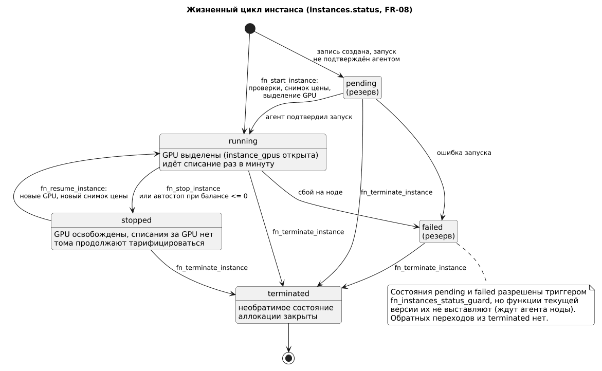
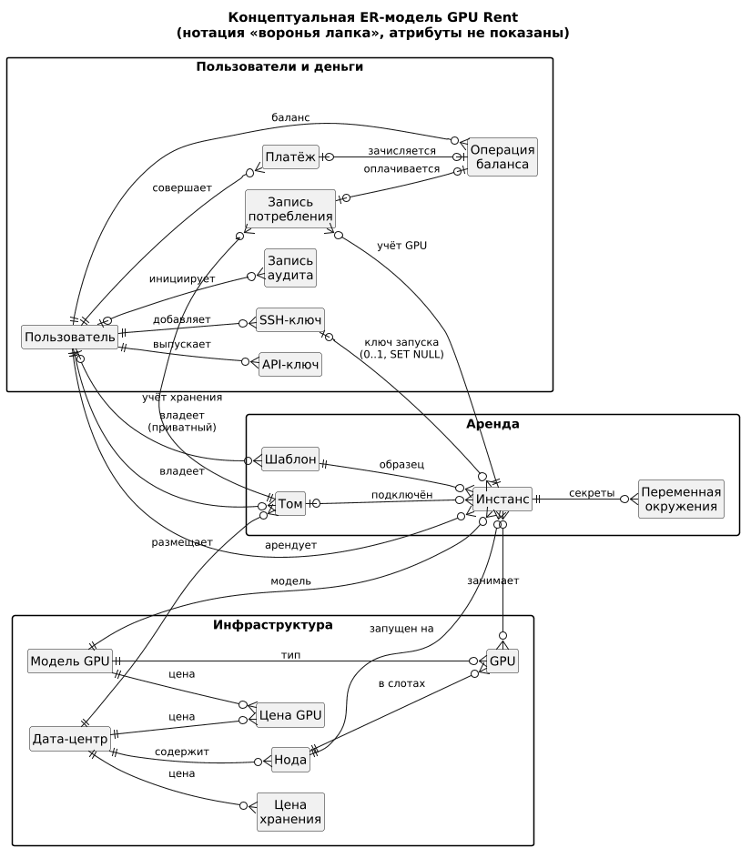
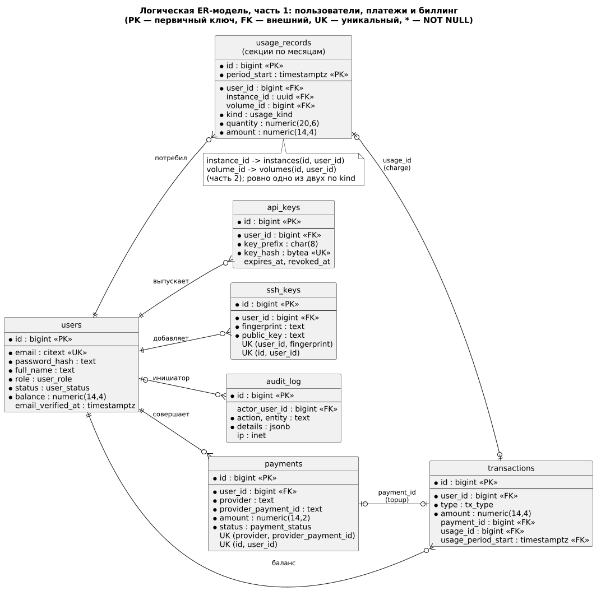
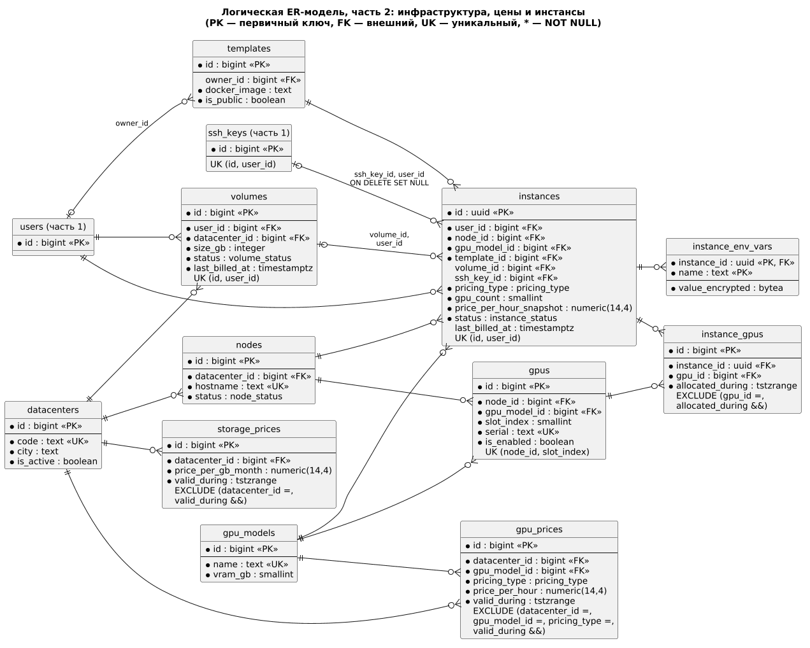
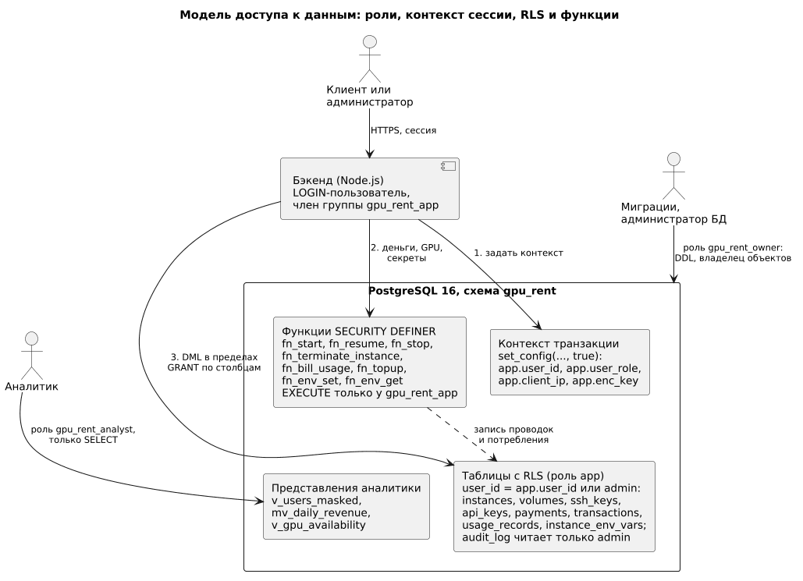

# Цель работы

Освоить процесс проектирования базы данных монолитного веб-приложения и выполнить его на проекте GPU Rent — сервисе аренды облачных GPU-серверов: от требований П2 прийти к сущностям и бизнес-правилам, построить концептуальную и логическую модели, описать данные словарём, обосновать типы, ключи и ограничения и закрепить на уровне проекта решения по производительности, нормализации и безопасности.

# Задание

Шаги задания (в отчёте — разделы 3.1–3.6):

1. Изучить основы проектирования баз данных: сущности, атрибуты, отношения, нормализацию.
2. Провести анализ требований, определить необходимые сущности и их атрибуты.
3. Создать схему базы данных: таблицы, связи, ключи; разработать детали структуры данных — типы, индексы, ограничения.
4. Рассмотреть методы оптимизации производительности: индексирование, кэширование, агрегирование.
5. Рассмотреть нормализацию и денормализацию для оптимизации запросов.
6. Учесть меры безопасности данных: ограничения доступа и шифрование.

Тексты практических занятий 3 и 4 совпадают, поэтому работа разделена. **П3 (настоящий отчёт)** — анализ данных, концептуальная и логическая модели: что хранится, почему схема устроена именно так и какие требования она предъявляет к реализации (ограничения, индексы, секции, роли, шифрование). **П4** — физическая реализация в PostgreSQL 16 (миграции `db/migrations`, тестовые данные, тесты) и измерения `EXPLAIN ANALYZE` до и после оптимизации. Измерений в этом отчёте нет; где речь о реализации и цифрах, дана ссылка на П4.

Схема уже реализована миграциями 0001–0012. Когда первоначальный проект и реализация различаются, в отчёте описана фактическая схема; расхождения собраны в разделе 3.3.6.

# Ход работы

Подразделы 3.1–3.6 соответствуют шагам задания 1–6. Обозначения: FR-xx и NFR-xx — требования П2 (таблицы 7 и 8 отчёта П2), BR-xx — бизнес-правила (таблица 4). Имена таблиц, столбцов и функций приведены по миграциям репозитория.

## Основы проектирования баз данных

### Сущность, атрибут, связь, кардинальность

**Сущность** — класс объектов предметной области, о которых хранятся данные (пользователь, инстанс, платёж); **атрибут** — её свойство (email, статус): обязательное или нет, простое или составное, хранимое или вычисляемое. **Связь** — осмысленная ассоциация сущностей; её **кардинальность** говорит, сколько экземпляров одной сущности связано с одним экземпляром другой (1:1, 1:N, M:N), а **обязательность** — может ли экземпляр существовать без связи. Использована нотация «воронья лапка» (развитие модели Чена [1]): черта — «один», кружок — «ноль», «лапка» — «много». В реляционной модели 1:N реализуется внешним ключом на стороне «много», 1:1 — внешним ключом с `UNIQUE`, M:N — ассоциативной таблицей; в проекте так устроена связь «инстанс — физическая GPU» (`instance_gpus`) с атрибутом связи — периодом занятости.

### Ключи и целостность

Ключ — минимальный набор атрибутов, однозначно определяющий кортеж [2, 3]. Из потенциальных ключей один становится первичным (PK), остальные — альтернативными (`UNIQUE`). **Естественный** ключ берётся из предметной области (email, hostname), **суррогатный** — служебный идентификатор без предметного смысла. Суррогатный ключ не меняется при правке бизнес-данных и компактен во внешних ключах, поэтому он есть почти в каждой таблице проекта (исключения — `instance_env_vars` с составным естественным PK и `schema_migrations`, где ключ — номер миграции), а естественные ключи сохранены как `UNIQUE`. **Внешний ключ** (FK) гарантирует ссылочную целостность. Целостность бывает сущностной (PK уникален и не `NULL`), ссылочной (FK указывает на существующую строку), доменной (тип, `NOT NULL`, `CHECK`) и пользовательской — правила, которые не выразить типом или ключом (триггеры, `EXCLUDE`, функции) [4]. Чем больше правил обеспечивает СУБД, тем меньше зависимость от каждого места в коде приложения.

### Нормальные формы

Нормализация устраняет избыточность и аномалии вставки, обновления и удаления [5]. **1НФ** — значения атомарны, повторяющихся групп нет. **2НФ** — нет зависимости неключевых атрибутов от части составного ключа. **3НФ** — нет транзитивных зависимостей неключевых атрибутов от ключа. **НФБК** — левая часть каждой нетривиальной функциональной зависимости является суперключом. **4НФ** — независимые многозначные факты об объекте хранятся в разных таблицах. **Денормализация** — осознанная избыточность ради скорости чтения; допустима, если есть механизм, не дающий копиям разойтись (раздел 3.5.3).

### Уровни моделирования

Модель строится от общего к частному (таблица 1). Граница между П3 и П4 проходит по индексам, секциям и ролям: здесь они выведены как требования с обоснованием (раздел 3.4), в П4 реализованы и проверены замерами.

Таблица 1 — Уровни модели данных

| Уровень | Что описывает | Артефакты | Отчёт |
|---|---|---|---|
| Концептуальный | Сущности и связи, без атрибутов и СУБД | Рисунок 2 | П3 |
| Логический | Таблицы, атрибуты, типы, ключи, ограничения, нормальные формы | Рисунки 3, 4, словарь данных | П3 |
| Физический | DDL, индексы, секции, роли, объёмы, время выполнения | `db/migrations`, `db/seed`, `db/tests`, `db/bench` | П4 |

## Требования и анализ данных

### От требований к информационным потребностям

Для каждого требования П2 выписано, что нужно хранить, читать и проверять, по какому условию искать и как часто обращаться (таблица 2). Результат определяет состав сущностей и горячие запросы (раздел 3.4.1). Объём оценён в П2: при 100 работающих инстансах и записи раз в минуту учёт потребления растёт примерно на 52,6 млн строк в год (NFR-05).

Таблица 2 — Информационные потребности

| Потребность | Требования | Данные | Обращение |
|---|---|---|---|
| Учётные записи | FR-01, FR-02, NFR-03 | email, хэш пароля, роль, статус | Чтение при входе |
| Ключи доступа | FR-03, FR-04 | SSH-ключи, хэши API-ключей, срок, отзыв | Поиск ключа API в каждом запросе API |
| Парк оборудования | FR-05, FR-14 | ДЦ, модели GPU, ноды, GPU | Частое чтение, редкая запись |
| Цены с историей | FR-05, FR-10, FR-15 | Цена GPU и хранения по ДЦ, модели, тарифу, периоду | Горячее чтение; проверка пересечений |
| Шаблоны и тома | FR-06, FR-09 | Образ, диск; размер, ДЦ, владелец тома | Чтение, средняя запись |
| Аренда GPU | FR-07, FR-08, FR-16 | Параметры, статус, выделенные GPU, снимок цены, секреты | Опрос статуса каждые 3 с |
| Учёт потребления | FR-10, FR-13, NFR-05 | Интервалы работы GPU и хранения, количество, сумма | Запись раз в минуту на инстанс |
| Баланс и журнал | FR-10–FR-13, NFR-04 | Проводки, баланс, связь списания с потреблением | Баланс читается при каждом запуске |
| Платежи | FR-11 | Провайдер, идентификатор платежа, сумма, статус | Идемпотентная запись по webhook |
| Аудит | FR-18, NFR-06 | Кто, что, когда, старое и новое значение, IP | Только добавление |
| Аналитика | FR-17, NFR-09 | Выручка по дням, ДЦ, моделям; пользователи без ПДн | Агрегаты |

### Сущности

Из потребностей выделено 18 предметных сущностей (таблица 3) и служебная таблица `schema_migrations` — журнал применённых миграций (NFR-08).

Таблица 3 — Сущности предметной области

| Сущность | Назначение | Требования |
|---|---|---|
| `users` | Клиенты и администраторы; кэш баланса | FR-01, FR-02, FR-16 |
| `api_keys` | Ключи API (только хэш) | FR-04 |
| `ssh_keys` | Публичные SSH-ключи | FR-03 |
| `datacenters` | Дата-центры | FR-05, FR-14 |
| `gpu_models` | Модели GPU и характеристики | FR-05, FR-14 |
| `nodes` | Серверы дата-центра | FR-14 |
| `gpus` | Физические GPU | FR-05, FR-14 |
| `gpu_prices` | История цен GPU по ДЦ, модели, тарифу | FR-05, FR-10, FR-15 |
| `storage_prices` | История цен хранения по ДЦ | FR-09, FR-15 |
| `templates` | Шаблоны запуска, публичные и приватные | FR-06 |
| `volumes` | Сетевые тома | FR-09 |
| `instances` | Инстансы: параметры, статус, снимок цены | FR-07, FR-08, FR-16 |
| `instance_gpus` | Выделение GPU инстансам по времени | FR-07, FR-08 |
| `instance_env_vars` | Зашифрованные переменные окружения | FR-07, NFR-03 |
| `usage_records` | Учёт потребления, секции по месяцам | FR-10, FR-13, NFR-05 |
| `transactions` | Журнал операций баланса (ledger) | FR-10–FR-13, NFR-04 |
| `payments` | Платежи через шлюз | FR-11 |
| `audit_log` | Журнал аудита | FR-18, NFR-06 |

Два решения по составу приняты осознанно. Цена вынесена в таблицы с периодом действия, а не в атрибут модели GPU: она зависит от ДЦ, тарифа и времени, а историю нужно хранить (FR-15). Занятость GPU не хранится признаком в `gpus`, а выводится из `instance_gpus`, где каждая запись — интервал занятости: так можно восстановить, кто и когда занимал GPU.

Атрибуты выделялись теми же шагами: каждому нужен источник-требование и способ использования. Из FR-04 получены `key_prefix`, `key_hash`, `expires_at`, `revoked_at`; из FR-10 — `price_per_hour_snapshot` и `last_billed_at`; из FR-09 — `size_gb` и `datacenter_id` тома; из FR-18 — `details` и `ip` журнала. Атрибуты, которые не нужны ни одному требованию (телефон, адрес), не включены: это минимизация данных (раздел 3.6.5). Полный перечень — в словаре данных (раздел 3.3.5).

### Бизнес-правила

Бизнес-правила — утверждения о данных, которые должны выполняться всегда. Правило, нарушение которого портит деньги или ресурсы, защищается в самой СУБД, а не только в коде приложения; механизм каждого правила указан в таблице 4.

Таблица 4 — Бизнес-правила и механизмы их обеспечения

| ID | Правило | Требования | Механизм |
|---|---|---|---|
| BR-01 | Email уникален без учёта регистра | FR-01 | `citext`, `UNIQUE`, `CHECK` формата |
| BR-02 | Пароль хранится только как bcrypt-хэш | NFR-03 | `CHECK` формата `$2a/$2b/$2y$…` |
| BR-03 | API-ключ хранится как sha256 и уникален; SSH-ключ уникален в аккаунте | FR-03, FR-04 | `UNIQUE (key_hash)`; `UNIQUE (user_id, fingerprint)` |
| BR-04 | Одна GPU занята не более чем одним инстансом в любой момент | FR-07, FR-08 | `EXCLUDE USING gist (gpu_id =, allocated_during &&)`; подбор `FOR UPDATE SKIP LOCKED` |
| BR-05 | Инстанс получает ровно `gpu_count` (1–8) GPU одной online-ноды нужной модели и ДЦ | FR-07 | `CHECK`; `fn_start_instance`; триггер `fn_instance_gpus_consistency` |
| BR-06 | Цены позиции (ДЦ, модель, тариф) не пересекаются во времени; цена больше нуля | FR-15 | `EXCLUDE` в `gpu_prices`, `storage_prices`; `CHECK` |
| BR-07 | Цена фиксируется снимком при запуске и обновляется при повторном | FR-10 | `price_per_hour_snapshot`; `fn_start_instance`, `fn_resume_instance` |
| BR-08 | Том и нода инстанса — в одном ДЦ; ДЦ ноды и тома неизменяем | FR-09 | Триггеры `fn_instances_volume_dc`, `fn_forbid_column_change` |
| BR-09 | Том подключён не более чем к одному живому (`pending`, `running`, `stopped`) инстансу | FR-09 | Частичный `UNIQUE uq_instances_active_volume` |
| BR-10 | Том: 10–10000 ГБ, размер только растёт; подключённый не удаляется, удалённый не возвращается | FR-09 | `CHECK`; триггер `fn_volumes_guard` |
| BR-11 | Инстанс, том, платёж, потребление и проводка согласованы по владельцу | NFR-03, NFR-04 | `UNIQUE (id, user_id)`, составные FK |
| BR-12 | Статус инстанса меняется по графу переходов, `terminated` необратим; владелец, модель, число GPU и тариф не меняются | FR-08 | Триггеры `fn_instances_status_guard`, `fn_forbid_column_change` |
| BR-13 | Журнал, учёт потребления и аудит только дополняются | NFR-04, NFR-06 | Триггеры `BEFORE UPDATE/DELETE/TRUNCATE`; `REVOKE` |
| BR-14 | Баланс равен сумме проводок и меняется только проводкой; начальный баланс 0 | NFR-04 | Триггеры `fn_ledger_apply`, `fn_users_guard` |
| BR-15 | Знак проводки соответствует типу; суммы не `NaN` | NFR-04 | `CHECK ck_transactions_sign` |
| BR-16 | Списание ссылается на своё потребление; одно потребление — одно списание | FR-10 | `CHECK`; частичный `UNIQUE` |
| BR-17 | Пополнение ссылается на платёж; один платёж — одно зачисление; повторный webhook безвреден | FR-11 | `UNIQUE (provider, provider_payment_id)`; частичный `UNIQUE`; `fn_topup` |
| BR-18 | Интервалы потребления не повторяются, граница учёта не идёт назад | FR-10 | `UNIQUE (instance_id, period_start)`, `last_billed_at` |
| BR-19 | При балансе не выше нуля инстансы останавливаются в транзакции списания | FR-12 | `fn_bill_usage`, запись в `audit_log` |
| BR-20 | Запуск — активному пользователю с балансом не меньше стоимости часа | FR-07, FR-16 | `fn_start_instance` (GR003, GR002) |
| BR-21 | Шаблон публичный тогда и только тогда, когда у него нет владельца | FR-06 | `CHECK ck_templates_public_owner` |
| BR-22 | Секреты окружения хранятся зашифрованными; пустой ключ — ошибка | NFR-03 | `fn_env_set`, `fn_env_get` (GR006) |
| BR-23 | Смена роли и статуса пользователя, правка цен, смена статуса инстанса попадают в аудит | FR-18 | Триггеры `fn_audit_*` |
| BR-24 | Платёж: `pending` → `succeeded`/`failed`, `succeeded` → `refunded`; сумма и владелец неизменны | FR-11 | Триггеры `fn_payments_status_guard`, `fn_forbid_column_change` |

### Жизненный цикл инстанса

Статусы инстанса образуют конечный автомат (рисунок 1, FR-08). Допустимые переходы заданы триггером `fn_instances_status_guard`; любая другая пара отклоняется, а `terminated` — конечное состояние.



В `running` у инстанса есть открытые записи в `instance_gpus` и раз в минуту идёт списание. `fn_stop_instance` сначала дотарифицирует интервал до момента остановки, затем закрывает периоды занятости GPU; в `stopped` GPU свободны и могут достаться другому клиенту, а тома продолжают тарифицироваться. Поэтому `fn_resume_instance` заново подбирает GPU и обновляет снимок цены, и возобновление не гарантировано, если свободных GPU нет (ошибка GR001).

Состояния `pending` и `failed` схемой разрешены, но функции их не выставляют: `fn_start_instance` создаёт инстанс сразу в `running`, запуск на ноде эмулируется. Они зарезервированы под агент ноды (раздел 3.3.6). Платёж и том имеют более простые автоматы: платёж `pending` → `succeeded` или `failed`, затем `succeeded` → `refunded`; том `active` → `deleted` без возврата.

## Проектирование схемы базы данных

### Концептуальная модель

Концептуальная модель (рисунок 2) фиксирует сущности и связи без атрибутов; сущности собраны в три области: пользователи и деньги, аренда, инфраструктура. Четыре особенности определяют остальное проектирование. Связь «инстанс занимает GPU» — многие ко многим и зависит от времени: одна GPU за месяц обслуживает много инстансов, а инстанс при повторном запуске получает другие GPU. Цена — самостоятельная сущность, привязанная к ДЦ и модели и действующая в течение периода. Денежные факты разделены на платёж (внешнее событие), запись потребления (что израсходовано) и операцию баланса (что списано или зачислено); пополнение связано не более чем с одним платежом, списание — не более чем с одной записью потребления. Том переживает инстанс, но в каждый момент подключён не более чем к одному живому инстансу.



### Логическая модель

Логическая модель разбита на две диаграммы: «пользователи, платежи и биллинг» (рисунок 3) и «инфраструктура, цены и инстансы» (рисунок 4). На рисунках — ключи и ключевые атрибуты, полный список полей — в словаре данных (раздел 3.3.5).





Соглашения схемы `gpu_rent`: имена таблиц — во множественном числе, `snake_case`; ограничения именуются по виду (`pk_`, `fk_`, `uq_`, `ck_`, `ex_`), индексы — `idx_`; первичный ключ — `id bigint GENERATED ALWAYS AS IDENTITY`, исключения — `instances.id` (uuid), составной PK у `instance_env_vars` и `usage_records` (`id`, `period_start`); все столбцы `NOT NULL`, кроме тех, где отсутствие значения несёт смысл; статусы и виды — девять перечислений (`enum`), значения которых указаны в словаре. В схеме 19 первичных ключей (18 предметных таблиц и `schema_migrations`), 28 внешних (шесть составных), 36 именованных `CHECK`, три `EXCLUDE`, 20 триггеров на таблицах в миграциях и функции жизненного цикла, биллинга и секретов.

### Описание связей

Связи, их тип, обязательность и реализация даны в таблице 5. Составные внешние ключи решают отдельную задачу (BR-11): запись не может ссылаться на объект другого пользователя. Например, потребление не может указывать на чужой инстанс, потому что пара (`instance_id`, `user_id`) должна существовать в `instances`.

Таблица 5 — Связи между таблицами

| Связь | Тип | Обязательность | Реализация |
|---|---|---|---|
| `users` — `api_keys`, `ssh_keys` | 1:N | Да | FK `user_id`, `ON DELETE CASCADE` |
| `users` — `payments`, `transactions`, `volumes`, `instances` | 1:N | Да | FK `user_id`, индексы по `user_id` |
| `users` — `templates` | 1:N | Нет: `NULL` — публичный | FK `owner_id`; `CHECK is_public = (owner_id IS NULL)` |
| `users` — `audit_log` | 1:N | Нет: `NULL` — система | FK `actor_user_id` |
| `datacenters` — `nodes`, `volumes`, `gpu_prices`, `storage_prices` | 1:N | Да | FK `datacenter_id` |
| `nodes` — `gpus` | 1:N | Да | FK; `UNIQUE (node_id, slot_index)` |
| `gpu_models` — `gpus`, `gpu_prices`, `instances` | 1:N | Да | FK `gpu_model_id` |
| `nodes`, `templates` — `instances` | 1:N | Да | FK; ДЦ инстанса выводится через ноду |
| `volumes` — `instances` | 1:N, не более одного живого | Нет | Составной FK (`volume_id`, `user_id`); частичный `UNIQUE` |
| `ssh_keys` — `instances` | 1:N | Нет | Составной FK (`ssh_key_id`, `user_id`), `ON DELETE SET NULL (ssh_key_id)` |
| `instances` — `gpus` | M:N с периодом | Да: `gpu_count` GPU у работающего | Таблица `instance_gpus`; `EXCLUDE` |
| `instances` — `instance_env_vars` | 1:N | Нет | FK, `CASCADE`; PK (`instance_id`, `name`) |
| `instances` — `usage_records` | 1:N | Нет: только `gpu` | Составной FK (`instance_id`, `user_id`) |
| `volumes` — `usage_records` | 1:N | Нет: только `storage` | Составной FK (`volume_id`, `user_id`); `CHECK` «одно из двух» |
| `usage_records` — `transactions` | 1:0..1 | Для `charge` | Составной FK (`usage_id`, `usage_period_start`); частичный `UNIQUE` |
| `payments` — `transactions` | 1:0..1 | Для `topup` | Составной FK (`payment_id`, `user_id`); частичный `UNIQUE` |

Связь «ДЦ — модель GPU» реализована таблицей `gpu_prices` — ассоциативной сущностью с атрибутами «тариф», «цена», «период». Внешний ключ на секционированную `usage_records` обязан ссылаться на полный первичный ключ (`id`, `period_start`) [6], поэтому в `transactions` есть `usage_period_start`.

### Выбор типов данных

Критерии: точность (деньги и время не терпят накопления ошибок), защита от неверных значений и цена хранения на больших таблицах. Решения и отвергнутые альтернативы — в таблице 6; справочник типов — [7].

Таблица 6 — Выбор типов данных

| Данные | Тип | Альтернатива | Обоснование |
|---|---|---|---|
| Идентификаторы | `bigint GENERATED ALWAYS AS IDENTITY` | `serial`, `uuid` | 8 байт, монотонная вставка, компактные FK; `ALWAYS` запрещает ручной `id` |
| `instances.id` | `uuid`, `gen_random_uuid()` | `bigint` | Виден в URL и API: случайный идентификатор нельзя угадать перебором (не заменяет проверку прав) |
| Цены, суммы списаний | `numeric(14,4)` | `float`, `money` | `float` копит двоичную погрешность, `money` зависит от локали; четыре знака нужны, так как цена секунды меньше копейки; `CHECK <> 'NaN'` |
| Платежи | `numeric(14,2)` | `numeric(14,4)` | Рубли и копейки; предел меньше 10^10 согласован с `transactions.amount` |
| Количество | `numeric(20,6)` | `double precision` | Секунды и ГБ·с без потери точности |
| Время | `timestamptz` | `timestamp` | Абсолютный момент; БД в UTC, границы месячных секций не зависят от пояса сессии |
| Периоды | `tstzrange`, `[)` | Пара столбцов | `&&` и `EXCLUDE` (GiST, `btree_gist`) запрещают пересечения декларативно [8]; открытый конец — «действует сейчас» |
| Статусы, виды | `enum` | Справочник; `text` + `CHECK` | Короткие стабильные наборы, 4 байта, опечатка невозможна; минус: значение нельзя удалить. Справочники — ДЦ и модели: они меняются данными |
| Email | `citext` | `text` + `lower()` | Сравнение без регистра и `UNIQUE` без функционального индекса |
| Хэш ключа, шифртекст | `bytea` | `text` (hex, base64) | Компактнее; `CHECK` длины 32 у sha256 |
| Аудит `details` | `jsonb` | Столбцы | Состав события различается; индексируется GIN |
| IP-адрес | `inet` | `text` | Проверка формата, операторы сетей |
| Малые числа | `smallint` | `integer` | `gpu_count`, `slot_index`, `vram_gb`: экономия и самодокументируемый диапазон |
| Строки | `text` + `CHECK` | `varchar(n)` | `varchar(n)` не быстрее; `char(2)`, `char(8)` — только для кодов фиксированной длины |

### Словарь данных

Словарь описывает все таблицы схемы `gpu_rent` (таблицы 7–24). «NULL» — допустимость пустого значения. Стандартный первичный ключ `id bigint GENERATED ALWAYS AS IDENTITY` в таблицах не показан; строками выделены только нестандартные ключи (`instances`, `instance_env_vars`, `usage_records`). Метки `created_at` (`timestamptz NOT NULL DEFAULT now()`) указаны, если у них особая роль. Служебная `schema_migrations` (`version text` — PK, `applied_at timestamptz`) в словарь не включена. Полные определения — в `db/migrations/0003_reference_tables.sql` и `0004_core_tables.sql`.

Таблица 7 — Словарь данных: `users`

| Поле | Тип | NULL | Ключ, ограничения | Описание |
|---|---|---|---|---|
| email | citext | нет | `UNIQUE`; `CHECK` формата | Логин без учёта регистра |
| password_hash | text | нет | `CHECK` формата bcrypt | Хэш пароля |
| full_name | text | нет | — | ФИО (ПДн) |
| role | user_role | нет | `DEFAULT 'client'` | `client`, `admin` |
| status | user_status | нет | `DEFAULT 'active'` | `active`, `blocked` |
| balance | numeric(14,4) | нет | `DEFAULT 0` | Кэш суммы проводок (D-1) |
| email_verified_at | timestamptz | да | — | `NULL` — не подтверждён |
| created_at, updated_at | timestamptz | нет | `DEFAULT now()` | Создание, правка профиля |

Таблица 8 — Словарь данных: `api_keys`

| Поле | Тип | NULL | Ключ, ограничения | Описание |
|---|---|---|---|---|
| user_id | bigint | нет | FK → `users`, `CASCADE` | Владелец |
| name | text | нет | — | Название |
| key_prefix | char(8) | нет | — | Видимая часть ключа |
| key_hash | bytea | нет | `UNIQUE`; длина 32 | sha256 ключа |
| last_used_at | timestamptz | да | — | Последнее использование |
| expires_at | timestamptz | да | `CHECK` позже `created_at` | Срок; `NULL` — бессрочный |
| revoked_at | timestamptz | да | — | Момент отзыва |

Таблица 9 — Словарь данных: `ssh_keys`

| Поле | Тип | NULL | Ключ, ограничения | Описание |
|---|---|---|---|---|
| user_id | bigint | нет | FK → `users`, `CASCADE` | Владелец |
| name | text | нет | — | Название |
| public_key | text | нет | `CHECK` префикса `ssh-`/`ecdsa-` | Публичный ключ |
| fingerprint | text | нет | `UNIQUE (user_id, fingerprint)` | Отпечаток |

Таблица 10 — Словарь данных: `datacenters`

| Поле | Тип | NULL | Ключ, ограничения | Описание |
|---|---|---|---|---|
| code | text | нет | `UNIQUE` | Код, например `MSK-1` |
| name | text | нет | — | Название |
| city | text | нет | — | Город |
| country | char(2) | нет | `CHECK [A-Z]{2}` | Код страны |
| is_active | boolean | нет | `DEFAULT true` | Доступен для запуска |

Таблица 11 — Словарь данных: `gpu_models`

| Поле | Тип | NULL | Ключ, ограничения | Описание |
|---|---|---|---|---|
| vendor | text | нет | — | Производитель |
| name | text | нет | `UNIQUE` | Модель, `RTX 4090` |
| vram_gb | smallint | нет | `CHECK > 0` | Видеопамять, ГБ |
| fp32_tflops | numeric(8,2) | нет | `CHECK > 0` | Производительность FP32 |

Таблица 12 — Словарь данных: `nodes`

| Поле | Тип | NULL | Ключ, ограничения | Описание |
|---|---|---|---|---|
| datacenter_id | bigint | нет | FK → `datacenters`; неизменяем | ДЦ ноды |
| hostname | text | нет | `UNIQUE` | Имя сервера |
| cpu_cores | smallint | нет | `CHECK > 0` | Ядра |
| ram_gb, disk_gb | integer | нет | `CHECK > 0` | Память и диск, ГБ |
| status | node_status | нет | `DEFAULT 'online'` | `online`, `maintenance`, `offline` |

Таблица 13 — Словарь данных: `gpus`

| Поле | Тип | NULL | Ключ, ограничения | Описание |
|---|---|---|---|---|
| node_id | bigint | нет | FK → `nodes` | Нода |
| gpu_model_id | bigint | нет | FK → `gpu_models` | Модель |
| slot_index | smallint | нет | `CHECK >= 0`; `UNIQUE (node_id, slot_index)` | Слот в ноде |
| serial | text | нет | `UNIQUE` | Серийный номер |
| is_enabled | boolean | нет | `DEFAULT true` | `false` — выведена из эксплуатации |

Таблица 14 — Словарь данных: `gpu_prices`

| Поле | Тип | NULL | Ключ, ограничения | Описание |
|---|---|---|---|---|
| datacenter_id | bigint | нет | FK → `datacenters` | ДЦ |
| gpu_model_id | bigint | нет | FK → `gpu_models` | Модель |
| pricing_type | pricing_type | нет | — | `on_demand`, `spot` |
| price_per_hour | numeric(14,4) | нет | `CHECK > 0` | ₽ за одну GPU в час |
| valid_during | tstzrange | нет | `CHECK` границ; `EXCLUDE` по позиции | Период; открытый конец — действует сейчас |

Таблица 15 — Словарь данных: `storage_prices`

| Поле | Тип | NULL | Ключ, ограничения | Описание |
|---|---|---|---|---|
| datacenter_id | bigint | нет | FK → `datacenters` | ДЦ |
| price_per_gb_month | numeric(14,4) | нет | `CHECK > 0` | ₽ за ГБ в месяц (30 суток) |
| valid_during | tstzrange | нет | `CHECK` границ; `EXCLUDE (datacenter_id =, … &&)` | Период действия |

Таблица 16 — Словарь данных: `templates`

| Поле | Тип | NULL | Ключ, ограничения | Описание |
|---|---|---|---|---|
| owner_id | bigint | да | FK → `users` | `NULL` — публичный |
| name | text | нет | — | Название |
| docker_image | text | нет | — | Образ Docker |
| default_disk_gb | integer | нет | `CHECK > 0` | Диск по умолчанию |
| default_ports | text | нет | `DEFAULT ''` | Порты |
| is_public | boolean | нет | `CHECK` с `owner_id` | Публичный шаблон |

Таблица 17 — Словарь данных: `volumes`

| Поле | Тип | NULL | Ключ, ограничения | Описание |
|---|---|---|---|---|
| user_id | bigint | нет | FK → `users`; `UNIQUE (id, user_id)`; неизменяем | Владелец |
| datacenter_id | bigint | нет | FK → `datacenters`; неизменяем | ДЦ тома |
| name | text | нет | — | Название |
| size_gb | integer | нет | `CHECK BETWEEN 10 AND 10000` | Размер, только растёт |
| status | volume_status | нет | `DEFAULT 'active'` | `active`, `deleted` |
| deleted_at | timestamptz | да | `CHECK` со `status` | Момент удаления |
| last_billed_at | timestamptz | нет | `CHECK >= created_at` | Граница биллинга (D-5) |

Таблица 18 — Словарь данных: `instances`

| Поле | Тип | NULL | Ключ, ограничения | Описание |
|---|---|---|---|---|
| id | uuid | нет | PK; `UNIQUE (id, user_id)` | Идентификатор в URL |
| user_id | bigint | нет | FK → `users`; неизменяем | Владелец |
| node_id | bigint | нет | FK → `nodes` | Текущая нода |
| gpu_model_id | bigint | нет | FK → `gpu_models`; неизменяем | Модель (D-4) |
| template_id | bigint | нет | FK → `templates` | Шаблон |
| volume_id | bigint | да | Составной FK → `volumes`; частичный `UNIQUE` | Подключённый том |
| ssh_key_id | bigint | да | Составной FK → `ssh_keys`, `SET NULL (ssh_key_id)` | SSH-ключ, выбранный при запуске |
| name | text | нет | — | Название |
| pricing_type | pricing_type | нет | неизменяем | `on_demand`, `spot` |
| gpu_count | smallint | нет | `CHECK BETWEEN 1 AND 8`; неизменяем | Число GPU |
| container_disk_gb | integer | нет | `CHECK > 0` | Диск контейнера |
| price_per_hour_snapshot | numeric(14,4) | нет | `CHECK > 0` | Цена всего инстанса в час при запуске |
| status | instance_status | нет | `DEFAULT 'pending'`; триггер | `pending`, `running`, `stopped`, `terminated`, `failed` |
| started_at | timestamptz | да | `CHECK`: задан у `running` | Начало последнего запуска |
| stopped_at | timestamptz | да | — | Момент остановки |
| terminated_at | timestamptz | да | `CHECK` со `status` | Завершение |
| last_billed_at | timestamptz | да | `CHECK`: задан у `running` | Списано до момента (D-5) |

Таблица 19 — Словарь данных: `instance_gpus`

| Поле | Тип | NULL | Ключ, ограничения | Описание |
|---|---|---|---|---|
| instance_id | uuid | нет | FK → `instances` | Инстанс |
| gpu_id | bigint | нет | FK → `gpus`; триггер | GPU в ноде инстанса и его модели |
| allocated_during | tstzrange | нет | `CHECK`; `EXCLUDE (gpu_id =, … &&)` | Период занятости; открытый конец — занята сейчас |

Таблица 20 — Словарь данных: `instance_env_vars`

| Поле | Тип | NULL | Ключ, ограничения | Описание |
|---|---|---|---|---|
| instance_id | uuid | нет | PK (часть); FK → `instances`, `CASCADE` | Инстанс |
| name | text | нет | PK (часть); `CHECK` имени | Имя переменной |
| value_encrypted | bytea | нет | — | Значение, `pgp_sym_encrypt` |

Таблица 21 — Словарь данных: `usage_records`

| Поле | Тип | NULL | Ключ, ограничения | Описание |
|---|---|---|---|---|
| id | bigint | нет | PK (часть) | Идентификатор |
| period_start | timestamptz | нет | PK (часть); ключ секций | Начало интервала |
| user_id | bigint | нет | FK → `users` | Владелец (D-2) |
| instance_id | uuid | да | Составной FK; `UNIQUE (instance_id, period_start)` | Для `gpu` |
| volume_id | bigint | да | Составной FK; `UNIQUE (volume_id, period_start)` | Для `storage` |
| kind | usage_kind | нет | `CHECK` «одно из двух» | `gpu`, `storage` |
| period_end | timestamptz | нет | `CHECK > period_start` | Конец интервала |
| quantity | numeric(20,6) | нет | `CHECK > 0` | Секунды или ГБ·с |
| amount | numeric(14,4) | нет | `CHECK >= 0` | Сумма, ₽ (D-3) |

Таблица 22 — Словарь данных: `transactions`

| Поле | Тип | NULL | Ключ, ограничения | Описание |
|---|---|---|---|---|
| user_id | bigint | нет | FK → `users` | Владелец баланса |
| type | tx_type | нет | — | `topup`, `charge`, `refund`, `bonus`, `adjustment` |
| amount | numeric(14,4) | нет | `CHECK` знака по типу | Плюс — зачисление, минус — списание |
| payment_id | bigint | да | Составной FK; `CHECK` для `topup` | Зачтённый платёж |
| usage_id | bigint | да | Составной FK; `CHECK` для `charge` | Оплаченное потребление |
| usage_period_start | timestamptz | да | Часть FK на секции | Ключ секции потребления |
| description | text | нет | `DEFAULT ''` | Текст для пользователя |
| created_at | timestamptz | нет | `DEFAULT now()` | Момент проводки |

Таблица 23 — Словарь данных: `payments`

| Поле | Тип | NULL | Ключ, ограничения | Описание |
|---|---|---|---|---|
| user_id | bigint | нет | FK → `users`; `UNIQUE (id, user_id)`; неизменяем | Плательщик |
| provider | text | нет | `UNIQUE` вместе со следующим полем | Шлюз |
| provider_payment_id | text | нет | `UNIQUE` вместе с полем выше | Идентификатор у шлюза |
| amount | numeric(14,2) | нет | `CHECK` от 0 до 10^10; неизменяем | Сумма, ₽ |
| status | payment_status | нет | `DEFAULT 'pending'`; триггер | `pending`, `succeeded`, `failed`, `refunded` |
| paid_at | timestamptz | да | `CHECK` со `status` | Момент оплаты |

Таблица 24 — Словарь данных: `audit_log`

| Поле | Тип | NULL | Ключ, ограничения | Описание |
|---|---|---|---|---|
| actor_user_id | bigint | да | FK → `users` | Кто действовал; `NULL` — система |
| action | text | нет | — | Действие, `user.role_changed` |
| entity | text | нет | — | Таблица-объект |
| entity_id | text | да | — | Идентификатор объекта |
| details | jsonb | нет | `DEFAULT '{}'`; GIN | Старое и новое значение |
| ip | inet | да | — | Адрес клиента |

### Расхождения и открытые вопросы модели

Логическая модель сверена с требованиями П2 и с реализацией. Найдены расхождения и нерешённые вопросы (таблица 25); ни один не нарушает целостность денег и GPU, но часть требований закрыта не полностью.

Таблица 25 — Расхождения, ограничения и решения

| Вопрос | Состояние в миграциях 0001–0012 | Решение и план |
|---|---|---|
| SSH-ключ инстанса (FR-07) | Закрыто миграцией 0012: добавлен `instances.ssh_key_id`, сам ключ в БД не копируется и передаётся агенту ноды в команде запуска | Реализовано: составной FK (`ssh_key_id`, `user_id`) → `ssh_keys` с `ON DELETE SET NULL (ssh_key_id)`: удаление ключа отзывает его у будущих запусков, а чужой ключ привязать нельзя. Добавлены `UNIQUE (id, user_id)` у `ssh_keys`, частичный индекс `idx_instances_ssh_key` и параметр `p_ssh_key_id` в `fn_start_instance`; проверяет тест 13 |
| Согласие на обработку ПДн (NFR-09) | Момент и версия согласия не хранятся | Добавить `users.consent_at`, `users.consent_version` |
| Удаление аккаунта по запросу субъекта | Физическое удаление невозможно: внешние ключи и неизменяемый журнал | Обезличивание (служебные значения вместо email и ФИО, блокировка); не реализовано |
| Состояния `pending`, `failed` | Разрешены, функциями не выставляются; при `failed` аллокации не закрываются | С появлением агента ноды добавить функцию перехода в `failed` с закрытием аллокаций |
| История запусков | Повторный запуск перезаписывает `started_at`, `node_id`, снимок цены; суммы прошлых интервалов остаются в `usage_records` | `instance_runs` осознанно не вводится; развитие |
| Граница учёта хранения | `volumes.last_billed_at` добавлено сверх первоначального проекта: иначе границу пришлось бы искать как `max(period_end)` по всем секциям | Закреплено; хранение раз в минуту даёт на порядок больше строк, чем GPU, — рассмотреть почасовое начисление |
| Срок хранения секций | FK `transactions → usage_records` не даёт удалить секцию, пока на неё ссылается журнал | Согласовать срок потребления (не менее года, NFR-06) с архивированием журнала |
| Долг и округление | Баланс может уйти в минус между проходами; округление до 0,0001 ₽ на каждый интервал | Резервирование средств и накопительное округление — развитие |
| Подтверждение остановки агентом; история размеров томов | Не реализованы | Известные ограничения версии |

К уточнениям первоначального эскиза, которые уже включены в описание и расхождениями не считаются, относятся: связь списания с потреблением (`usage_id`, `usage_period_start`), составные внешние ключи владельца, суррогатный `id` в `instance_gpus`, столбец `instances.gpu_model_id`, проверки границ диапазонов и `NaN`.

## Оптимизация производительности на уровне проекта

Принцип: оптимизировать то, что дорого и часто, а решения, которые позже вводить дорого (секционирование, ключи, денормализация), закладывать сразу. Остальное выбирается по измерениям П4. Здесь — какие запросы считаются горячими, какие меры заложены и почему.

### Горячие запросы

Запросы ранжированы по частоте и влиянию на NFR-01 (p95 менее 300 мс, каталог при 1000 RPS) и NFR-05 (рост учёта); для каждого указана мера (таблица 26).

Таблица 26 — Горячие запросы и проектные решения

| Запрос | Частота | Решение |
|---|---|---|
| Каталог `v_gpu_availability` (FR-05) | До 1000 RPS, гость | Кэш Redis; в БД — частичный индекс занятых аллокаций, GiST-индекс цен |
| Мои инстансы (опрос статуса) | Каждые 3 с | Частичный индекс `instances (user_id)` без завершённых |
| Подбор GPU при запуске (FR-07) | На запуск | Индекс активных аллокаций, `UNIQUE (node_id, slot_index)`, `SKIP LOCKED` |
| Проход биллинга по работающим (FR-10) | Раз в минуту | Частичный индекс `instances (status)`; пользователь — в своей короткой транзакции |
| Баланс | Каждый запуск, кабинет | Поле `users.balance`, не сумма по журналу |
| История операций (FR-13) | Средняя | Индекс (`user_id`, `created_at DESC`, `id DESC`), keyset-пагинация |
| Расходы за период (FR-13) | Средняя | Секции по месяцам, индекс (`user_id`, `period_start`) |
| Дашборд выручки (FR-17) | Редко, тяжёлый | `mv_daily_revenue` |
| Вход по email, проверка API-ключа | Каждый вход и запрос API | `UNIQUE (email)`, `UNIQUE (key_hash)` |
| Webhook платежа (FR-11) | Единицы в минуту | `UNIQUE (provider, provider_payment_id)`, `fn_topup` идемпотентна |
| Поиск в аудите (FR-18) | Редко | GIN по `details`, индекс (`entity`, `entity_id`, `created_at`) |

### Индексирование

Правила проекта: (1) индексы внешних ключей создаются явно — PostgreSQL сам их не строит, а без них проверка ссылок при изменении родителя читает таблицу целиком; (2) если запрос касается малой доли строк, индекс делается частичным (`WHERE …`): он меньше и реже обновляется; (3) в составном индексе сначала равенство, затем диапазон или сортировка; (4) на самой пишущей таблице `usage_records` индексов минимум, потому что каждый индекс замедляет запись, которая идёт раз в минуту на каждый инстанс. Индексы, которые уже создают `PRIMARY KEY`, `UNIQUE` и `EXCLUDE`, повторно не объявляются. Теория индексов — [9], синтаксис — [7]. Проектные индексы даны в таблице 27.

Таблица 27 — Проектные индексы

| Индекс | Тип и условие | Назначение |
|---|---|---|
| `idx_instances_user_active` | B-tree (`user_id`) `WHERE status <> 'terminated'` | Список инстансов клиента; завершённых со временем большинство, индекс остаётся малым |
| `idx_instances_status_active` | B-tree (`status`) `WHERE` живые статусы | Активные инстансы для биллинга |
| `uq_instances_active_volume` | `UNIQUE` (`volume_id`) `WHERE` живые статусы | BR-09 |
| `idx_instances_ssh_key` | B-tree (`ssh_key_id`) `WHERE ssh_key_id IS NOT NULL` | Быстрый `SET NULL` при удалении SSH-ключа |
| `idx_instance_gpus_active` | B-tree (`gpu_id`) `WHERE upper_inf(allocated_during)` | «Какие GPU заняты сейчас» |
| `ex_*` (три `EXCLUDE`) | GiST | Запрет пересечений; попутно поиск по моменту `valid_during @> now()` |
| `idx_usage_user_period` | B-tree (`user_id`, `period_start`) на секции | Расходы пользователя за период |
| `idx_usage_period_brin` | BRIN (`period_start`) на секции | Диапазоны по времени: данные добавляются по порядку времени, индекс намного компактнее B-tree |
| `idx_transactions_user_created` | B-tree (`user_id`, `created_at DESC`, `id DESC`) | История; `id` нужен для пагинации без пропусков |
| `uq_transactions_topup_payment`, `uq_transactions_charge_usage` | `UNIQUE … WHERE type = …` | Идемпотентность зачисления и списания |
| `idx_audit_details`, `idx_audit_entity` | GIN `jsonb_path_ops`; B-tree (`entity`, `entity_id`, `created_at DESC`) | Поиск по содержимому (`@>`), история объекта |

Не индексируются булевы признаки низкой селективности (`is_enabled`, `is_active`) и таблицы из десятков строк.

### Секционирование, агрегирование, кэширование

**Секционирование.** `usage_records` делится по `period_start` помесячно (15 секций 2025-10…2026-12 и `DEFAULT`). Основание — NFR-05: десятки миллионов строк в год при запросах почти всегда за период, поэтому читается одна секция. Старые данные отсоединяются секцией, а не массовым `DELETE`; индексы секций помещаются в память [6, 9]. Цена известна заранее: уникальные ограничения включают ключ секционирования (`PK (id, period_start)`), внешний ключ на таблицу возможен только по полному PK, секции создаются заранее функцией `fn_ensure_usage_partition`, а `DEFAULT` должна оставаться пустой.

**Агрегирование.** В схему заложены два агрегата: `users.balance` (раздел 3.5.3) и материализованное представление `mv_daily_revenue` — выручка и GPU-часы по дням (по Москве), ДЦ и моделям. Дашборд читает строку на день, ДЦ и модель вместо миллионов записей. Обновление — `REFRESH MATERIALIZED VIEW CONCURRENTLY` (нужен уникальный индекс, читатели не блокируются); цена — устаревание на период обновления, для дашборда допустимое. Модель и ДЦ берутся из `instances` и `nodes`, а не из `instance_gpus`: соединение с аллокациями размножило бы суммы в `gpu_count` раз.

**Кэширование.** Кэшируется то, что читают массово и что допускает небольшое устаревание: каталог и сессии. Каталог — Redis, cache-aside, ключ на пару «ДЦ — модель» (24 пары), время жизни 10 с, плюс `ETag`: при 1000 запросов в секунду к БД доходит около 2,4 запроса в секунду (расчёт П2). Устаревший кэш не опасен — наличие GPU окончательно проверяет `fn_start_instance`. Не кэшируются баланс, статусы и проверка API-ключа: источник истины — БД, а неверная сумма или отозванный ключ дороже точечного запроса по индексу. Списки и история выводятся keyset-пагинацией: стоимость страницы не растёт с её номером.

### Конкурентный доступ

Операции с деньгами и ресурсами оформлены функциями БД с единым порядком блокировок: сначала строка `users` (`FOR UPDATE`), затем ресурсы пользователя. Строки GPU берутся только с `SKIP LOCKED`, поэтому запуски разных пользователей не ждут друг друга и взаимоблокировок между ними нет. `last_billed_at` читается после блокировки, и граница учёта не идёт назад. Проход биллинга пропускает пользователя, чья строка занята, и спишет его следующим проходом. Следствие для приложения: при высокой конкуренции запуск может получить отказ GR001 «нет свободных GPU», хотя GPU освободятся через миллисекунды, поэтому вызов нужно уметь повторять. Контекст `app.user_id` задаётся транзакционно, что совместимо с PgBouncer в режиме транзакций.

### Требования к физической модели и сценарии П4

Решения раздела сведены в требования к реализации и сопоставлены со сценариями измерений П4 (таблица 28); результатов измерений в отчёте нет.

Таблица 28 — Требования к реализации и что проверяет П4

| Решение проекта | Требование к физической модели | Сравнение в П4 |
|---|---|---|
| Частичные индексы инстансов | Индекс с `WHERE`, FK-индексы | Без индекса, полный, частичный |
| Секционирование `usage_records` | `PARTITION BY RANGE`, секции вперёд, `DEFAULT` пуста | Запрос за месяц: вся таблица и одна секция |
| BRIN по времени | BRIN на секциях | Размер и скорость против B-tree |
| `users.balance` | Триггер-инкремент, прямой `UPDATE` запрещён | Сумма по журналу и поле |
| `mv_daily_revenue` | Уникальный индекс, `REFRESH … CONCURRENTLY` | Сырые данные и витрина |
| Каталог | Частичный индекс активных аллокаций | Без индекса и с ним |
| Keyset-пагинация | Индекс (`user_id`, `created_at DESC`, `id DESC`) | `OFFSET` и keyset |
| Объём данных | 5 000 пользователей, 20 000 инстансов, не менее 1 млн записей потребления за 12 месяцев, загрузка до 2 минут | Различия заметны только на реалистичных объёмах |

## Нормализация и денормализация

### Пошаговое приведение к нормальным формам

Возьмём «плоский» набор атрибутов — строку счёта за использование:

```text
СТРОКА_СЧЁТА(email, full_name, instance_id, instance_name, gpu_model,
             vram_gb, dc_code, dc_city, gpu_count, price_per_hour,
             period_start, period_end, amount)
```

Функциональные зависимости (таблица 29) следуют из бизнес-правил; допущение примера: цена неизменна в пределах запуска. Ключ — (`instance_id`, `period_start`).

Таблица 29 — Функциональные зависимости примера

| № | Зависимость | Смысл |
|---|---|---|
| F1 | `email` → `full_name` | ФИО определяется пользователем |
| F2 | `instance_id` → `email`, `instance_name`, `gpu_model`, `dc_code`, `gpu_count`, `price_per_hour` | Один владелец, модель, площадка, число GPU и цена запуска |
| F3 | `gpu_model` → `vram_gb` | Память определяется моделью |
| F4 | `dc_code` → `dc_city` | Город определяется площадкой |
| F5 | (`instance_id`, `period_start`) → `period_end`, `amount` | Интервал оплаты |
| F6 | `price_per_hour`, `period_start`, `period_end` → `amount` | Сумма вычисляется |

**Шаг 0: форма вне 1НФ.** Счёт за месяц как его видит пользователь: запись на месяц, внутри список инстансов, а в нём список интервалов. Вложенные повторяющиеся наборы в ячейке нарушают 1НФ: нельзя выбрать или изменить один интервал, нельзя задать ключ.

**Шаг 1: 1НФ.** Одна строка — один интервал одного инстанса; получено `СТРОКА_СЧЁТА` с ключом (`instance_id`, `period_start`). Аномалии остаются: город ДЦ повторяется в каждой строке (правка города требует обновить тысячи строк, пропуск одной даст противоречие); ДЦ или модель нельзя занести, пока нет счёта; удаление единственной строки счёта уничтожает сведения об инстансе и пользователе.

**Шаг 2: 2НФ.** Зависимость F2 частичная: её атрибуты, а через них и зависимые по F1, F3, F4, определяются частью ключа — `instance_id`. Атрибуты выносятся:

```text
ПОТРЕБЛЕНИЕ(instance_id, period_start, period_end, amount)      -- F5, F6
ИНСТАНС(instance_id, email, full_name, instance_name, gpu_model,
        vram_gb, dc_code, dc_city, gpu_count, price_per_hour)   -- F1-F4
```

**Шаг 3: 3НФ.** В `ИНСТАНС` остались транзитивные зависимости: `instance_id` → `email` → `full_name`, `instance_id` → `gpu_model` → `vram_gb`, `instance_id` → `dc_code` → `dc_city`. Они выносятся в свои отношения:

```text
ПОЛЬЗОВАТЕЛЬ(email, full_name)
МОДЕЛЬ_GPU(gpu_model, vram_gb)
ДЦ(dc_code, dc_city)
ИНСТАНС(instance_id, email, instance_name, gpu_model, dc_code,
        gpu_count, price_per_hour)
ПОТРЕБЛЕНИЕ(instance_id, period_start, period_end, amount)
```

**Шаг 4: НФБК.** Детерминанты каждого отношения — его ключи: `email`, `gpu_model`, `dc_code`, `instance_id`, (`instance_id`, `period_start`); схема в НФБК.

**Шаг 5: 4НФ.** Независимые многозначные факты об инстансе не смешиваются. Если бы в одной таблице лежали (`instance_id`, `ssh_key`, `env_name`), то при двух ключах и трёх переменных возникло бы шесть строк — независимые наборы перемножаются (`instance` →→ `ssh_key`, `instance` →→ `env_name`). В проекте переменные вынесены в `instance_env_vars`, ключи — в `ssh_keys`.

**Соответствие итоговой схеме.** `ПОЛЬЗОВАТЕЛЬ` → `users`, `МОДЕЛЬ_GPU` → `gpu_models`, `ДЦ` → `datacenters`, `ИНСТАНС` → `instances`, `ПОТРЕБЛЕНИЕ` → `usage_records`; у этих сущностей добавлены суррогатные ключи, а естественные остались `UNIQUE`. ДЦ в инстансе не хранится, а выводится: `instances.node_id` → `nodes.datacenter_id`, иначе `instance_id` → `node_id` → `datacenter_id` была бы транзитивной зависимостью. Несколько GPU у инстанса вынесены в `instance_gpus`: столбцы «gpu_1 … gpu_8» нарушили бы 1НФ, а ассоциативная таблица с периодом решает и это, и историю занятости. Сумма `amount` сохранена как производный атрибут (раздел 3.5.3).

### Проверка итоговой схемы на 3НФ

Для каждой таблицы выписаны функциональные зависимости (таблица 30). Формальные отступления двух видов: сознательные денормализации раздела 3.5.3 и один нарушающий 1НФ столбец — `templates.default_ports` (список портов одной строкой, например `22/tcp,8888/http`). Порты передаются агенту ноды целиком и в условиях запросов не участвуют, поэтому вынесение их в отдельную таблицу не окупается.

Таблица 30 — Проверка нормальных форм

| Таблица | Детерминанты | Вывод |
|---|---|---|
| `users` | `id`, `email` → все | НФБК: обе — потенциальные ключи |
| `gpus` | `id`; `serial`; (`node_id`, `slot_index`) → все | НФБК. Нода не определяет модель (в ноде допустимы разные) |
| `nodes`, `datacenters`, `gpu_models`, `api_keys`, `ssh_keys`, `volumes`, `payments` | `id` и альтернативные ключи (`hostname`, `code`, `name`, `key_hash`, пары в `UNIQUE`) → все | НФБК |
| `templates` | `id` → все | НФБК по ключам, но `default_ports` нарушает 1НФ: список портов одной строкой |
| `gpu_prices`, `storage_prices` | `id` → все; (позиция, момент) → цена | НФБК: `EXCLUDE` делает позицию с моментом потенциальным ключом |
| `instance_gpus` | `id` → все | НФБК. Нода не хранится: её определяет GPU (`gpu_id` → `node_id`) |
| `instance_env_vars` | (`instance_id`, `name`) → `value_encrypted` | НФБК |
| `instances` | `id` → все | 3НФ и НФБК внутри таблицы; `gpu_model_id` и снимок цены повторяют сведения других таблиц (D-4, снимок цены) |
| `usage_records` | (`id`, `period_start`) → все; (`instance_id`, `period_start`) → все | Ключи в порядке; `user_id` зависит от `instance_id`, `amount` — от цены и интервала: отступления D-2, D-3 |
| `transactions` | `id` → все | 3НФ; сумма списания повторяет `usage_records.amount` (D-3) |
| `audit_log` | `id` → все | НФБК |

### Осознанные денормализации

Денормализация ускоряет чтение, но усложняет запись и рискует создать противоречие, поэтому допустима только с механизмом согласования и способом проверки (таблица 31).

Таблица 31 — Денормализации и механизмы согласованности

| Что хранится (откуда выводится) | Зачем | Механизм и проверка |
|---|---|---|
| **D-1.** `users.balance` (сумма `transactions.amount`) | Баланс нужен при каждом запуске; сумма по журналу растёт с историей | Триггер `AFTER INSERT` добавляет сумму проводки (инкремент: O(1) и нет гонки «прочитал — записал»); прямой `UPDATE` отклоняется по `pg_trigger_depth()`; журнал неизменяем. Проверка: сверка `balance ≠ SUM` даёт 0 строк (NFR-04) |
| **D-2.** `usage_records.user_id` (владелец `instances` или `volumes`) | Агрегаты, RLS и индекс по пользователю без соединения | Составные FK (`instance_id`, `user_id`), (`volume_id`, `user_id`): значение не может отличаться от владельца объекта |
| **D-3.** `quantity`, `amount` (длительность и цена); `transactions.amount` списания равна `amount` со знаком минус | Сумма — юридически значимый факт, округляется один раз; отчёты суммируют готовое | Обе записи создаёт одна функция в одной транзакции; связь 1:1 защищена составным FK и частичным `UNIQUE`; прямой `INSERT` приложению не выдан |
| **D-4.** `instances.gpu_model_id` (`instance_gpus` → `gpus`) | Выручка и загрузка по моделям без соединения с аллокациями (оно размножило бы суммы) | Триггер `fn_instance_gpus_consistency`: GPU аллокации стоит в ноде инстанса и имеет его модель; столбец неизменяем |
| **D-5.** `last_billed_at` (`max(usage_records.period_end)`) | Граница учёта нужна раз в минуту; максимум по всем секциям дорог | Двигается только вперёд, в функциях биллинга под блокировкой пользователя; `UNIQUE (…, period_start)` не даёт записать интервал дважды |
| **D-6.** `mv_daily_revenue` (`usage_records` ⋈ `instances` ⋈ `nodes`) | Дашборд без сканирования миллионов записей | `REFRESH … CONCURRENTLY` по расписанию (`fn_refresh_daily_revenue`); устарелость — период обновления. Проверка: сумма витрины равна сумме GPU-потребления за те же дни |

**Снимок цены — не денормализация.** `instances.price_per_hour_snapshot` хранит цену на момент запуска. Это самостоятельный факт аренды — «на какой цене клиент согласился», а не копия строки `gpu_prices`: прайс-лист администратор меняет и исправляет, а договорённость с клиентом нет. Цена инстанса (цена GPU на `gpu_count`) не выводится из других столбцов таблицы, поэтому нормальные формы не нарушены. При повторном запуске снимок заменяется новым; суммы прошлых интервалов остаются в `usage_records`.

## Безопасность данных

Учитываются угрозы: нарушение контроля доступа (чтение и правка чужих данных), утечка учётных и платёжных данных, подмена денежных записей, утечка секретов клиентов, нарушение 152-ФЗ. Типовые атаки на веб-приложения — [10, 11]; человеческий фактор как слабое звено, включая учётные записи администраторов, — [12]. Меры построены как многоуровневая защита: ошибка приложения не должна приводить к порче денег или утечке чужих данных.

### Классификация данных

Класс данных определяет строгость защиты (таблица 32).

Таблица 32 — Классы данных

| Класс | Данные | Меры |
|---|---|---|
| Персональные данные | `users.email`, `full_name`; `audit_log.ip` | Минимизация (только email и ФИО), маскирование для аналитики, права по столбцам, TLS, хранение в РФ |
| Учётные секреты | `password_hash`, `key_hash` | bcrypt и sha256, открытые значения не хранятся |
| Секреты клиентов | `instance_env_vars.value_encrypted` | `pgp_sym_encrypt`, ключ вне БД, RLS |
| Финансовые данные | `balance`, `transactions`, `payments`, `usage_records`, цены | Журнал только на добавление, составные FK, `numeric`, идемпотентность, аудит; карточные данные не хранятся (их принимает шлюз) |
| Операционные данные | `instances`, `volumes`, `nodes`, `gpus`, `audit_log` | RLS по владельцу; аудит читает только администратор |
| Публичные данные | Каталог, публичные шаблоны | Доступны гостю через кэш |

### Модель доступа: роли, контекст и RLS

Доступ построен на трёх ролях (рисунок 5) — группах без права входа; пользователи для подключения создаются при развёртывании и входят в нужную группу, пароли в репозитории не хранятся.



Таблица 33 — Права ролей

| Объекты | `gpu_rent_app` (приложение) | `gpu_rent_analyst` |
|---|---|---|
| `users` | `SELECT`; `INSERT` (`email`, `password_hash`, `full_name`); `UPDATE` (те же, `role`, `status`, `email_verified_at`); баланс недоступен | Только `v_users_masked` |
| `api_keys`, `ssh_keys`, `payments`, `volumes` | `SELECT`, `INSERT`; `UPDATE` только перечисленных столбцов; `DELETE` только у `ssh_keys`; RLS | — |
| `instances`, `instance_gpus`, `instance_env_vars` | `SELECT`; `UPDATE (name)` у `instances`; `DELETE` у `instance_env_vars`; RLS у `instances` и `instance_env_vars`; создание и статусы — функции | — |
| `transactions`, `usage_records` | Только `SELECT` с RLS; запись — функции | — |
| `audit_log` | `INSERT`; `SELECT` только администратору | — |
| Справочники и цены | `SELECT`, `INSERT`, `UPDATE`; у `templates` ещё `DELETE` | — |
| `v_gpu_availability`, `mv_daily_revenue` | `SELECT` | `SELECT` |
| Функции `fn_*` | `EXECUTE` | — |

Роль `gpu_rent_owner` — владелец схемы, выполняет миграции и владеет функциями; приложение под ней не работает. Принципы: (1) `REVOKE ALL … FROM PUBLIC` на базу, схему `public` и таблицы, запрет `EXECUTE` для `PUBLIC` на новые функции; (2) права по столбцам — у приложения нет записи в `users.balance`; (3) деньги, GPU и секреты меняются функциями `SECURITY DEFINER` с зафиксированным `search_path` (защита от подмены объектов) и `EXECUTE` только у приложения.

**Политики RLS** включены на девяти таблицах (`instances`, `volumes`, `ssh_keys`, `api_keys`, `payments`, `transactions`, `usage_records`, `instance_env_vars`, `audit_log`), всего десять политик [13]: `user_id = app.user_id` либо роль `admin`; секреты видны тем, кто видит инстанс; аудит читает только администратор. Контекст (`app.user_id`, `app.user_role` — `client`, `admin` или `system`, `app.client_ip`) приложение задаёт в начале транзакции через `set_config(…, true)`: значение живёт до конца транзакции и не «протекает» между клиентами пула. Без контекста политики возвращают пустой результат, а не ошибку. Значение `system` у планировщика биллинга и обработчика webhook разрешает вызов `fn_bill_usage` и `fn_topup`, но на RLS не влияет.

**Граница доверия.** RLS защищает от забытого `WHERE user_id = …` в коде (нарушение контроля доступа, A01:2021 [11]), но не от компрометации роли приложения: её владелец может выставить любой `app.user_id`. Поэтому рядом стоят права по столбцам, функции вместо прямой записи, неизменяемые журналы и аудит. Проверка RLS тестами — в П4.

### Криптографическая защита

Способы защиты сведены в таблицу 34. Принцип [14]: стойкость определяется секретностью ключа, а не алгоритма, поэтому ключ не хранится рядом с защищаемыми данными.

Таблица 34 — Защита секретов

| Объект | Способ | Обоснование |
|---|---|---|
| Пароль | bcrypt, стоимость не менее 12 (NFR-03); считается в приложении, в БД хэш и `CHECK` формата | Медленный адаптивный хэш с солью [15, 16]; открытый пароль не попадает в запросы, журналы и статистику СУБД |
| API-ключ | Случайное значение не короче 32 байт; в БД sha256 (`bytea`, 32 байта) и префикс из 8 символов; показывается один раз | Ключ имеет высокую энтропию, перебор невозможен, быстрый хэш достаточен; bcrypt замедлил бы каждый запрос API |
| Переменные окружения | `pgp_sym_encrypt` (`pgcrypto`) [17]; ключ из `app.enc_key` задаётся на транзакцию и не хранится; пустой ключ — ошибка GR006; чтение — `fn_env_get` | Шифртекст без ключа бесполезен; по умолчанию AES-128, AES-256 задаётся параметром `cipher-algo`. Ограничения: на время вызова значение и ключ в памяти процесса БД, ключ нельзя писать в журналы запросов; ротация требует перешифрования |
| Канал | TLS 1.2+ до Nginx; приложение — БД `sslmode=verify-full`, когда БД вынесена с хоста; вход в БД по `scram-sha-256` | NFR-03 |
| Диск и копии | Шифрование диска, дампов и архива WAL; ключ отдельно от копий; проверка восстановления | Риск R-09 П2 |
| Секреты развёртывания | Пароли БД, `app.enc_key`, ключи шлюза — в окружении или секрет-хранилище, не в репозитории; сканирование в CI | Риск R-07 П2 |

### Целостность, аудит и маскирование

**Неизменяемость (BR-13).** Журнал операций, учёт потребления и аудит защищены дважды: приложению не выданы `UPDATE`, `DELETE`, `TRUNCATE`, а триггеры останавливают и владельца. Денежная ошибка исправляется компенсирующей проводкой (`adjustment`), а не правкой старой, поэтому журнал остаётся доказательством.

**Аудит (FR-18, NFR-06).** Триггеры пишут в `audit_log` смену роли и статуса пользователя, создание, правку и удаление цен, каждую смену статуса инстанса; `fn_bill_usage` добавляет запись об автоостановке (по ней уходит уведомление). Запись содержит действующего (`NULL` — система), старое и новое значение в `jsonb` и IP из `app.client_ip`; функции аудита — `SECURITY DEFINER`, запись не зависит от прав инициатора. Читает журнал только администратор; срок хранения — не менее года. Вход пользователей и отказы в доступе журналирует приложение.

**Маскирование (NFR-09).** Аналитику нужны сегменты и динамика, а не личность: `v_users_masked` отдаёт email как два первых символа и домен, ФИО — инициалами, плюс роль, статус, баланс и дату регистрации; к самой `users` роль `gpu_rent_analyst` доступа не имеет.

### Персональные данные и 152-ФЗ

Обрабатываются общие персональные данные: email, ФИО и IP-адрес в аудите; специальные и биометрические данные, а также данные банковских карт не хранятся. Требования закона [18] отражены так:

- объём данных соответствует целям (ст. 5): собираются только email и ФИО, без телефона, адреса и документов;
- согласие на обработку (ст. 9) берётся при регистрации; для доказательства нужны момент и версия согласия, но в миграциях их нет (раздел 3.3.6);
- базы данных граждан РФ хранятся на территории РФ (ч. 5 ст. 18): VPS размещается в РФ (П2);
- меры защиты (ст. 19): роли и права по столбцам, RLS, шифрование, аудит, зашифрованные копии;
- права субъекта (ст. 14, 21): доступ — запросом по `user_id`; удаление — обезличиванием, так как физическое удаление мешает журналу операций; процедура не реализована;
- аналитика без идентификации — через `v_users_masked`.

Организационные требования (политика обработки, уведомление уполномоченного органа, ответственные лица) выходят за рамки проекта БД.

### Остаточные риски

1. `users`, `templates`, `instance_gpus` и справочники не закрыты RLS: `users` нужна для входа до появления контекста, остальные приложение отдаёт по своим правилам. Фильтрация по владельцу лежит на коде и функциях (`fn_start_instance` проверяет доступ к шаблону).
2. Приложение может менять статус платежа (`UPDATE (status, paid_at)`); защита — проверка webhook, перепроверка статуса у шлюза (риск R-08 П2) и то, что проводку создаёт только `fn_topup` в контексте `system`.
3. Ключ `app.enc_key` проходит через сессию БД; защита — параметризованные запросы и запрет записи параметров в журналы. Шифрование в приложении снимает риск, но убирает контроль на уровне SQL.
4. Маскированный email с доменом и датой регистрации в малой выборке может быть распознан: маскирование — не полная анонимизация.
5. Обезличивание аккаунта и фиксация согласия не реализованы (раздел 3.3.6).

# Ответы на контрольные вопросы

## Вопросы уровня 2 (неудовлетворительно)

### Какие основы проектирования баз данных вы усвоили?

Понятия сущности, атрибута, связи, кардинальности и обязательности (раздел 3.1.1); виды ключей (потенциальные, первичные, внешние, естественные, суррогатные) и четыре вида целостности (раздел 3.1.2); нормальные формы от 1НФ до НФБК и 4НФ (раздел 3.1.3); три уровня модели — концептуальный, логический, физический (таблица 1). На проекте выделено 18 предметных таблиц, построены концептуальная и две логические ER-диаграммы (рисунки 2–4), составлен словарь данных (раздел 3.3.5).

### Могли бы вы описать процесс анализа требований и определения сущностей для базы данных?

Пять шагов. Взять требования FR и NFR из П2. По каждому выписать, что хранить, читать и проверять, по какому условию искать и как часто (таблица 2). Сгруппировать данные по предметным понятиям: получилось 18 сущностей с указанием источника-требования (таблица 3). Сформулировать бизнес-правила и сопоставить им механизмы обеспечения (таблица 4). Описать жизненные циклы (рисунок 1). Решения этого этапа: цена — отдельная сущность с периодом действия; занятость GPU выводится из записей о выделении, а не хранится признаком.

### Какие основные принципы нормализации баз данных вы понимаете?

Нормализация устраняет избыточность через функциональные зависимости: 1НФ — атомарные значения; 2НФ — нет зависимости от части ключа; 3НФ — нет транзитивных зависимостей; НФБК — каждая детерминанта является суперключом; 4НФ — независимые многозначные факты хранятся раздельно. Цель — исключить аномалии вставки, обновления и удаления (раздел 3.1.3). Принципы применены к «строке счёта» по шагам (раздел 3.5.1), итоговая схема проверена по таблицам (таблица 30), отступления оформлены как денормализации с механизмами согласованности (таблица 31).

## Вопросы уровня 3 (удовлетворительно)

### Какие ключевые аспекты проектирования баз данных для веб-приложений вы изучили?

Шесть аспектов. Модель строится из требований (раздел 3.2). Целостность обеспечивает СУБД — ограничения, `EXCLUDE`, триггеры, функции, потому что код приложения ошибается (таблица 4). Типы: деньги `numeric`, время `timestamptz`, публикуемый в URL идентификатор `uuid` (таблица 6). Конкурентность: единый порядок блокировок, `SKIP LOCKED`, идемпотентные операции (раздел 3.4.4). Рост данных и горячие запросы: индексы, секции, кэш (раздел 3.4). Безопасность: роли, RLS, шифрование, аудит (раздел 3.6).

### Могли бы вы рассказать о методах оптимизации производительности баз данных?

Рассмотрены индексирование (B-tree, частичные, составные, GiST для `EXCLUDE`, BRIN, GIN; раздел 3.4.2), секционирование по времени, предагрегирование (поле баланса, материализованное представление), кэширование в Redis, keyset-пагинация, компактные типы, порядок блокировок и короткие транзакции (раздел 3.4.4). Каждая мера привязана к горячему запросу (таблица 26); эффект проверяется замерами в П4 (таблица 28).

### Какие аспекты безопасности данных были учтены при проектировании базы данных?

Классификация данных (таблица 32); три роли, права по столбцам и политики RLS (таблица 33); хэширование и шифрование секретов, защита канала и копий (таблица 34); неизменяемость журналов, аудит и маскирование (раздел 3.6.4); требования 152-ФЗ (раздел 3.6.5); остаточные риски (раздел 3.6.6).

## Вопросы уровня 4 (хорошо)

### Можете ли вы объяснить основные концепции проектирования баз данных для монолитных веб-приложений?

Все модули монолита работают с одной БД, поэтому схема — общий контракт, а инварианты должны жить в БД, а не в каждом модуле. Одна ACID-транзакция заменяет распределённые сценарии с компенсациями: запуск инстанса — проверка баланса, подбор GPU, снимок цены и выделение в одной транзакции (`fn_start_instance`), так что «полузапущенных» инстансов не остаётся (раздел 3.4.4). Один пул соединений обслуживает всех пользователей, отсюда роли, права по столбцам и RLS с транзакционным контекстом (раздел 3.6.2). БД — единственное хранилище и потенциальное узкое место, поэтому кэш, секции и агрегаты закладываются сразу, а реплика чтения и пул соединений вводятся по метрикам П2 (таблица 20 отчёта П2; PgBouncer — раздел 3.4.4). Границы будущих модулей видны в областях рисунка 2.

### Какие методы оптимизации производительности баз данных вы рассмотрели и применили?

Применены: частичные индексы инстансов и аллокаций, составной индекс истории, B-tree и BRIN на секциях, GIN для аудита, секционирование `usage_records` (15 месячных секций и `DEFAULT`), поле `users.balance`, `mv_daily_revenue` с `REFRESH CONCURRENTLY`, keyset-пагинация, `SKIP LOCKED` (таблицы 26, 27); заложены в миграции 0005–0009, замеры до и после — в П4. Отклонены: индекс на каждый столбец (замедляет запись таблицы, в которую пишут раз в минуту), кэширование баланса и статусов (риск неверных денег), реплика чтения и PgBouncer на первом этапе (вводятся по триггерам П2).

### Какие решения по нормализации и денормализации данных были приняты в вашем проекте?

Схема приведена к НФБК (таблица 30), кроме столбца `templates.default_ports` (список портов одной строкой нарушает 1НФ: он передаётся агенту целиком и в запросах не участвует), и содержит шесть осознанных денормализаций D-1–D-6 (таблица 31). ДЦ инстанса не хранится, а выводится через ноду, иначе возникла бы транзитивная зависимость. Занятость GPU вынесена в ассоциативную таблицу вместо столбцов «gpu_1 … gpu_8» (сохранена 1НФ). Денормализованы баланс (кэш суммы журнала, поддерживается триггером), `usage_records.user_id` и `instances.gpu_model_id` (агрегации без соединений; согласованность — составные FK и триггер), суммы потребления и списания, границы учёта и витрина выручки. Снимок цены денормализацией не считается: это самостоятельный факт аренды.

## Вопросы уровня 5 (отлично)

### Можете ли вы предоставить подробное описание процесса проектирования базы данных для монолитного веб-приложения?

Шесть этапов. (1) Основы: сущности, ключи, целостность, нормальные формы, уровни модели (раздел 3.1). (2) Анализ: требования П2 → информационные потребности → 18 сущностей → 24 бизнес-правила с механизмами → жизненный цикл инстанса (раздел 3.2). (3) Схема: концептуальная модель, две логические диаграммы, связи, типы, словарь данных, перечень расхождений с реализацией (раздел 3.3). (4) Производительность: горячие запросы, индексы, секции, агрегаты, кэш, конкурентность, требования к физической модели (раздел 3.4). (5) Нормализация: пошаговый пример, проверка схемы, шесть денормализаций с механизмами (раздел 3.5). (6) Безопасность: классификация, роли и RLS, криптография, аудит, 152-ФЗ, остаточные риски (раздел 3.6). Итог передан в П4 как набор проверяемых требований, схема реализована миграциями 0001–0012. Артефакты лежат в репозитории, диаграммы написаны как код (PlantUML), поэтому изменения модели ревьюятся так же, как код.

### Какие методы и инструменты вы использовали для оптимизации производительности вашей базы данных?

Методы: отбор горячих запросов по частоте и требованию NFR-01 (таблица 26), проектные меры с обоснованием (таблицы 27, 28), проверка измерениями `EXPLAIN (ANALYZE, BUFFERS)` на реалистичном объёме — 5 000 пользователей, 20 000 инстансов, не менее миллиона записей потребления за 12 месяцев (П4). Инструменты: PostgreSQL 16 с частичными индексами, BRIN, GIN, GiST, секциями и материализованными представлениями; расширения `btree_gist`, `citext`, `pgcrypto`; Redis для кэша каталога; детерминированная загрузка данных и скрипты воспроизведения `db/scripts` (описаны в П4); PlantUML для диаграмм.

### Какие меры безопасности данных были реализованы в вашей базе данных, и как они обеспечивают защиту информации?

Меры реализованы в миграциях 0003–0011 и проверяются тестами `db/tests` (описаны в П4). Сопоставление угроз и мер — в таблице 35; подробности — в разделе 3.6.

Таблица 35 — Угрозы и меры защиты

| Угроза | Мера в БД | Как защищает |
|---|---|---|
| Чтение и правка чужих данных | 10 политик RLS на 9 таблицах, контекст `app.user_id` | Чужие строки не видны и не изменяются даже при забытом условии в запросе |
| Повышение привилегий, прямая порча данных | Роли без входа, `REVOKE … FROM PUBLIC`, права по столбцам, `SECURITY DEFINER` с фиксированным `search_path` | Приложение не может напрямую изменить баланс, статус инстанса или журнал |
| Подделка и потеря денег | Журнал только на добавление, триггер баланса, составные FK, `CHECK` знака, `UNIQUE` для идемпотентности | Запись нельзя исправить задним числом, списать или зачислить дважды |
| Утечка паролей и ключей | bcrypt с `CHECK` формата; sha256 для API-ключей | Дамп БД не раскрывает ни пароли, ни ключи |
| Утечка секретов клиентов | `pgp_sym_encrypt`, ключ вне БД | Дамп без ключа бесполезен |
| Раскрытие ПДн в аналитике | `v_users_masked`, роль `gpu_rent_analyst` | Аналитик видит маскированные данные и не имеет доступа к `users` |
| Отрицание действий | Триггеры аудита, `audit_log` неизменяем | Видно, кто и когда менял роль, цены, статус инстанса |
| Перехват трафика, кража копий | TLS 1.2+, SCRAM, шифрование диска и копий | Данные нечитаемы вне доверенного контура |

# ЗАКЛЮЧЕНИЕ

В работе изучены основы проектирования баз данных (сущности, ключи, целостность, нормальные формы, уровни моделирования) и выполнено проектирование БД монолитного веб-приложения GPU Rent. По требованиям П2 выделены 18 предметных сущностей, сформулированы 24 бизнес-правила с механизмами обеспечения в БД, описан жизненный цикл инстанса. Построены концептуальная модель и две логические ER-диаграммы, описаны связи, обоснованы типы данных, составлен словарь данных по 18 таблицам схемы `gpu_rent`.

На уровне проекта закреплены меры производительности (частичные индексы, BRIN, GIN, месячное секционирование учёта, баланс и витрина выручки как агрегаты, кэш каталога, keyset-пагинация, единый порядок блокировок) и безопасности (три роли, права по столбцам, десять политик RLS на девяти таблицах, bcrypt, sha256, `pgp_sym_encrypt`, неизменяемые журналы, аудит, маскирование, требования 152-ФЗ). Схема приведена к НФБК на примере «строки счёта» и проверена таблица за таблицей (исключение — список портов `templates.default_ports`, нарушающий 1НФ); шесть отступлений оформлены как денормализации с механизмом согласованности и способом проверки. Схема реализована миграциями 0001–0012; реализация и измерения — тема П4.

Ограничения и открытые вопросы (таблица 25, раздел 3.6.6): нет фиксации согласия на обработку ПДн и процедуры обезличивания аккаунта; состояния `pending` и `failed` ждут агента ноды; срок хранения секций учёта ограничен внешним ключом журнала; политика долга, накопительное округление и история размеров томов не реализованы; `users` и `templates` не закрыты RLS. Следующий этап — физическая реализация и измерения (П4), затем бэкенд.

# СПИСОК ИСПОЛЬЗОВАННЫХ ИСТОЧНИКОВ

1. Chen P. P.-S. The Entity-Relationship Model — Toward a Unified View of Data // ACM Transactions on Database Systems. — 1976. — Vol. 1, No. 1. — P. 9–36.
2. Дейт К. Дж. Введение в системы баз данных. — 8-е изд. — М.: Вильямс, 2005. — 1328 с.
3. Коннолли Т., Бегг К. Базы данных. Проектирование, реализация и сопровождение. Теория и практика. — 3-е изд. — М.: Вильямс, 2003.
4. Codd E. F. A Relational Model of Data for Large Shared Data Banks // Communications of the ACM. — 1970. — Vol. 13, No. 6. — P. 377–387.
5. Kent W. A Simple Guide to Five Normal Forms in Relational Database Theory // Communications of the ACM. — 1983. — Vol. 26, No. 2. — P. 120–125.
6. PostgreSQL 16 Documentation: Table Partitioning [Электронный ресурс]. — URL: https://www.postgresql.org/docs/16/ddl-partitioning.html (дата обращения: 30.09.2026).
7. PostgreSQL 16 Documentation [Электронный ресурс]. — URL: https://www.postgresql.org/docs/16/ (дата обращения: 30.09.2026).
8. PostgreSQL 16 Documentation: Range Types [Электронный ресурс]. — URL: https://www.postgresql.org/docs/16/rangetypes.html (дата обращения: 30.09.2026).
9. Клеппман М. Высоконагруженные приложения. Программирование, масштабирование, поддержка. — СПб.: Питер, 2018. — 640 с.
10. Гудро М. Тайны хакеров. Безопасность Web-приложений. — ДМК Пресс, 2019. — 480 с.
11. OWASP Top Ten [Электронный ресурс]. — URL: https://owasp.org/www-project-top-ten/ (дата обращения: 30.09.2026).
12. Митник К. Искусство обмана. Хакерские приемы и тактики. — Манн, Иванов и Фербер, 2019. — 488 с.
13. PostgreSQL 16 Documentation: Row Security Policies [Электронный ресурс]. — URL: https://www.postgresql.org/docs/16/ddl-rowsecurity.html (дата обращения: 30.09.2026).
14. Шнайер Б. Прикладная криптография. — Питер, 2008. — 784 с.
15. Provos N., Mazières D. A Future-Adaptable Password Scheme // Proceedings of the USENIX Annual Technical Conference, FREENIX Track. — 1999. — P. 81–91.
16. OWASP Password Storage Cheat Sheet [Электронный ресурс]. — URL: https://cheatsheetseries.owasp.org/cheatsheets/Password_Storage_Cheat_Sheet.html (дата обращения: 30.09.2026).
17. PostgreSQL 16 Documentation: pgcrypto — cryptographic functions [Электронный ресурс]. — URL: https://www.postgresql.org/docs/16/pgcrypto.html (дата обращения: 30.09.2026).
18. Федеральный закон от 27.07.2006 № 152-ФЗ «О персональных данных» [Электронный ресурс]. — URL: https://www.consultant.ru/document/cons_doc_LAW_61801/ (дата обращения: 30.09.2026).
