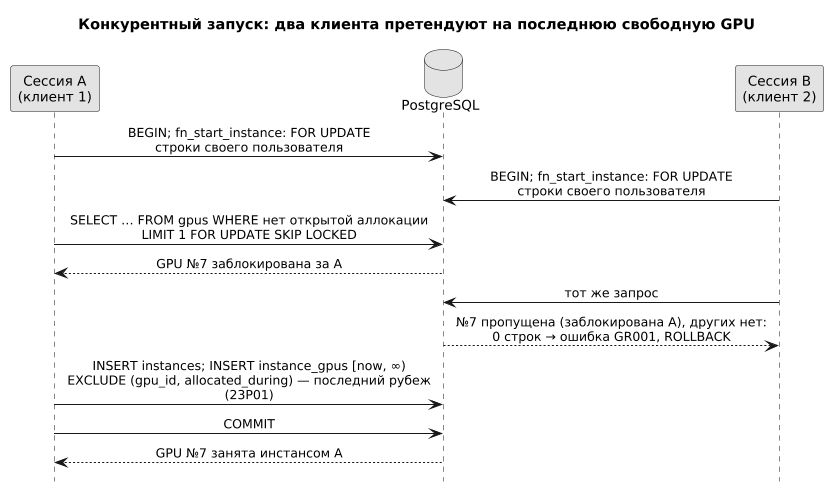
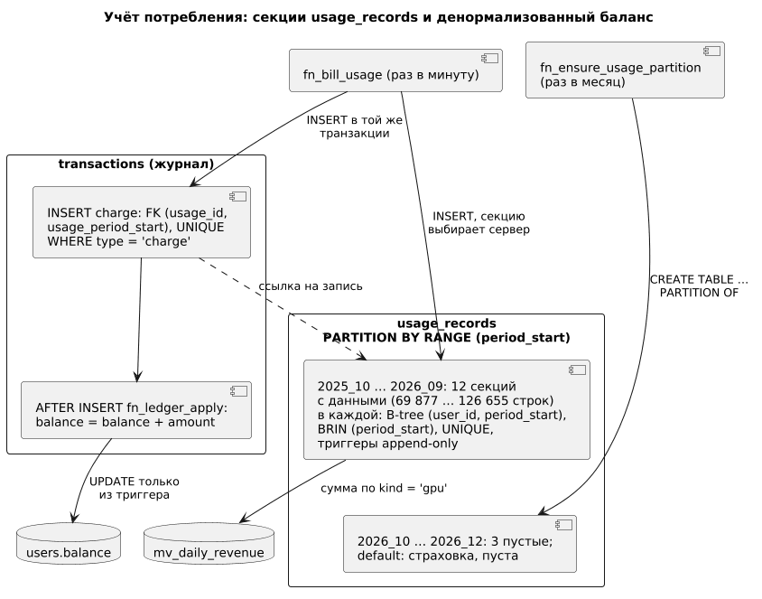
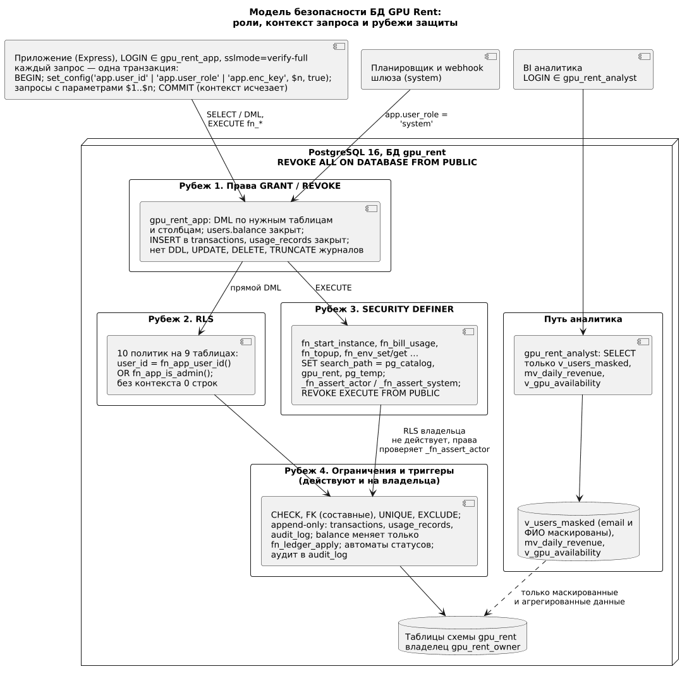

# Цель работы

Изучить физическое проектирование базы данных монолитного веб-приложения и применить его к проекту GPU Rent: реализовать в PostgreSQL 16 логическую модель из отчёта П3 (типы, ограничения, индексы, секционирование, триггеры и функции), оптимизировать горячие запросы с измерением плана до и после, реализовать меры защиты данных (роли, построчная безопасность, шифрование, аудит, маскирование) и подтвердить работу автоматическими тестами.

# Задание

1. Изучить основы физического проектирования баз данных: от логической модели к физической, типы данных, ограничения, индексы.
2. Провести анализ требований и данных: объёмы, профиль нагрузки, горячие запросы, критерии производительности.
3. Спроектировать и реализовать схему: таблицы, связи, ключи, типы, индексы, ограничения, триггеры и функции.
4. Применить методы оптимизации (индексирование, секционирование, агрегирование, кэширование) и подтвердить выигрыш замерами.
5. Принять решения по нормализации и денормализации и обеспечить согласованность денормализованных данных.
6. Обеспечить безопасность данных: ограничение доступа, шифрование, аудит, резервное копирование.
7. Проверить реализацию автоматическими тестами базы данных.

# Ход работы

Задания практических занятий №3 и №4 совпадают по тексту, поэтому принято разделение. Отчёт П3 посвящён концептуальному и логическому проектированию: сущности, связи, нормальные формы, проект защиты. Настоящий отчёт (П4) описывает физическую реализацию в PostgreSQL 16, оптимизацию с замерами и реализованные меры безопасности. Логическая модель здесь не повторяется, в таблице 1 напоминаются лишь ключевые сущности. Подразделы 3.1–3.7 соответствуют шагам задания, подраздел 3.8 фиксирует ограничения. Обозначения FR-xx и NFR-xx взяты из отчёта П2, имена объектов — из каталога `db/` репозитория.

Числа получены на стенде: PostgreSQL 16.15, Apple M2 (8 ядер, 8 ГБ памяти), настройки по умолчанию (`shared_buffers` 128 МБ, `work_mem` 4 МБ), один клиент, тёплый кэш. Они воспроизводятся командой `bash db/scripts/reset.sh && bash db/scripts/test.sh && bash db/scripts/bench.sh` из корня репозитория (прогон выполнен 30.09.2026); планы и времена взяты из `db/bench/results`. Измерения, которых нет в `db/bench` (время функций, цена записи, триггер баланса, RLS, копирование), являются отдельными разовыми замерами на копиях базы: они не сохраняются в `db/bench/results` и помечены в тексте как дополнительные. Время зависит от железа, поэтому сравниваются отношения и число прочитанных страниц.

## Основы физического проектирования баз данных

### От логической модели к физической

Логическая модель отвечает на вопрос, какие данные нужны, физическая — как хранить их, чтобы выполнить требования с запасом: выбираются типы, ключи, ограничения, индексы, разбиение таблиц, права и процедуры доступа [1]. Порядок работы: типы и ключи, ограничения, триггеры и функции, индексы под измеренные запросы, секционирование, права и политики; каждый шаг оформлен миграцией (таблица 6) и покрыт тестами (раздел 3.7). В схеме `gpu_rent` 19 таблиц, 9 enum-типов, 2 представления и 1 материализованное представление; таблицы `api_keys`, `ssh_keys`, `templates`, `volumes`, `gpu_models` и `schema_migrations` дополняют сущности таблицы 1.

Таблица 1 — Ключевые сущности логической модели П3 и их физическое воплощение

| Сущность | Таблицы | Ключ | Особенность реализации |
|---|---|---|---|
| Пользователь | `users` | `bigint` identity | `balance` — кэш журнала; `email citext` UNIQUE; CHECK формата bcrypt |
| ДЦ, нода, GPU | `datacenters`, `nodes`, `gpus` | `bigint` identity | `UNIQUE (node_id, slot_index)`; ДЦ ноды неизменяем |
| Цена | `gpu_prices`, `storage_prices` | `bigint` identity | `tstzrange` и EXCLUDE: периоды не пересекаются |
| Инстанс, выделение GPU | `instances`, `instance_gpus` | `uuid`; `bigint` | снимок цены; `tstzrange` и EXCLUDE по `gpu_id` |
| Потребление | `usage_records` | `(id, period_start)` | секции по месяцам |
| Журнал, платёж | `transactions`, `payments` | `bigint` identity | журнал только на добавление; составные внешние ключи; `UNIQUE (provider, provider_payment_id)` |
| Секреты, аудит | `instance_env_vars`, `audit_log` | составной; `bigint` | `pgp_sym_encrypt`; GIN по `details` |

### Типы данных и ограничения

Типы выбираются по смыслу величины, а ограничения переносят бизнес-правила в базу, где их нельзя обойти (таблица 2).

Таблица 2 — Выбор типов данных

| Данные | Тип | Обоснование |
|---|---|---|
| Деньги | `numeric(14,4)`, платежи `numeric(14,2)` | Точная арифметика, `float` накапливает погрешность (NFR-04); тип допускает `NaN`, поэтому везде `CHECK (x <> 'NaN')` |
| Момент времени | `timestamptz`, база в UTC | Границы месячных секций не зависят от часового пояса сессии |
| Период | `tstzrange` | Работают оператор `&&` и EXCLUDE; границы `[начало, конец)` с CHECK на непустоту |
| Статусы | 9 типов `enum` | 4 байта на значение, допустимые значения проверяет тип |
| Идентификаторы | `bigint` identity; `uuid` у `instances` | Идентификатор нельзя задать вручную; `uuid` не раскрывает число инстансов в URL |
| Email, секреты, детали аудита | `citext`, `bytea`, `jsonb` | Уникальность без регистра; шифртекст; поиск `@>` по GIN |

### Индексы PostgreSQL: виды и применение

Индекс ускоряет чтение за счёт структуры, которую нужно хранить и обновлять при каждой записи, поэтому его создают под измеренный запрос [2, 3]. Из 65 объявленных индексов 60 — B-tree (11 частичных), 3 — GiST, по одному — GIN и BRIN (таблица 3).

Таблица 3 — Виды индексов и их применение

| Вид | Что ускоряет | Где применён |
|---|---|---|
| B-tree | Равенство, диапазоны, сортировка | Ключи, индексы внешних ключей, `(user_id, created_at DESC, id DESC)` |
| GiST | Пересечение диапазонов | Три EXCLUDE: `gpu_prices`, `storage_prices`, `instance_gpus` (`btree_gist` даёт `=` для скаляров) |
| GIN | Поиск внутри `jsonb` и массивов | `audit_log.details`, класс `jsonb_path_ops` |
| BRIN | Диапазоны по упорядоченным данным; минимум и максимум на группу страниц | `period_start` в секциях `usage_records` |
| Частичный | Только строки, удовлетворяющие условию | `instances (user_id) WHERE status <> 'terminated'`, `instance_gpus (gpu_id) WHERE upper_inf(…)`, индексы идемпотентности |
| Покрывающий (`INCLUDE`) | Чтение без обращения к таблице | Не применён; кандидат — `(user_id, created_at DESC, id DESC) INCLUDE (type, amount)` |

### MVCC и нагрузка на обновления

PostgreSQL реализует многоверсионность (MVCC) [4, 5]: `UPDATE` создаёт новую версию строки, старая остаётся до очистки `VACUUM`. Следствия: таблицы с частыми обновлениями раздуваются, а обновление, не являющееся HOT (Heap-Only Tuple: индексируемые столбцы не менялись и на странице есть место), пишет новые записи во все индексы. «Горячие» строки проекта — `users.balance` (меняется при каждом списании) и `instances.last_billed_at` (раз в минуту); потребление и журналы только дополняются и мёртвых версий не создают. Влияние обновления баланса измерено в разделе 3.5.3.

## Требования и анализ данных

### Профиль нагрузки и объёмы

Тестовые данные задают годовой профиль: 4 ДЦ, 6 моделей GPU, 60 нод, 392 GPU, 5000 пользователей, 20 000 инстансов (88 работают), 1 184 157 записей потребления за 12 месяцев. База занимает 625 МБ (таблица 4, `db/bench/results/sizes.txt`), две таблицы составляют 92 % объёма.

Таблица 4 — Объёмы данных после загрузки

| Объект | Строк | Данные | Индексы | Всего |
|---|---|---|---|---|
| `usage_records` (16 секций) | 1 184 157 | 123 МБ | 168 МБ | 291 МБ |
| `transactions` | 1 208 510 | 172 МБ | 115 МБ | 287 МБ |
| `users` | 5000 | 8048 КБ | 968 КБ | 9016 КБ |
| `instance_gpus` | 40 658 | 3400 КБ | 5352 КБ | 8752 КБ |
| `instances` | 20 000 | 3408 КБ | 3024 КБ | 6432 КБ |
| `payments` | 19 754 | 2368 КБ | 3600 КБ | 5968 КБ |
| Остальные таблицы и витрина | не более 6517 | менее 4 МБ каждая | | |

Запись `usage_records` вместе с индексами занимает около 258 байт. По расчёту П2 (100 работающих инстансов, запись раз в минуту) за год накопится 52,56 млн строк, то есть около 12,6 ГиБ в год или 1,05 ГиБ в месяц на секцию; это экстраполяция по измеренному размеру строки. Журнал `transactions` растёт вровень с потреблением и не секционирован (раздел 3.8).

### Горячие запросы

Частоты в таблице 5 — оценки по допущению П4 (около 30 клиентов с открытым кабинетом, каждый опрашивает статус раз в 3 с, то есть около 10 запросов в секунду), а не измерения; число работающих инстансов (100) взято из П2.

Таблица 5 — Горячие запросы

| Обозн. | Запрос | Требование | Частота (оценка) | Мера оптимизации |
|---|---|---|---|---|
| а | Активные инстансы пользователя | FR-08 | около 10 в секунду | частичный индекс |
| б | Расходы пользователя за месяц | FR-13 | единицы в минуту | секции, составной индекс |
| в | Текущий баланс | FR-13 | десятки в секунду | `users.balance` |
| г | Выручка по ДЦ и моделям | FR-17 | менее 1 в секунду | материализованное представление |
| д | Каталог: свободные GPU и цены | FR-05, NFR-01 | 1000 в секунду на входе, около 2,4 к БД | частичный индекс, кэш |
| е | Страница истории операций | FR-13 | единицы в минуту | keyset-пагинация |
| ж | Биллинг-проход | FR-10, FR-12 | один в минуту | индекс по статусу |
| з | Запуск инстанса | FR-07 | десятки в час | блокировки, EXCLUDE |

### Критерии производительности

Требование NFR-01 задаёт p95 менее 300 мс на уровне API. На запрос к БД принят бюджет 30 мс (10 % от 300 мс; остальное — сеть, Node.js, сериализация): это проектное допущение, проверяемое нагрузочным тестом в работе 9.4 плана. NFR-04 проверяется сверкой `balance = SUM(transactions)` (тесты 02, 12, `concurrency.sh`), NFR-05 — отсечением секций (разделы 3.4.2, 3.4.4), NFR-08 — пустая база с 12 миграциями создаётся за 0,55 с (отдельный замер вне `db/bench`), сид загружается за 35 с (прогон `reset.sh`, `db/bench/results/sizes.txt`, строка «Время последнего сида») при лимите 2 минуты.

## Физическая схема

### Организация миграций

Схема создаётся простыми SQL-файлами `db/migrations/NNNN_name.sql` без ORM: Prisma отвергнута в П1, так как не выражает EXCLUDE, RLS и секционирование. Каждый файл идёт в одной транзакции от роли `gpu_rent_owner` и записывает версию в `schema_migrations`; `db/scripts/reset.sh` пересоздаёт базу, применяет файлы по порядку с остановкой на первой ошибке и загружает сид.

Таблица 6 — Миграции

| Файл | Что делает |
|---|---|
| `0001_extensions_and_schema` | Роли (NOLOGIN), UTC, `REVOKE ALL FROM PUBLIC`, схема, `pgcrypto`, `btree_gist`, `citext` |
| `0002_types` | 9 enum-типов |
| `0003_reference_tables` | Пользователи, ключи, ДЦ, модели, ноды, GPU, цены (EXCLUDE), шаблоны |
| `0004_core_tables` | Платежи, тома, инстансы, `instance_gpus`, секреты, `usage_records`, `transactions`, `audit_log` |
| `0005_guards_and_triggers` | Журналы только на добавление, триггер баланса, неизменяемые поля, автоматы статусов |
| `0006_partitioning` | `fn_ensure_usage_partition`, 15 месячных секций и `default` |
| `0007_indexes` | Индексы под запросы, индексы идемпотентности |
| `0008_functions` | Запуск, остановка, возобновление, терминация, биллинг, пополнение, шифрование env |
| `0009_views` | `v_gpu_availability`, `mv_daily_revenue`, `v_users_masked` |
| `0010_audit` | Триггеры аудита |
| `0011_security` | Права ролей, 10 политик RLS |
| `0012_instance_ssh_key` | `instances.ssh_key_id`, составной внешний ключ на `ssh_keys`, параметр `p_ssh_key_id` в `fn_start_instance` |

Физический уровень уточняет модель П3 рядом решений (таблица 7), не нарушая её.

Таблица 7 — Решения физического уровня, уточняющие П3

| Решение | Причина |
|---|---|
| `volumes.last_billed_at` | Граница биллинга хранения; иначе пришлось бы искать `max(period_end)` по всем секциям для каждого тома раз в минуту |
| Инстанс создаётся сразу в состоянии `running`, `pending` не используется | Запуск на ноде считается мгновенным; `failed` ожидает протокола агента ноды |
| Функции сверх списка П3: `fn_resume_instance`, `fn_env_set/get`, `fn_refresh_daily_revenue`; параметр `p_user_id` у `fn_bill_usage` | Повторный запуск, шифрование секретов, обновление витрины, биллинг по одному пользователю |
| Контекст `app.user_role = 'system'`; коды ошибок GR001…GR006 | Планировщик и webhook; бэкенд различает причины отказа (нет GPU, мало средств, состояние, не найдено, согласованность, нет ключа) |
| `refund` — отрицательная сумма; витрина считает день по Москве и только GPU; в индекс журнала добавлен `id` | Возврат уменьшает баланс; дашборд в местном времени; нужен для keyset-пагинации |
| Расширения в схеме `gpu_rent`; `pg_stat_statements` не создаётся | Один `search_path`; расширению нужен `shared_preload_libraries` и перезапуск (раздел 3.4.8) |

### Выдержки DDL ключевых таблиц

Листинги 1–4 показывают, как ограничения выражают правила предметной области. Составной внешний ключ `(volume_id, user_id)` запрещает подключить чужой том, частичный уникальный индекс — подключить один том к двум живым инстансам.

Листинг 1 — Таблица instances (выдержка, `0004_core_tables.sql`, `0007_indexes.sql`, `0012_instance_ssh_key.sql`)

```sql
CREATE TABLE instances (
    id uuid NOT NULL DEFAULT gen_random_uuid(),
    user_id bigint NOT NULL,
    volume_id bigint,         -- далее node_id, template_id ... (опущены)
    ssh_key_id bigint,        -- 0012: ключ пользователя, необязателен
    gpu_count smallint NOT NULL,
    price_per_hour_snapshot numeric(14,4) NOT NULL,   -- за весь инстанс
    status instance_status NOT NULL DEFAULT 'pending',
    last_billed_at timestamptz,
    CONSTRAINT pk_instances PRIMARY KEY (id),
    CONSTRAINT uq_instances_id_user UNIQUE (id, user_id),
    CONSTRAINT fk_instances_volume_owner FOREIGN KEY (volume_id, user_id)
        REFERENCES volumes (id, user_id),
    CONSTRAINT fk_instances_ssh_key_owner FOREIGN KEY (ssh_key_id, user_id)
        REFERENCES ssh_keys (id, user_id) ON DELETE SET NULL (ssh_key_id),
    CONSTRAINT ck_instances_gpu_count CHECK (gpu_count BETWEEN 1 AND 8),
    CONSTRAINT ck_instances_running CHECK (status <> 'running'
        OR (started_at IS NOT NULL AND last_billed_at IS NOT NULL)));
CREATE UNIQUE INDEX uq_instances_active_volume ON instances (volume_id)
    WHERE status IN ('pending', 'running', 'stopped');
```

Листинг 2 — Диапазоны и EXCLUDE (выдержка, `0003_reference_tables.sql`, `0004_core_tables.sql`)

```sql
-- instance_gpus: открытый конец диапазона = GPU занята сейчас
allocated_during tstzrange NOT NULL,
CONSTRAINT ck_instance_gpus_range CHECK (NOT isempty(allocated_during)
    AND lower_inc(allocated_during) AND NOT upper_inc(allocated_during)
    AND lower(allocated_during) IS NOT NULL),
CONSTRAINT ex_instance_gpus_no_overlap
    EXCLUDE USING gist (gpu_id WITH =, allocated_during WITH &&)
-- gpu_prices: у товара не бывает двух цен на один момент
CONSTRAINT ex_gpu_prices_no_overlap EXCLUDE USING gist (
    datacenter_id WITH =, gpu_model_id WITH =,
    pricing_type WITH =, valid_during WITH &&)
```

Листинг 3 — Таблица usage_records (выдержка, `0004_core_tables.sql`, `0006_partitioning.sql`)

```sql
CREATE TABLE usage_records (
    id bigint GENERATED ALWAYS AS IDENTITY,
    user_id bigint NOT NULL,        -- денормализовано для агрегаций
    instance_id uuid,  volume_id bigint,  kind usage_kind NOT NULL,
    period_start timestamptz NOT NULL,  period_end timestamptz NOT NULL,
    quantity numeric(20,6) NOT NULL,  amount numeric(14,4) NOT NULL,
    CONSTRAINT pk_usage_records PRIMARY KEY (id, period_start),
    CONSTRAINT uq_usage_instance_start UNIQUE (instance_id, period_start),
    CONSTRAINT fk_usage_instance_owner FOREIGN KEY (instance_id, user_id)
        REFERENCES instances (id, user_id),
    CONSTRAINT ck_usage_period CHECK (period_end > period_start)
) PARTITION BY RANGE (period_start);
-- CREATE TABLE usage_records_2026_08 PARTITION OF usage_records
--   FOR VALUES FROM ('2026-08-01 00:00+00') TO ('2026-09-01 00:00+00')
```

Первичный ключ и уникальные ограничения партиционированной таблицы обязаны включать ключ секционирования `period_start`, поэтому ключ составной, и ссылки из `transactions` идут на пару `(id, period_start)`.

Листинг 4 — Таблица transactions (выдержка, `0004_core_tables.sql`, `0007_indexes.sql`)

```sql
CONSTRAINT fk_transactions_payment_owner FOREIGN KEY (payment_id, user_id)
    REFERENCES payments (id, user_id),
CONSTRAINT fk_transactions_usage FOREIGN KEY (usage_id, usage_period_start)
    REFERENCES usage_records (id, period_start),
-- знак суммы задан типом: topup, bonus > 0; charge, refund < 0 (CHECK)
CREATE UNIQUE INDEX uq_transactions_topup_payment
    ON transactions (payment_id) WHERE type = 'topup';
CREATE UNIQUE INDEX uq_transactions_charge_usage
    ON transactions (usage_id, usage_period_start) WHERE type = 'charge';
```

### Ограничения целостности

Схема содержит 19 первичных ключей, 15 уникальных ограничений, 28 внешних ключей, 36 проверок CHECK (объявлены в миграциях; четыре из них таблица `usage_records` передаёт каждой из 16 секций, поэтому в каталоге `pg_constraint` их 100), 3 ограничения EXCLUDE и 3 уникальных частичных индекса (таблица 8).

Таблица 8 — Ограничения целостности

| Вид | Примеры | Что защищает |
|---|---|---|
| CHECK | `gpu_count BETWEEN 1 AND 8`; `size_gb BETWEEN 10 AND 10000`; знак суммы по типу; формат bcrypt `^\$2[abxy]\$`; длина хэша API-ключа 32 байта; `period_end > period_start`; защита от `NaN` | Допустимые значения и формат |
| UNIQUE | `(provider, provider_payment_id)`; `email` без регистра; `(node_id, slot_index)`; `(instance_id, period_start)`; `(id, user_id)` (в том числе у `ssh_keys`) | Идемпотентность, отсутствие дублей, база для составных ключей |
| EXCLUDE | аллокации GPU, цены GPU, цены хранения | Пересечение периодов |
| FOREIGN KEY (составные) | `instances`→`volumes` и `ssh_keys`, `usage_records`→`instances`, `transactions`→`payments` и `usage_records` | Совпадение владельца в связанных строках |
| Триггеры | автоматы статусов; том и нода в одном ДЦ; GPU принадлежит ноде и модели инстанса; неизменяемые поля | Правила, не выражаемые декларативно |

Правила удаления консервативны: `ON DELETE CASCADE` заданы трижды (`api_keys` и `ssh_keys` при удалении пользователя, `instance_env_vars` при удалении инстанса) — для данных, бессмысленных без владельца. Ключ `instances`→`ssh_keys` использует `ON DELETE SET NULL (ssh_key_id)`: удаление SSH-ключа обнуляет только ссылку (`user_id` остаётся), инстанс продолжает работать. Остальные 24 ключа работают по умолчанию (`NO ACTION`): платёж, инстанс и запись журнала нельзя потерять удалением родителя, а пользователь блокируется (`status = 'blocked'`), а не удаляется.

### Триггеры и функции

Схема содержит 20 триггеров (таблица 9; в миграциях 21 оператор `CREATE TRIGGER`, так как `trg_usage_records_no_truncate` создаётся и на родительской таблице, и на секции по умолчанию) и 33 функции: 12 вызываются приложением (`fn_*`), 12 триггерных и 9 внутренних (`_fn_*`); 17 функций объявлены `SECURITY DEFINER` с фиксированным `search_path`.

Таблица 9 — Триггеры

| Группа | Где | Действие |
|---|---|---|
| Журналы только на добавление | `transactions`, `audit_log`, `usage_records` (и каждая секция): `BEFORE UPDATE OR DELETE`, `BEFORE TRUNCATE` | Ошибка 23001 для любого, включая владельца |
| Баланс | `AFTER INSERT` на `transactions`; `BEFORE INSERT OR UPDATE` на `users` | Инкремент `balance`; прямое изменение отклоняется |
| Неизменяемые поля | `nodes`, `volumes`, `payments`, `instances` | Владелец, ДЦ, сумма платежа, число GPU и тариф не меняются |
| Автоматы и согласованность | статусы инстанса и платежа, удаление тома; том и нода в одном ДЦ; GPU из ноды и модели инстанса | Недопустимые переходы и несовпадения отклоняются |
| Аудит | `users` (роль, статус), `gpu_prices`, `instances` (статус) | Запись в `audit_log` |

**Запуск инстанса: `fn_start_instance`.** Функция выполняет запуск атомарно, в одной транзакции:

1. Проверяет право действовать от имени пользователя и допустимость `gpu_count` (1–8).
2. Блокирует строку пользователя `FOR UPDATE`; все решения принимаются под этой блокировкой. Заблокированный пользователь получает ошибку GR003.
3. Проверяет ДЦ, шаблон и, если указан том, его владельца, ДЦ и свободу. SSH-ключ (необязательный параметр `p_ssh_key_id`) записывается в `instances.ssh_key_id`; ключ другого пользователя отклоняет составной внешний ключ (SQLSTATE 23503).
4. Находит действующую цену и проверяет, что баланс не меньше стоимости часа всего инстанса (GR002); цена фиксируется снимком.
5. Выбирает ноду, где свободных GPU меньше всего при достаточном числе (best fit), и блокирует строки GPU командой `FOR UPDATE SKIP LOCKED` (листинг 5); после блокировки повторно проверяет отсутствие открытых аллокаций, создаёт `instances` и ровно `gpu_count` строк `instance_gpus`. Если свободных GPU не нашлось, ошибка GR001.

Листинг 5 — Захват GPU без ожидания (выдержка из `_fn_alloc_gpus`, `0008_functions.sql`)

```sql
SELECT array_agg(s.id) INTO v_ids FROM (
    SELECT g.id FROM gpus g
    WHERE g.node_id = v_node AND g.gpu_model_id = p_gpu_model_id
      AND g.is_enabled
      AND NOT EXISTS (SELECT 1 FROM instance_gpus ig WHERE ig.gpu_id = g.id
                      AND upper_inf(ig.allocated_during))
    ORDER BY g.slot_index
    LIMIT p_gpu_count
    FOR UPDATE OF g SKIP LOCKED
) s;
```

Конкурентная безопасность обеспечена двумя независимыми слоями (рисунок 1). Первый — `FOR UPDATE SKIP LOCKED` [6]: строку GPU, которую держит другая транзакция, запрос пропускает, а не ждёт, поэтому два запуска не выберут одну GPU и не заблокируют друг друга. Второй — EXCLUDE: даже при ошибке в коде вторая аллокация той же GPU получила бы 23P01. Порядок блокировок един во всех функциях (сначала пользователь, затем его ресурсы, GPU только через `SKIP LOCKED`), поэтому взаимоблокировки между пользователями не возникают (`concurrency.sh` их не зафиксировал). Цена подхода: при высокой конкуренции возможен отказ GR001, хотя свободная GPU появится через миллисекунды, и приложение должно повторить вызов.



Тест `concurrency.sh` (12 одновременных сессий на ноде с 4 GPU): ровно 4 запуска удались, 8 получили GR001, ни одна GPU не выделена дважды. Время вызова (дополнительное измерение, 200 пар «запуск — остановка» в одной сессии на сиде, три повтора): в среднем 0,21–0,61 мс на запуск и 0,16–0,33 мс на остановку; первый вызов в новой сессии — 7,9–15,5 мс и 3,1–4,4 мс (построение планов PL/pgSQL).

**Биллинг-проход: `fn_bill_usage`.** Планировщик раз в минуту вызывает `fn_bill_usage(p_now, p_user_id)`. Функция без блокировок находит пользователей с неоплаченным интервалом (по частичному индексу `idx_instances_status_active`), блокирует строку каждого (`SKIP LOCKED`: занятого запуском пользователя спишут следующим проходом) и только после блокировки читает `last_billed_at`. Сумма за интервал `[last_billed_at, p_now)` равна `round(цена_снимка × секунды / 3600, 4)`; в одной транзакции создаются запись `usage_records`, списание `transactions` и сдвигается граница. Интервал дешевле 0,0001 ₽ откладывается. Если после списания баланс не больше нуля, инстансы пользователя останавливаются в той же транзакции, а в `audit_log` пишется запись-уведомление (FR-12).

Идемпотентность обеспечена тремя способами: граница не идёт назад (повторный проход на тот же момент ничего не делает), `UNIQUE (instance_id, period_start)` запрещает вторую запись на то же начало, `uq_transactions_charge_usage` — второе списание за одну запись. Дополнительное измерение на сиде (проход на 13:00 UTC 30.09.2026, откат): обработано 1639 пользователей, создано 2180 записей (88 за GPU и 2092 за хранение) на 51 556,9669 ₽; время в четырёх запусках 1388, 569, 356 и 372 мс (первый — холодный кэш); повторный проход на тот же момент — 0,46–1,7 мс и ничего не списывает, баланс сходится с журналом; проход по одному пользователю — около 1 мс. До порога «проход дольше 30 с» (таблица 20 отчёта П2) запас не менее 20-кратного.

**Идемпотентное пополнение: `fn_topup`.** Шлюз может прислать уведомление несколько раз. Функция блокирует пользователя, переводит платёж из `pending` в `succeeded` (из `failed` и `refunded` зачислить нельзя, GR003) и вставляет пополнение `INSERT … ON CONFLICT (payment_id) WHERE type = 'topup' DO NOTHING`. Результат `true` означает «зачислено сейчас», `false` — «уже было». Гарантию даёт уникальный частичный индекс, а не код функции, поэтому она сохраняется при параллельных вызовах: 10 одновременных `fn_topup` по одному платежу дали ровно одно зачисление (баланс вырос на 777 ₽ один раз), а повторная вставка платежа с тем же идентификатором шлюза отклонена ограничением `uq_payments_provider_id`.

### Секционирование usage_records

Потребление растёт быстрее всех таблиц (NFR-05), поэтому `usage_records` секционирована по `RANGE (period_start)`: 15 месячных секций с 2025-10 по 2026-12 и секция `default` (рисунок 2). Месяцы считаются по UTC и не зависят от часового пояса сессии (тест 09). Индексы объявлены на родителе, и PostgreSQL создаёт их в каждой секции, в том числе будущей. Триггер `BEFORE TRUNCATE` уровня оператора не наследуется, поэтому его добавляет `fn_ensure_usage_partition`, которую планировщику предстоит вызывать раз в месяц на месяц вперёд (автоматизация — работа 7.1 плана; созданных секций хватает до конца 2026 года). Секция `default` — страховка: строка вне созданных месяцев не теряется, но секция должна оставаться пустой (в сиде пуста, тест 12).



### Тестовые данные

Сид `db/seed/seed.sql` детерминирован: `setseed(0.4242)`, момент «сейчас» зафиксирован (30.09.2026 12:00 UTC), порядок строк задан `ORDER BY`. Инстансы размещаются по «линиям» (группам соседних GPU одной ноды) последовательно, поэтому аллокации не пересекаются и проходят EXCLUDE. Потребление свёрнуто в почасовые записи для GPU и суточные для хранения (в бою запись раз в минуту); на время вставки двух крупнейших таблиц снимаются внешние ключи и вторичные индексы и возвращаются в конце. Блок самопроверки откатывает транзакцию при нарушении объёмов или согласованности.

Результат: 5000 пользователей, 20 000 инстансов, 40 658 аллокаций, 1 184 157 записей потребления, 1 208 510 проводок, 19 754 платежа; загрузка 35 с в прогоне `reset.sh` (`db/bench/results/sizes.txt`, строка «Время последнего сида»; лимит 2 минуты). Детерминизм проверен: хэши содержимого восьми групп таблиц после двух независимых загрузок совпали.

## Оптимизация производительности

### Методика измерений

Сценарии `db/bench/01…06_*.sql` выполняются под суперпользователем (влияние RLS измерено в разделе 3.6.3) с отключённым JIT; каждый запрос один раз выполняется вхолостую и затем под `EXPLAIN (ANALYZE, BUFFERS)` [7]. Состояние «до» получают удалением индекса в транзакции с откатом (`BEGIN … DROP INDEX … ROLLBACK`), данные не меняются. Показатели: время выполнения и число страниц по 8 КБ (`hit` — из кэша PostgreSQL, `read` — из ОС или диска).

Между двумя полными прогонами `bench` (предыдущим и итоговым, сохранённым в `db/bench/results`) варианты длительностью 17–150 мс различаются не более чем на 7 %, варианты в 1–8 мс — до 15 % (кроме варианта (а, A): 1,7 и 2,8 мс), варианты быстрее 0,3 мс — до 2,3 раза. Поэтому выводы опираются на порядок величины и число страниц; в таблицах и листингах значения итогового прогона. Планы сокращены до ключевых узлов, времени и страниц.

### Результаты по сценариям

**(а) Активные инстансы.** `SELECT id, name, status FROM instances WHERE user_id = 6 AND status <> 'terminated' ORDER BY created_at DESC` для пользователя с наибольшим числом инстансов (178, живых 26). Варианты: A — индексов по `user_id` нет; B — полный индекс внешнего ключа (296 КБ); C — частичный индекс `WHERE status <> 'terminated'` (88 КБ); планы — в листинге 6.

Листинг 6 — План сценария (а)

```text
A  Seq Scan on instances (rows=26)   Rows Removed by Filter: 19974
   Buffers: shared hit=422                      Execution Time: 2.807 ms
B  Bitmap Heap Scan on instances (rows=26)  Rows Removed by Filter: 152
   -> Bitmap Index Scan on idx_instances_user
   Buffers: shared hit=156                      Execution Time: 0.139 ms
C  Index Scan using idx_instances_user_active (rows=26)
   Buffers: shared hit=27                       Execution Time: 0.034 ms
```

Частичный индекс не содержит терминированных инстансов, поэтому читается 27 страниц против 156 и 422, а сам индекс в 3,4 раза меньше. На 20 000 строк абсолютное время B и C измеряется сотыми долями миллисекунды и шумит (между прогонами C давало 0,016 и 0,034 мс); устойчив выигрыш в страницах и размере, он растёт с долей терминированных инстансов.

**(б) Расходы за месяц.** `SELECT sum(amount) FROM usage_records WHERE user_id = 71 AND period_start >= '2026-08-01+00' AND period_start < '2026-09-01+00'` для типичного пользователя (32 записи в августе, медиана по 2378 пользователям с потреблением — 32, максимум — 615). Варианты: A — условие через `date_trunc('month', period_start AT TIME ZONE 'UTC')`, секции отсечь нельзя, индекса нет; B — условие по «сырому» `period_start`, индекса нет; C — отсечение и индекс `(user_id, period_start)` (листинг 7).

Листинг 7 — План сценария (б)

```text
A  Parallel Append: Parallel Seq Scan по всем 16 секциям
   (usage_records_2026_09: Rows Removed by Filter: 126655, и т. д.)
   Buffers: hit=13711 read=2012                 Execution Time: 26.920 ms
B  Seq Scan on usage_records_2026_08 (rows=32)
   Rows Removed by Filter: 124248  Buffers: hit=1596   7.403 ms
C  Bitmap Index Scan on usage_records_2026_08_user_id_period_start_idx
   Buffers: shared hit=35                       Execution Time: 0.017 ms
```

Отсечение секций даёт 3,6 раза (читается 1 секция из 16: 1596 страниц вместо 15 723), индекс — ещё около 435 раз; для самого «тяжёлого» пользователя (615 записей) запрос занял 0,196 мс. Вывод: условие обязано ссылаться на `period_start` напрямую, без функций (тест 09).

**(в) Баланс.** A — `SELECT sum(amount) FROM transactions WHERE user_id = 6` без индекса; B — то же с индексом `(user_id, created_at DESC, id DESC)`; C — `SELECT balance FROM users WHERE id = 6` (листинг 8). У пользователя 6 в журнале 8137 строк, сумма журнала и `users.balance` совпадают (491 357,3936).

Листинг 8 — План сценария (в)

```text
A  Parallel Seq Scan on transactions   Buffers: hit=6743 read=15316
   Rows Removed by Filter: 400124 (на процесс)  Execution Time: 26.077 ms
B  Bitmap Heap Scan on transactions (rows=8137)  Heap Blocks: exact=6546
   -> Bitmap Index Scan on idx_transactions_user_created
   Buffers: shared hit=6589                     Execution Time: 2.629 ms
C  Index Scan using pk_users on users (rows=1)   Buffers: shared hit=11
                                                Execution Time: 0.007 ms
```

Сумма по журналу даже с индексом растёт линейно с длиной истории (индекс не содержит `amount`, читаются 6546 страниц таблицы), а баланс нужен в шапке каждой страницы. Чтение из `users` выполняется за постоянное время; цена решения измерена в разделе 3.5.3.

**(г) Выручка по ДЦ и моделям.** A и C — агрегат по сырым `usage_records` с соединением с `instances` и `nodes` за месяц и за год; B и D — тот же отчёт по `mv_daily_revenue` (6517 строк; листинг 9). Результаты совпадают (тест 12).

Листинг 9 — План сценария (г)

```text
A  Hash Join <- Parallel Append: 2026_08 Bitmap Index Scan (BRIN),
   2026_09 Parallel Seq Scan   Buffers: hit=3395   18.635 ms  (месяц)
B  Bitmap Heap Scan on mv_daily_revenue <- uq_mv_daily_revenue
   Buffers: shared hit=67                          0.124 ms
C  то же по сырым данным за год  Buffers: hit=15078 read=1968  143.616 ms
D  Seq Scan on mv_daily_revenue (rows=6517)  hit=64    0.957 ms
```

Выигрыш около 150 раз и для месяца, и для года; время по витрине почти не растёт с объёмом сырых данных. В плане A индекс BRIN по `period_start` действительно участвует в выборке диапазона. Цена актуальности — в разделе 3.4.5.

**(д) Каталог.** `SELECT * FROM v_gpu_availability` (весь каталог) и с условием `datacenter_code = 'MSK-1'`. Узкое место — поиск открытых аллокаций среди 40 658 строк `instance_gpus` (открытых 187). A и C — без частичного индекса `idx_instance_gpus_active`, B и D — с ним (16 КБ); листинг 10.

Листинг 10 — План сценария (д)

```text
A  Seq Scan on instance_gpus ig (rows=187)  Buffers всего: 432   2.298 ms
B  Bitmap Index Scan on idx_instance_gpus_active
                                            Buffers всего: 21    0.264 ms
C  один ДЦ, без индекса  Buffers 443  2.162 ms
D  один ДЦ, с индексом   Buffers 32   0.219 ms
```

Ускорение в 8,7 и 9,9 раза. GiST-индекс EXCLUDE (3336 КБ) предикат `upper_inf(allocated_during)` не обслуживает, поэтому без частичного индекса читается вся таблица, растущая с каждым запуском.

**(е) История операций.** Страница из 50 строк из середины истории пользователя 6 (8137 проводок, смещение 4068). A — `OFFSET` без индекса; B — `OFFSET` с индексом; C — keyset: `WHERE (created_at, id) < (последняя строка предыдущей страницы) ORDER BY created_at DESC, id DESC LIMIT 50` (листинг 11).

Листинг 11 — План сценария (е)

```text
A  Limit <- Gather Merge <- Sort <- Parallel Seq Scan on transactions
   Buffers: hit=3871 read=18280                 Execution Time: 27.537 ms
B  Limit <- Index Scan using idx_transactions_user_created (rows=4118)
   Buffers: shared hit=3647                     Execution Time: 0.850 ms
C  Index Scan, Index Cond: (user_id = 6) AND (ROW(created_at, id) < ROW(…))
   Buffers: shared hit=43 (rows=50)             Execution Time: 0.018 ms
```

`OFFSET` читает и отбрасывает 4068 строк, стоимость растёт линейно с номером страницы; keyset читает ровно 50 строк при любой глубине [3]. Для этого `id` добавлен в индекс вторым ключом сортировки, иначе строки с одинаковым `created_at` нельзя упорядочить однозначно.

Результаты сведены в таблице 10: ускорение приведено к варианту без меры и к ближайшему промежуточному варианту.

Таблица 10 — Результаты оптимизации (время по `EXPLAIN ANALYZE`, мс)

| Сценарий | До | После | Ускорение | Страницы до → после | Мера |
|---|---|---|---|---|---|
| а. Активные инстансы | 2,807 (без индекса); 0,139 (полный индекс) | 0,034 | в 83 раза; в 4,1 раза | 422 и 156 → 27 | частичный индекс |
| б. Расходы за месяц | 26,920 (полный скан); 7,403 (только отсечение) | 0,017 | в 1584 раза; в 435 раз | 15 723 и 1596 → 35 | секции и индекс |
| в. Баланс | 26,077 (SUM без индекса); 2,629 (SUM с индексом) | 0,007 | в 3725 раз; в 376 раз | 22 059 и 6589 → 11 | `users.balance` |
| г. Выручка, месяц | 18,635 | 0,124 | в 150 раз | 3395 → 67 | `mv_daily_revenue` |
| г. Выручка, год | 143,616 | 0,957 | в 150 раз | 17 046 → 64 | `mv_daily_revenue` |
| д. Каталог, весь | 2,298 | 0,264 | в 8,7 раза | 432 → 21 | частичный индекс |
| д. Каталог, один ДЦ | 2,162 | 0,219 | в 9,9 раза | 443 → 32 | частичный индекс |
| е. История, страница 4068 | 27,537 (OFFSET без индекса); 0,850 (OFFSET с индексом) | 0,018 | в 1530 раз; в 47 раз | 22 151 и 3647 → 43 | индекс и keyset |

Отношения получены делением времён итогового прогона и устойчивы по порядку величины: (б) около полутора тысяч раз, (г) 150 раз, (д) 9–10 раз, (е) около полутора тысяч раз. Для (а) и (в) знаменатель составляет микросекунды (0,034 и 0,007 мс), поэтому достоверен порядок величины (десятки раз для (а), тысячи для (в)), а число страниц (22 059 → 11) надёжнее отношения времён. Наименее выразителен сценарий (а): на 20 000 строк выигрыш частичного индекса над полным (4,1 раза по времени, 5,8 раза по страницам) сопоставим с шумом, главный результат — сравнение с отсутствием индекса и размер индекса. После оптимизации все запросы укладываются в бюджет 30 мс; самый дорогой — годовой отчёт по витрине (0,96 мс, 3 % бюджета).

### Индексирование и его стоимость

Набор индексов (таблица 11) строился по правилам: индекс заводится под измеренный запрос; если нужны только «живые» строки, он частичный; в составном индексе первым стоит столбец равенства, затем диапазона или сортировки; индекс на столбце с малым числом значений не создаётся, вместо него частичный. Внешние ключи без покрытия уникальным индексом получили 14 индексов (`0007_indexes.sql`): без них удаление родителя и соединения сканируют дочернюю таблицу.

Таблица 11 — Основные индексы и их эффект

| Индекс | Вид | Назначение | Размер и эффект |
|---|---|---|---|
| `idx_instances_user_active` | B-tree, частичный | Кабинет (а) | 88 КБ против 296 КБ полного; 27 страниц против 156 |
| `idx_instances_status_active` | B-tree, частичный | Отбор кандидатов биллинга (ж) | 40 КБ; используется планировщиком (88 строк из 20 000) |
| `idx_instance_gpus_active` | B-tree, частичный | Занятость GPU, каталог (д) | 16 КБ; ускорение в 8,7 раза |
| `ex_instance_gpus_no_overlap` | GiST, EXCLUDE | Запрет двойной аллокации | 3336 КБ; целостность |
| `idx_usage_user_period` | B-tree, в каждой секции | Отчёты пользователя (б) | 0,017 мс против 7,403 мс |
| `idx_usage_period_brin` | BRIN, в каждой секции | Диапазоны времени | 24 КБ против 3672 КБ у составного B-tree `(user_id, period_start)` (секция 2026_08) |
| `idx_transactions_user_created` | B-tree | История (е), сумма (в) | 51 МБ, самый большой индекс схемы |
| `uq_transactions_topup_payment`, `uq_transactions_charge_usage` | B-tree, уникальные частичные | Идемпотентность | 36 МБ (списания) |
| `idx_audit_details` | GIN | `details @> '{…}'` | 104 КБ |

Индексы занимают на `usage_records` 168 МБ против 123 МБ данных, на `transactions` 115 МБ против 172 МБ. Влияние на запись измерено дополнительно: в три одинаковые таблицы (форма строки как у `transactions`) вставлено по 500 000 строк командой `INSERT … SELECT` — без индексов, с одним индексом истории и с пятью индексами, как у `transactions` (таблица 12; медиана трёх повторов, в скобках диапазон).

Таблица 12 — Цена индексов при вставке 500 000 строк

| Число индексов | Время, с | Скорость, строк/с | Объём индексов |
|---|---|---|---|
| 0 | 1,48 (1,34–1,53) | около 339 000 | 0 |
| 1 | 2,73 (2,53–2,78) | около 183 000 | 21 МБ |
| 5 | 4,53 (4,38–6,17) | около 110 000 | 47 МБ |

Пять индексов замедляют вставку примерно втрое. При расчётной нагрузке (100 работающих инстансов дают около 1,7 строки потребления и столько же проводок в секунду) запас по скорости записи превышает четыре порядка (110 000 строк/с против 1,7), поэтому стоимость индексов на запись несущественна, а на чтении они дают выигрыш на порядки.

### Партиционирование и отсечение секций

Отсечение секций (partition pruning) [8] работает, если условие по ключу секционирования не скрыто функцией: в сценарии (б) вариант A читает 16 секций, вариант B — одну; тест 09 фиксирует оба случая. На секциях действует BRIN: на упорядоченных по времени данных он занимает 24 КБ вместо 3672 КБ у составного B-tree `(user_id, period_start)` той же секции и подходит для запросов по диапазону времени, хотя грубее (в плане (г, A) он возвращает лишние строки, отсеиваемые при перепроверке); порядок вставки сида задан по времени ради корреляции BRIN. Старый месяц можно отсоединить (`DETACH PARTITION`) и архивировать без массового `DELETE`, но этому мешает внешний ключ из `transactions` (раздел 3.8).

### Материализованное представление

`mv_daily_revenue` хранит выручку и GPU-часы по дню (по Москве), ДЦ и модели: 6517 строк, 808 КБ против 1,18 млн строк сырых данных. Уникальный индекс `uq_mv_daily_revenue` нужен для `REFRESH MATERIALIZED VIEW CONCURRENTLY` [9]: обновление не блокирует читателей. Полное обновление по году данных заняло 514 мс (`04_revenue_dashboard.txt`). Стратегия: планировщик вызывает `fn_refresh_daily_revenue()` раз в 5 минут, это 0,2 % времени (0,514 с из 300 с), а устаревание дашборда не превышает 5 минут, что допустимо для FR-17. Обновление пересчитывает все 12 месяцев, при 52 млн строк в год оно вырастет примерно в 44 раза (линейная оценка, около 23 с); порог перехода на инкрементальное обновление — 30 с.

### Кэширование

Кэширование многоуровневое (таблица 13): часть уровней реализована в БД, прикладной кэш запланирован на недели 5–6 (работа 4.3 плана).

Таблица 13 — Уровни кэширования

| Уровень | Механизм | Состояние |
|---|---|---|
| Страничный кэш PostgreSQL и ОС | `shared_buffers` (на стенде 128 МБ): в сценарии (в, A) прочитано 15 316 страниц из ОС, так как таблица (172 МБ) не помещается. На сервере начальное значение около 25 % памяти, `effective_cache_size` 50–75 % [10] | Настройка эксплуатации |
| Подготовленные выражения | Планирование сравнимо с выполнением: (а, C) 0,065 мс против 0,034 мс, (в, C) 0,006 против 0,007, (е, C) 0,015 против 0,018. Именованные запросы node-postgres (`name`) переиспользуют план; за PgBouncer в режиме transaction нужна версия 1.21+ с `max_prepared_statements` [11] | План для работы 4.1; выигрыш не измерялся |
| Кэш Redis | Каталог: cache-aside, ключ на пару «ДЦ — модель» (24 ключа), TTL 10 с, ETag. Инвалидация: при смене цены после `COMMIT` удаляются ключи пары, при изменении нод и GPU — ключи ДЦ. Число свободных GPU не инвалидируется: `fn_start_instance` проверяет наличие под блокировкой, устаревшее число даст максимум GR001 | План (работа 4.3). Расчёт: 24 ключа за 10 с дают 2,4 запроса в секунду к БД вместо 1000; при 0,264 мс на запрос это 0,06 % одного ядра |
| Материализованное представление, `users.balance` | Кэш агрегата и постоянный кэш суммы внутри БД | Реализовано (разделы 3.4.5, 3.5) |

### Агрегирование и пагинация

Агрегаты считаются в БД и отдаются готовыми: `v_gpu_availability` сворачивает счётчики через `FILTER (WHERE …)`, а цены агрегирует отдельно и присоединяет к уже свёрнутым счётчикам, иначе две строки цены (on-demand и spot) удвоили бы число GPU (тест 11 проверяет это и умножение сумм в витрине). Списки всегда ограничены `LIMIT`, глубокие страницы отдаются keyset-способом (сценарий (е)).

### Мониторинг

Набор для эксплуатации: `pg_stat_statements` [12] (запросы с наибольшим суммарным временем), `auto_explain` [13] (планы запросов дольше 200 мс), `pg_stat_user_indexes` (индексы с `idx_scan = 0` — кандидаты на удаление), `pg_stat_user_tables` (мёртвые строки, очистка), размер секции `default` (должен быть нулевым), время биллинг-прохода (тревога выше 30 с). В среде разработки `pg_stat_statements` и `auto_explain` не включены: `pg_stat_statements` требует `shared_preload_libraries` и перезапуска, а `auto_explain` можно подгрузить командой `LOAD` (суперпользователь) или через `session_preload_libraries` без перезапуска; в любом случае это параметр окружения, а не схемы, и миграция `CREATE EXTENSION` без него бесполезна. На стенде параметр пуст, расширение `pg_stat_statements` 1.10 доступно, но не создано. В эксплуатации (работа 9.3) включается параметрами контейнера `shared_preload_libraries = 'pg_stat_statements,auto_explain'`, `auto_explain.log_min_duration = '200ms'`, затем `CREATE EXTENSION pg_stat_statements`.

## Нормализация и денормализация

### Нормальные формы в модели

Модель приведена к нормальной форме Бойса — Кодда (НФБК, она строже третьей) [1]: значения атомарны, неключевые атрибуты зависят от всего ключа и не зависят друг от друга, детерминантами зависимостей служат только ключи. Справочные сведения вынесены в отдельные таблицы, цена — в `gpu_prices` с историей, связь «многие ко многим» между инстансами и GPU разрешена таблицей `instance_gpus` с временем аллокации; ДЦ инстанса не хранится, а определяется через ноду, транзитивной зависимости нет. Единственное осознанное нарушение 1НФ — `templates.default_ports` (список портов одной строкой, например `22/tcp,8888/http`): он передаётся агенту целиком и в условиях запросов не участвует.

### Реализованные денормализации

Денормализация оправдана, если измерение показало выигрыш, а согласованность обеспечивает механизм БД, а не дисциплина кода. В проекте таких мест шесть (таблица 14; обозначения D-1–D-6 те же, что в П3).

Таблица 14 — Денормализации, механизмы согласованности и проверки

| Что | Зачем | Механизм согласованности | Проверка |
|---|---|---|---|
| D-1. `users.balance` — кэш суммы `transactions` | Баланс за постоянное время (в) | Триггер-инкремент `fn_ledger_apply`; прямое изменение отклоняет `fn_users_guard` (`pg_trigger_depth`); у приложения нет `UPDATE (balance)` | Тесты 02, 12 (5000 пользователей), `concurrency.sh` |
| D-2. `usage_records.user_id` | Агрегаты без соединений | Составные внешние ключи `(instance_id, user_id)`, `(volume_id, user_id)` | Тест 06 |
| D-3. `quantity`, `amount` в `usage_records`; `transactions.amount` списания равна `amount` со знаком минус | Сумма округляется один раз; отчёты суммируют готовое | Обе записи создаёт одна функция биллинга в одной транзакции; связь 1:1 — составной внешний ключ `fk_transactions_usage` и частичный `UNIQUE uq_transactions_charge_usage`; прямой `INSERT` приложению не выдан | Тесты 02, 04 |
| D-4. `instances.gpu_model_id` | Выручка по моделям без соединения с аллокациями | Неизменяемый столбец; триггер `fn_instance_gpus_consistency` | Тесты 03, 11 |
| D-5. `last_billed_at` у инстансов и томов | Граница биллинга за постоянное время | Меняется только внутренними функциями биллинга, только вперёд | Тест 04, `concurrency.sh` |
| D-6. `mv_daily_revenue` | Дашборд без сканирования миллионов строк | `REFRESH … CONCURRENTLY` по расписанию | Тест 12 (сверка с сырыми данными) |

Снимок цены `price_per_hour_snapshot` денормализацией не является: это историческая фиксация факта (цена на момент запуска, FR-10), которую нельзя вывести из текущей цены.

### Цена и выигрыш денормализации баланса

Выигрыш по чтению измерен в сценарии (в): 26,077 мс (сумма по журналу), 2,629 мс (с индексом) и 0,007 мс (`users.balance`). Цену по записи измерили дополнительно (разовый замер вне `db/bench`): в отдельной базе с миграциями проекта 5000 пользователей, 20 транзакций по 5000 проводок (по одной на пользователя), всего 100 000 строк журнала; два прогона (таблица 15).

Таблица 15 — Цена триггера баланса при вставке 100 000 проводок

| Вариант | Время, мс (два прогона) | На строку | Доля HOT-обновлений | Размер `users` после |
|---|---|---|---|---|
| Триггер отключён | 482 и 477 | около 4,8 мкс | — | 1040 КБ |
| Триггер включён, `fillfactor` 100 (как в проекте) | 3737 и 3658 | около 37 мкс | 1,6 % | 20 МБ |
| Триггер включён, `fillfactor` 70 | 2696 и 2710 | около 27 мкс | 94,6 % | 3112 КБ |

Триггер замедляет вставку в журнал в 7,7 раза (5,6 раза при `fillfactor` 70), но абсолютная стоимость 27–37 мкс на проводку, то есть 27–37 тысяч проводок в секунду против расчётных 1,7, заметна лишь в цифрах. Важнее другое: при плотной упаковке страниц почти каждое обновление не HOT, и таблица `users` из 5000 строк за 100 000 обновлений разрастается до 20 МБ (до очистки автоочисткой) [4]. `fillfactor = 70` оставляет на странице место под новые версии, и 94,6 % обновлений становятся HOT. В миграциях такая настройка для `users` и `instances` пока не выполнена; она внесена в план второй итерации БД (работы 7.2 и 7.3, раздел 3.8). Рассинхрон баланса исключён механизмом и проверяется при каждом прогоне тестов, а сериализация операций одного пользователя через блокировку его строки — желаемое поведение.

## Безопасность данных

### Угрозы и рубежи защиты

Защита эшелонированная: запрос проходит четыре рубежа, каждый из которых закрывает свой класс ошибок и атак (рисунок 3). Права (рубеж 1) ограничивают, что роль вообще может делать; RLS (рубеж 2) — какие строки она видит; функции `SECURITY DEFINER` (рубеж 3) — какими операциями разрешено менять деньги и GPU; ограничения и триггеры (рубеж 4) не дают нарушить инвариант даже владельцу. Рассматриваются угрозы: доступ к данным чужого клиента (RLS, тест 07), SQL-инъекция (раздел 3.6.7), накрутка баланса и правка журнала (тесты 02, 07), избыточные права приложения (тест 07), кража паролей, ключей и секретов из дампа (тесты 06, 08, 12), утечка персональных данных аналитику (тест 07), подмена действий (тесты 02, 10), перехват трафика и потеря данных (разделы 3.6.4, 3.6.8).



### Роли и привилегии

Права выданы по принципу наименьших: `REVOKE ALL` у `PUBLIC` на базу, схему `public`, таблицы, последовательности и функции, а `ALTER DEFAULT PRIVILEGES` закрывает `EXECUTE` и для будущих функций. Три роли (таблица 16) созданы как `NOLOGIN`; приложению при развёртывании выдаётся собственный `LOGIN`-пользователь, входящий в роль (`CREATE ROLE … LOGIN … IN ROLE gpu_rent_app`), пароль берётся из секрета окружения и в репозитории не хранится.

Таблица 16 — Роли и привилегии

| Роль | Назначение | Разрешено | Запрещено |
|---|---|---|---|
| `gpu_rent_owner` | Владелец схемы, миграции, `SECURITY DEFINER`-функции | Всё в схеме; RLS на владельца не действует | Подключение из приложения не предусмотрено |
| `gpu_rent_app` | Приложение | `SELECT`; `INSERT` и `UPDATE` по перечню столбцов (баланс не входит); `EXECUTE` на 12 функциях; строки по политикам RLS | DDL и `CREATE` в схемах; `UPDATE`, `DELETE`, `TRUNCATE` журналов; прямой `INSERT` в `transactions` и `usage_records`; вызов `_fn_*`; временные таблицы |
| `gpu_rent_analyst` | Аналитика | `SELECT` только из `v_users_masked`, `mv_daily_revenue`, `v_gpu_availability` | Таблицы, функции, ПДн |
| `PUBLIC` | Остальные | Ничего | Всё (`REVOKE ALL`) |

### Row-Level Security

Политики RLS [14] ограничивают чтение и запись строк `instances`, `volumes`, `ssh_keys`, `api_keys` и `payments`, только чтение — `transactions` и `usage_records`; секреты `instance_env_vars` видны тем, кто видит сам инстанс, а `audit_log` читает лишь администратор. Идентификатор пользователя приложение передаёт в каждой транзакции функцией `set_config(…, true)` (листинг 12): значение действует до `COMMIT`, не «протекает» между запросами через пул и совместимо с PgBouncer в режиме transaction. Значения берутся из серверной сессии, а не из тела запроса. Без контекста политика возвращает ноль строк, а не ошибку.

Листинг 12 — Политика RLS и контекст запроса

```sql
ALTER TABLE instances ENABLE ROW LEVEL SECURITY;
CREATE POLICY p_instances ON instances FOR ALL TO gpu_rent_app
    USING      (user_id = fn_app_user_id() OR fn_app_is_admin())
    WITH CHECK (user_id = fn_app_user_id() OR fn_app_is_admin());
BEGIN;                                       -- на стороне приложения
SELECT set_config('app.user_id',   $1, true),       -- is_local = true
       set_config('app.user_role', $2, true);
SELECT id, name, status FROM instances
 WHERE user_id = $1 AND status <> 'terminated' ORDER BY created_at DESC;
COMMIT;
```

Действие политик проверено на сиде под ролью `gpu_rent_app` (таблица 17, откат транзакций).

Таблица 17 — Видимость строк под ролью приложения

| Контекст | Запрос | Строк |
|---|---|---|
| Контекст не задан | `SELECT count(*) FROM instances` | 0 |
| `app.user_id = 6`, клиент | `SELECT count(*) FROM instances` | 178 |
| то же | `… WHERE user_id = 7` (чужие) | 0 |
| то же | `SELECT count(*) FROM transactions` | 8137 |
| `app.user_role = 'admin'` | `SELECT count(*) FROM instances` | 20 000 |

Влияние RLS на время измерено дополнительно (разовый замер вне `db/bench`; сценарии (а), (б), (е) под суперпользователем и под ролью приложения с контекстом): планы те же, политика встраивается как условие `Filter`; время 0,043 → 0,054 мс (а), 0,057 → 0,060 мс (б), 0,048 → 0,061 мс (е), то есть накладные расходы порядка 10–20 мкс. RLS не заменяет `WHERE`: запрос `SELECT id FROM instances WHERE status <> 'terminated'` без `user_id` под ролью клиента читает все живые инстансы и отбрасывает чужие (отфильтровано 2432 строки), 7,326 мс против 0,054 мс. Приложение обязано писать собственное условие, а политика остаётся страховкой от его пропуска.

### Шифрование и хранение секретов

Меры для каждого вида секретов и каналов сведены в таблице 18.

Таблица 18 — Защита секретов и каналов

| Объект | Мера | Проверка |
|---|---|---|
| Пароль | bcrypt (стоимость не ниже 12, NFR-03) считается в приложении; в БД только хэш, `CHECK` формата `^\$2[abxy]\$` не пропускает открытый пароль | Тесты 06, 12 |
| API-ключ | Выдаётся один раз; хранится SHA-256 (32 байта, `UNIQUE`, `CHECK octet_length = 32`) и видимый префикс. Быстрого хэша достаточно: ключ случаен и длинен (приложение генерирует 256 бит), в отличие от пароля, который выбирает человек [15] | Тесты 06, 12 |
| Переменные окружения | `pgp_sym_encrypt` (OpenPGP, по умолчанию AES-128 [16]); ключ приходит в `app.enc_key` и в БД не хранится; пустой ключ — ошибка GR006; неверный — ошибка, а не мусор | Тест 08 (19 проверок) |
| Канал «приложение — БД» | `ssl = on`, в `pg_hba.conf` только `hostssl` со `scram-sha-256`, клиент с `sslmode=verify-full` | Эксплуатация; на стенде `ssl = off` |
| Диск и копии | Шифрование тома (LUKS), копии шифруются до отправки за пределы хоста | План |

Листинг 13 — Шифрование переменных окружения (вывод psql на сиде, дополнительный прогон)

```text
     name      | bytes |     head
 HF_TOKEN      |    93 | c30d04070302   -- первые 6 байт шифртекста
 WANDB_API_KEY |    96 | c30d04070302
SELECT pgp_sym_decrypt(value_encrypted, 'wrong') ...
ERROR:  Wrong key or corrupt data
SELECT fn_env_get(:iid, 'HF_TOKEN');           -- app.enc_key не задан
ERROR:  app.enc_key is not set
SELECT left(fn_env_get(:iid, 'HF_TOKEN'), 6);  -- верный app.enc_key
 hf_999
```

Ограничения: ключ на время вызова доступен серверу и администратору БД, поэтому мера защищает от кражи дампа и копий, но не от администратора; ключ не должен попадать в журналы (`log_statement = none` по умолчанию, параметры привязки ограничиваются `log_parameter_max_length`); алгоритм `aes256` выбирается параметром `cipher-algo`; массовой перешифровки при смене ключа нет.

### Аудит и неизменяемость журналов

Триггеры аудита (`0010_audit.sql`) пишут в `audit_log` изменения роли и статуса пользователя, все операции над ценами и смену статуса инстанса. Актор берётся из `app.user_id`, адрес — из `app.client_ip`; системные действия (автостоп) имеют пустого актора. Функции триггеров объявлены `SECURITY DEFINER`, чтобы писать в журнал мог любой инициатор изменения. Журнал защищён двумя слоями: у роли приложения нет `UPDATE`, `DELETE`, `TRUNCATE`, а триггеры отклоняют их и у владельца; читает журнал только администратор (RLS). Аналогично защищены `transactions` и `usage_records`, а хранение не менее года (NFR-06) обеспечено запретом удаления; секционирование аудита не выполнено, так как его объём мал (195 строк в сиде). Поиск по содержимому обслуживает GIN-индекс: на 195 строках планировщик выбирает последовательное чтение, а при `enable_seqscan = off` использует `idx_audit_details` (104 КБ).

### Маскирование и 152-ФЗ

Персональные данные в проекте — email, ФИО и IP-адрес в журнале аудита (`audit_log.ip`, его читает только администратор); других данных не хранится (минимизация, NFR-09). Аналитик работает с представлением `v_users_masked`: email сокращается до двух символов и домена, ФИО до инициалов. Под ролью `gpu_rent_analyst` представление возвращает, например, для администратора `ad***@gpu-rent.example` и `А. С.`, для клиента 6 — `us***@example.com` и `А. А. А.`, а прямое `SELECT email FROM users` завершается ошибкой `permission denied for table users`.

Требования закона № 152-ФЗ [17] реализуются так: соответствие целям и минимизация (ст. 5) — набор полей; защита при обработке (ст. 19) — разграничение доступа, шифрование, журнал, маскирование; хранение данных граждан РФ в базах на территории РФ (ст. 18) — размещение VPS в РФ. Обезличивание по требованию субъекта не реализовано: пользователя с историей операций нельзя удалить из-за внешних ключей, потребуется функция, заменяющая email и ФИО на обезличенные значения с сохранением журнала (раздел 3.8).

### Защита от SQL-инъекций

Инъекция возникает, когда пользовательский ввод попадает в текст запроса. Меры [18]: приложение использует только параметризованные запросы (драйвер передаёт текст и значения раздельно), имена столбцов для сортировки берутся из белого списка; в функциях, доступных приложению, динамический SQL один — в `fn_ensure_usage_partition`, где имя и границы собираются через `format('%I', …)` и `format('%L', …)` из даты; прочие `EXECUTE` находятся в миграциях и сиде. Функции `SECURITY DEFINER` работают с правами владельца, поэтому в каждой из 17 зафиксирован `SET search_path = pg_catalog, gpu_rent, pg_temp` (временная схема последней): иначе вызывающий мог бы подменить имя функции или оператора своим объектом и выполнить его с повышенными правами [19]; у приложения нет права `CREATE` ни в `gpu_rent`, ни в `public`. Наконец, успешная инъекция выполнялась бы от имени `gpu_rent_app`: она не могла бы напрямую писать в `transactions` и `usage_records`, менять схему и читать чужие строки при верном контексте. Но роль приложения вправе вызывать `fn_topup`, `fn_bill_usage` и `fn_refresh_daily_revenue`, а контекст (`app.user_id`, `app.user_role`) задаётся самим соединением, поэтому вставший на место приложения атакующий может подделать его и вызвать эти функции (раздел 3.6.9); полная защита требует отдельных `LOGIN`-ролей для планировщика и webhook, это в плане. Классификация атак и приёмы защиты описаны в [20, 21].

### Резервное копирование и восстановление

Применяются два взаимодополняющих способа [22]. Логическая копия `pg_dump -Fc` (раз в сутки) переносима между версиями и восстанавливается выборочно. Физическая копия `pg_basebackup` вместе с архивом журнала предзаписи (`archive_mode = on`, `archive_command`) позволяет восстановиться на заданный момент (PITR, `recovery_target_time`). Целевые значения: потеря данных не более 5 минут (`archive_timeout = 300`), восстановление не более часа; они не измерялись. Копии шифруются и хранятся вне хоста, восстановление проверяется регулярно (ежемесячно). На стенде `wal_level = replica`, то есть уровня журнала достаточно для архивации; сам `archive_mode` включается с перезапуском.

Логическая копия проверена на сиде (дополнительное измерение): `pg_dump -Fc` базы 622 МБ занял 4,0 с и дал файл 36,7 МиБ, `pg_restore -j 4` в пустую базу — 7,5 с; число строк и хэши содержимого восьми групп таблиц совпали с исходными. Проверка выявила тонкость: параметры уровня базы (`timezone = UTC`, `search_path`) и права на базу не переносятся `pg_restore` в заранее созданную базу (у восстановленной базы список прав пуст), и без `timezone` хэши временных меток расходились из-за часового пояса сессии. Поэтому восстановление использует `pg_dump --create` либо повторяет `ALTER DATABASE … SET` и права из миграции 0001, а роли кластера переносятся отдельно (`pg_dumpall --globals-only`).

### Граница доверия и ограничения защиты

Защита рассчитана на ошибки в коде приложения (забытый фильтр, подмена идентификатора), но не на полную компрометацию роли приложения:

- Контекст `app.user_id`, `app.user_role` и значения `admin`, `system` выставляет само приложение, поэтому тот, кто управляет соединением, может задать любые. Снижение риска: отдельные `LOGIN`-пользователи для планировщика и webhook с `EXECUTE` только на `fn_bill_usage`, `fn_topup`, `fn_refresh_daily_revenue` и проверка подписи webhook (план).
- Таблица `users` не защищена RLS: при входе по email идентификатор ещё неизвестен. Хэши паролей защищает bcrypt; кандидат на развитие — вход через функцию `SECURITY DEFINER` и RLS на `users`.
- Роль приложения может вставлять в `audit_log` строки с произвольным актором (`WITH CHECK (true)`), но не может изменить или удалить существующие.

## Тестирование базы данных

Тесты написаны на SQL и запускаются скриптом `db/scripts/test.sh`. Каждый файл `db/tests/NN_*.sql` идёт в транзакции с откатом, строит собственную фикстуру (изолированные ДЦ `TST-1`, `TST-2`, модели, пользователи), а проверки под ролями выполняются настоящим `SET LOCAL ROLE`. Провал завершает `psql` с ненулевым кодом, скрипт печатает `FAIL` и возвращает 1. Конкурентные проверки нельзя выполнить в одной сессии с откатом, поэтому `concurrency.sh` создаёт временную базу, запускает десятки параллельных сессий (одновременный старт обеспечивает барьер на advisory-блокировке) и удаляет её. Состав тестов дан в таблице 19.

Таблица 19 — Состав тестов

| Файл | Что проверяет | Проверок |
|---|---|---|
| `01_exclusion_constraints` | EXCLUDE на аллокациях и ценах, CHECK диапазонов | 13 |
| `02_ledger` | Неизменяемость журнала, `balance = SUM`, запрет прямого `UPDATE`, знак и тип | 32 |
| `03_instance_lifecycle` | Запуск (ровно `gpu_count` GPU одной ноды, best fit), остановка, возобновление, терминация, права, тома | 77 |
| `04_billing` | Точная сумма, повторный проход, округление, хранение, автостоп, `p_user_id` | 53 |
| `05_topup` | Идемпотентность пополнения, состояния платежа, права | 18 |
| `06_owner_consistency` | Составные внешние ключи, форматы (bcrypt, email, SHA-256), диапазоны | 21 |
| `07_rls_and_roles` | RLS под реальными ролями, права приложения, аналитик, роль без прав | 78 |
| `08_env_encryption` | Верный, неверный и пустой ключ; чужой инстанс | 19 |
| `09_partitioning` | Границы, маршрутизация, отсечение, `fn_ensure_usage_partition`, триггеры секций | 27 |
| `10_audit` | Триггеры аудита, актор, IP, GIN-поиск | 19 |
| `11_views` | `v_gpu_availability`, `mv_daily_revenue` без умножения сумм | 15 |
| `12_seed_integrity` | Сверка сида: баланс, списания, индексы, объёмы | 32 |
| `13_ssh_key` | SSH-ключ инстанса: запись при запуске, отказ для чужого ключа, `SET NULL` при удалении ключа | 8 |
| `concurrency.sh` | 12 запусков на 4 GPU, 10 параллельных `fn_topup`, биллинг и остановка | 14 |

Шесть обязательных проверок спецификации покрыты так: повторный биллинг на тот же момент ничего не списывает (04); второй `fn_topup` возвращает `false` и не зачисляет (05, `concurrency.sh`); прямой `UPDATE users.balance` отклонён (02, 07); запись потребления с инстансом чужого пользователя и запуск с SSH-ключом другого пользователя отклонены составными внешними ключами (06, 13); `TRUNCATE transactions` отклонён (02, 07); `fn_start_instance` выделяет ровно `gpu_count` GPU одной ноды (03). Результат полного прогона `bash db/scripts/test.sh` (код возврата 0):

Листинг 14 — Вывод test.sh

```text
PASS  01_exclusion_constraints            13 checks
PASS  02_ledger                           32 checks
PASS  03_instance_lifecycle               77 checks
PASS  04_billing                          53 checks
PASS  05_topup                            18 checks
PASS  06_owner_consistency                21 checks
PASS  07_rls_and_roles                    78 checks
PASS  08_env_encryption                   19 checks
PASS  09_partitioning                     27 checks
PASS  10_audit                            19 checks
PASS  11_views                            15 checks
PASS  12_seed_integrity                   32 checks
PASS  13_ssh_key                           8 checks
PASS  concurrency                         14 checks
----
PASS: 14 файлов, 426 проверок
```

Тесты идут на сиде, поэтому `fn_bill_usage` внутри них дополнительно обрабатывает сидовых пользователей; результат откатывается, а проверки привязаны к пользователям фикстуры. Мутационная проверка (намеренное ослабление защит с контролем падения тестов) в репозиторий не входит, поэтому полнота оценивается только перечнем инвариантов.

## Ограничения реализации и развитие

- **Известные ограничения модели** (описаны, не реализованы): подтверждение фактической остановки агентом ноды; история размеров томов для точного биллинга хранения после расширения; политика допустимого долга; накопительное округление (интервал округляется до 4 знаков, дешевле 0,0001 ₽ откладывается).
- **Состояние `failed`:** триггер допускает переход, но функции для него нет, а прямое изменение статуса у приложения закрыто; появится с протоколом агента ноды.
- **Биллинг хранения раз в минуту:** в проходе сида на 88 записей GPU приходится 2092 записи хранения, то есть при вызове раз в минуту около 3 млн строк в сутки. Функция биллит интервал независимо от частоты вызова, поэтому хранение можно считать раз в час и сократить число строк в 60 раз; для этого нужен отдельный режим вызова.
- **Блокировки и повторы:** проход одной транзакцией держит блокировки пользователей до конца, при большом числе пользователей планировщик вызывает `fn_bill_usage` по одному (`p_user_id`); ложный отказ GR001 при конкуренции требует повтора со стороны приложения.
- **Срок хранения и секции:** внешний ключ `transactions → usage_records` не позволяет отсоединить старую секцию, пока на неё ссылается журнал; `transactions` не секционирована и растёт вровень с потреблением (около 12 ГиБ в год по расчёту). Нужно секционирование журнала либо совместное архивирование.
- **`fillfactor`:** для `users` и `instances` стоит снизить до 70 отдельной миграцией (раздел 3.5.3).
- **Безопасность и эксплуатация:** отдельные роли планировщика и webhook, RLS для `users`, обезличивание по запросу (раздел 3.6.9); мониторинг, автоматическое создание секций, копирование и PITR описаны планом и не автоматизированы.

# Ответы на контрольные вопросы

## Вопросы уровня 2 (неудовлетворительно)

### Какие основы проектирования баз данных вы усвоили?

Проектирование идёт слоями: концептуальная модель (сущности и связи), логическая (таблицы, ключи, нормальные формы), физическая (типы, ограничения, индексы, секционирование, права). Усвоены виды ключей (первичные, внешние, составные, суррогатные `bigint` и `uuid`), выбор типов (`numeric` для денег вместо `float`, `timestamptz`, `tstzrange`; таблица 2), ограничения целостности, закрепляющие правила в самой БД (таблица 8), индексы и их цена (таблицы 3, 11, 12), транзакции и блокировки при конкурентном доступе (рисунок 1), MVCC (раздел 3.1.4). Главный принцип проекта: инварианты денег и GPU гарантирует БД, а не код приложения.

### Могли бы вы описать процесс анализа требований и определения сущностей для базы данных?

Из требований П2 выделяются существительные, связи и правила, затем для каждой сущности определяются ключ, атрибуты и ограничения. Примеры: FR-15 (цены с историей без пересечений) даёт `gpu_prices` с периодом и EXCLUDE; FR-10 (цена фиксируется при запуске) — столбец `price_per_hour_snapshot`; FR-11 (идемпотентность по идентификатору платежа) — `UNIQUE (provider, provider_payment_id)`; NFR-04 (баланс не расходится с журналом) — журнал `transactions` и триггер баланса; NFR-05 (десятки миллионов строк в год) — секционирование `usage_records`. Затем анализируются данные: объёмы (таблица 4) и горячие запросы (таблица 5) определяют индексы, секции и кэш.

### Какие основные принципы нормализации баз данных вы понимаете?

Нормализация устраняет дублирование и аномалии обновления, вставки и удаления. Первая нормальная форма требует атомарных значений, вторая — зависимости неключевых атрибутов от всего ключа, третья — отсутствия зависимостей между неключевыми атрибутами [1]. В проекте справочники и цены вынесены в отдельные таблицы, связь инстансов с GPU разрешена таблицей `instance_gpus`, ДЦ инстанса определяется через ноду (раздел 3.5.1). Нормализация — исходная точка, отступать от неё допустимо осознанно и с механизмом согласованности (раздел 3.5.2).

## Вопросы уровня 3 (удовлетворительно)

### Какие ключевые аспекты проектирования баз данных для веб-приложений вы изучили?

Аспекты веб-нагрузки: много одновременных запросов (блокировки, `FOR UPDATE SKIP LOCKED`, EXCLUDE; рисунок 1), повторы запросов и уведомлений (идемпотентность `fn_topup` и биллинга), целостность на уровне БД, преобладание чтения и потребность в кэше, пагинация (keyset), передача контекста пользователя в транзакции через пул соединений (`set_config`, раздел 3.6.3), версионируемые миграции и воспроизводимые тесты, безопасность и эксплуатация (копии, мониторинг).

### Могли бы вы рассказать о методах оптимизации производительности баз данных?

Изучены и применены индексы (B-tree, частичные, GiST, GIN, BRIN), секционирование с отсечением, материализованное представление с `REFRESH … CONCURRENTLY`, денормализация с механизмом согласованности, keyset-пагинация, кэширование на нескольких уровнях (таблица 13) и мониторинг. Метод один: измерить запрос по `EXPLAIN (ANALYZE, BUFFERS)`, внести изменение, измерить снова. Итоги шести сценариев — в таблице 10: от ускорения в 9 раз (каталог) до тысяч раз (баланс, история).

### Какие аспекты безопасности данных были учтены при проектировании базы данных?

Ограничение доступа (три роли, `REVOKE ALL FROM PUBLIC`, права по столбцам, построчная безопасность), целостность (журналы только на добавление, запрет прямого изменения баланса), криптография (bcrypt, SHA-256 для API-ключей, `pgp_sym_encrypt` для секретов, TLS), аудит, маскирование персональных данных для аналитика, защита от SQL-инъекций, резервное копирование и соответствие 152-ФЗ (раздел 3.6).

## Вопросы уровня 4 (хорошо)

### Можете ли вы объяснить основные концепции проектирования баз данных для монолитных веб-приложений?

В монолите база — единая точка согласованности: запуск инстанса и списание денег выполняются одной ACID-транзакцией без распределённых саг. Отсюда концепции. Инварианты живут в БД (ограничения, триггеры, функции), потому что пишет в неё не только API, но и планировщик, webhook и администратор. Составные операции оформлены атомарными идемпотентными функциями (`fn_start_instance`, `fn_bill_usage`, `fn_topup`). Границы модулей обеспечиваются правами (роли, RLS), а не отдельными БД, что сохраняет путь к выделению сервисов. Масштабирование идёт от дешёвого к дорогому: индексы, секции, кэш, затем реплика чтения и пул соединений. Схема — часть кода: миграции версионируются и проверяются тестами.

### Какие методы оптимизации производительности баз данных вы рассмотрели и применили?

Применены: частичные индексы (а, д), секционирование и составной индекс (б), денормализация баланса (в), материализованное представление (г), keyset-пагинация (е); шесть сценариев измерены до и после (таблица 10). Рассмотрены, но не применены, потому что запас по бюджету 30 мс и по нагрузке уже велик: покрывающие индексы `INCLUDE`, чтение с реплики, PgBouncer; секционирование журнала `transactions` вынесено в развитие (раздел 3.8). Подготовленные выражения и Redis запланированы на работы 4.1 и 4.3, мониторинг — на работу 9.3 (разделы 3.4.6 и 3.4.8).

### Какие решения по нормализации и денормализации данных были приняты в вашем проекте?

Модель приведена к НФБК; единственное отступление от первой нормальной формы — список портов шаблона. Денормализовано шесть мест (таблица 14): `users.balance`, `usage_records.user_id`, `instances.gpu_model_id`, суммы потребления и списания, границы биллинга `last_billed_at` и материализованное представление; у каждого есть механизм согласованности (триггер, составные внешние ключи, неизменяемость, `REFRESH CONCURRENTLY`) и тест. Для баланса измерены обе стороны: чтение быстрее в 3725 раз (26,077 → 0,007 мс), запись проводки медленнее в 5,6–7,7 раза (27–37 мкс на строку), что при нагрузке проекта не заметно; найден и способ удешевить запись (`fillfactor` 70; таблица 15).

## Вопросы уровня 5 (отлично)

### Можете ли вы предоставить подробное описание процесса проектирования базы данных для монолитного веб-приложения?

Процесс состоял из шагов, у каждого из которых есть проверяемый артефакт: требования FR-01–FR-18 и NFR-01–NFR-09 (П2); концептуальная и логическая модель с нормализацией и проектом защиты (П3); физическая схема в 12 миграциях с типами, ограничениями, индексами и секциями (таблица 6); 12 триггерных функций и 12 функций приложения (запуск, биллинг, пополнение); детерминированный сид на 1,2 млн строк за 35 с; 426 автоматических проверок; замеры и оптимизация шести горячих запросов (таблица 10); роли, RLS, шифрование, аудит, маскирование (раздел 3.6); воспроизводимый запуск тремя скриптами. Процесс итеративен: замеры и тесты возвращали решения в схему (в индекс журнала добавлен `id` ради keyset-пагинации, граница биллинга томов вынесена в столбец, выявлена потребность в `fillfactor`).

### Какие методы и инструменты вы использовали для оптимизации производительности вашей базы данных?

Инструменты: `EXPLAIN (ANALYZE, BUFFERS)`, `\timing` и `\gset` в скриптах `psql`, `pg_relation_size` и `pg_size_pretty`, `pg_stat_user_tables` (доля HOT-обновлений), сценарии `db/bench` с откатываемым `DROP INDEX` для состояния «до», детерминированный сид для воспроизводимости, скрипты `reset.sh`, `test.sh`, `bench.sh`. Методы: индексирование по типам (таблицы 3 и 11), секционирование с отсечением, материализованное представление, денормализация, keyset-пагинация, многоуровневое кэширование (таблица 13), мониторинг. Каждая мера подтверждена числом страниц и временем (таблица 10), а её цена измерена (таблицы 12 и 15).

### Какие меры безопасности данных были реализованы в вашей базе данных, и как они обеспечивают защиту информации?

Реализованы: 1) роли `owner`, `app`, `analyst` и `REVOKE ALL FROM PUBLIC` — минимальные права, нет DDL, `TRUNCATE` и `UPDATE` журналов; 2) RLS на девяти таблицах — клиент видит только свои строки, без контекста строк нет (таблица 17); 3) запрет прямого изменения баланса и журналы только на добавление — деньги нельзя подделать задним числом; 4) составные внешние ключи и CHECK — данные разных владельцев не смешиваются; 5) bcrypt-хэши паролей (формат проверяет CHECK) и SHA-256 API-ключей — дамп не раскрывает секретов; 6) `pgp_sym_encrypt` для переменных окружения с ключом вне БД (листинг 13); 7) `SECURITY DEFINER` с фиксированным `search_path` — функции нельзя перехватить; 8) аудит изменений ролей, цен и статусов в неизменяемом журнале; 9) маскирование email и ФИО для аналитика (раздел 3.6.6); 10) параметризованные запросы и минимальные права ограничивают последствия инъекции (но подделка контекста и вызов `fn_topup`, `fn_bill_usage` остаются возможными: граница доверия описана в разделе 3.6.9). Эксплуатационные меры (TLS, шифрование дисков и копий, PITR) описаны планом, логическая копия и восстановление проверены. Реализованное в БД покрыто тестами (таблица 19), границы защиты указаны в разделе 3.6.9.

# ЗАКЛЮЧЕНИЕ

В работе выполнена физическая реализация базы данных GPU Rent в PostgreSQL 16: 19 таблиц (в том числе партиционированная `usage_records` с 15 месячными секциями), 9 enum-типов, 65 индексов, 3 ограничения EXCLUDE, 20 триггеров, 33 функции, 2 представления и материализованное представление, три роли и 10 политик RLS в 12 версионируемых миграциях. Детерминированный сид (5000 пользователей, 20 000 инстансов, 1,18 млн записей потребления, 1,21 млн проводок) загружается за 35 с. Запуск инстанса безопасен при конкуренции (`FOR UPDATE SKIP LOCKED` и EXCLUDE: из 12 одновременных запросов на 4 GPU ровно 4 успеха), биллинг и пополнение идемпотентны, баланс совпадает с журналом.

Оптимизация подтверждена замерами: пять мер дали ускорение от 9 раз (каталог, 8,7–9,9 раза) до тысяч раз (баланс, история, расходы за месяц), при этом цена индексов (вставка втрое медленнее при пяти индексах) и денормализации баланса (запись проводки медленнее в 5,6–7,7 раза) для расчётной нагрузки несущественна. Безопасность обеспечена четырьмя рубежами (права, RLS, функции с фиксированным `search_path`, ограничения и триггеры); секреты шифруются, журналы неизменяемы, аналитик видит только маскированные данные. Проверка: 426 автоматических проверок (PASS: 14 файлов), логическая копия восстановлена без расхождений.

Ограничения: замеры выполнены на одной машине с настройками по умолчанию, время микросекундных запросов шумит (достоверны порядок величины и число страниц); прикладной кэш, мониторинг, копирование и TLS описаны планом. Для второй итерации БД выявлены доработки: `fillfactor` для `users` и `instances`, биллинг хранения раз в час, секционирование журнала, отдельные роли для планировщика и webhook, RLS для `users`, обезличивание по запросу.

# СПИСОК ИСПОЛЬЗОВАННЫХ ИСТОЧНИКОВ

1. Дейт К. Дж. Введение в системы баз данных. — 8-е изд. — М.: Вильямс, 2005. — 1328 с.
2. PostgreSQL 16 Documentation: Indexes [Электронный ресурс]. — URL: https://www.postgresql.org/docs/16/indexes.html (дата обращения: 30.09.2026).
3. Winand M. SQL Performance Explained. — Vienna: Markus Winand, 2012. — 204 p. — URL: https://use-the-index-luke.com/ (дата обращения: 30.09.2026).
4. PostgreSQL 16 Documentation: Concurrency Control [Электронный ресурс]. — URL: https://www.postgresql.org/docs/16/mvcc.html (дата обращения: 30.09.2026).
5. Клеппман М. Высоконагруженные приложения. Программирование, масштабирование, поддержка. — СПб.: Питер, 2018. — 640 с.
6. PostgreSQL 16 Documentation: SELECT, The Locking Clause [Электронный ресурс]. — URL: https://www.postgresql.org/docs/16/sql-select.html#SQL-FOR-UPDATE-SHARE (дата обращения: 30.09.2026).
7. PostgreSQL 16 Documentation: Using EXPLAIN [Электронный ресурс]. — URL: https://www.postgresql.org/docs/16/using-explain.html (дата обращения: 30.09.2026).
8. PostgreSQL 16 Documentation: Table Partitioning [Электронный ресурс]. — URL: https://www.postgresql.org/docs/16/ddl-partitioning.html (дата обращения: 30.09.2026).
9. PostgreSQL 16 Documentation: REFRESH MATERIALIZED VIEW [Электронный ресурс]. — URL: https://www.postgresql.org/docs/16/sql-refreshmaterializedview.html (дата обращения: 30.09.2026).
10. PostgreSQL 16 Documentation: Resource Consumption [Электронный ресурс]. — URL: https://www.postgresql.org/docs/16/runtime-config-resource.html (дата обращения: 30.09.2026).
11. PgBouncer Documentation: Configuration [Электронный ресурс]. — URL: https://www.pgbouncer.org/config.html (дата обращения: 30.09.2026).
12. PostgreSQL 16 Documentation: pg_stat_statements [Электронный ресурс]. — URL: https://www.postgresql.org/docs/16/pgstatstatements.html (дата обращения: 30.09.2026).
13. PostgreSQL 16 Documentation: auto_explain [Электронный ресурс]. — URL: https://www.postgresql.org/docs/16/auto-explain.html (дата обращения: 30.09.2026).
14. PostgreSQL 16 Documentation: Row Security Policies [Электронный ресурс]. — URL: https://www.postgresql.org/docs/16/ddl-rowsecurity.html (дата обращения: 30.09.2026).
15. Шнайер Б. Прикладная криптография. — Питер, 2008. — 784 с..
16. PostgreSQL 16 Documentation: pgcrypto [Электронный ресурс]. — URL: https://www.postgresql.org/docs/16/pgcrypto.html (дата обращения: 30.09.2026).
17. Федеральный закон от 27.07.2006 № 152-ФЗ «О персональных данных» [Электронный ресурс]. — URL: https://www.consultant.ru/document/cons_doc_LAW_61801/ (дата обращения: 30.09.2026).
18. OWASP SQL Injection Prevention Cheat Sheet [Электронный ресурс]. — URL: https://cheatsheetseries.owasp.org/cheatsheets/SQL_Injection_Prevention_Cheat_Sheet.html (дата обращения: 30.09.2026).
19. PostgreSQL 16 Documentation: CREATE FUNCTION, Writing SECURITY DEFINER Functions Safely [Электронный ресурс]. — URL: https://www.postgresql.org/docs/16/sql-createfunction.html#SQL-CREATEFUNCTION-SECURITY (дата обращения: 30.09.2026).
20. Гудро М. Тайны хакеров. Безопасность Web-приложений. — ДМК Пресс, 2019. — 480 с..
21. Митник К. Искусство обмана. Хакерские приемы и тактики. — Манн, Иванов и Фербер, 2019. — 488 с..
22. PostgreSQL 16 Documentation: Backup and Restore [Электронный ресурс]. — URL: https://www.postgresql.org/docs/16/backup.html (дата обращения: 30.09.2026).
